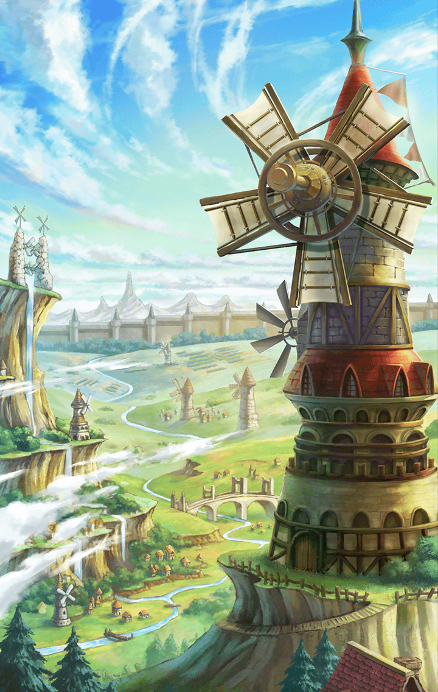
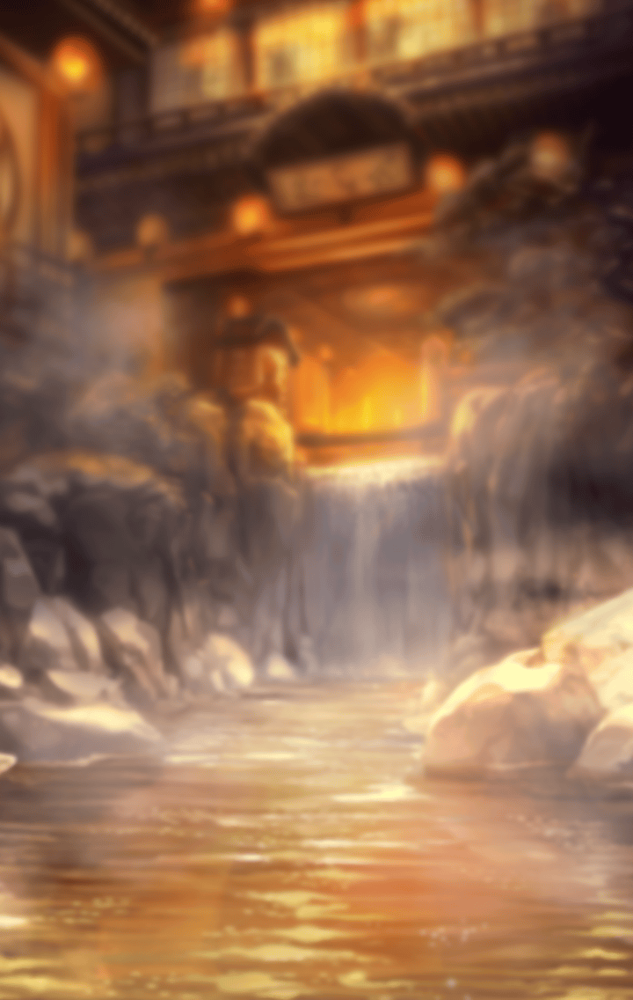

[View script in lisp](../scripts/202306104.txt)

**【ミネルヴァ】**
これは、私の
“前の世界”での記憶

**【ミネルヴァ】**
何年前かも定かではない
遥か遠い記憶

**【ミネルヴァ】**
私は、神々の手によって作られた……

**【ミネルヴァ】**
『エンシェントキラーズ』だった

**【ミネルヴァ】**
かつて、神々は異族を使い、
人々の数が増えすぎないよう
調節していた

**【ミネルヴァ】**
ところが異族は神々の予想以上に
人々を捕食してしまった

**【ミネルヴァ】**
そこで神々は “異族を狩る者”、
キラープリンセスを生み出して
異族狩りをさせることにした

**【ミネルヴァ】**
“神の箱庭”たる世界の秩序を
守るため、人間の捕食者である
異族を狩る…それが私たちの使命

**【ミネルヴァ】**
それは、戦うことしか
生きている意義を与えられない存在

**【ミネルヴァ】**
そんな私によく声を
かけてくれていたのが……

**【ユーノー】**
あら？
また来てくれたの？
ミネルヴァ

**【ミネルヴァ】**
人間の姿で司祭をしていた
『天使ユーノー』

**【ユーノー】**
今日も見ていく？
新婦さん、とてもキレイですよ

**【ミネルヴァ】**
当時、ユーノーは
人間を栄えさせるため

**【ミネルヴァ】**
男女を結ぶ
『結婚』という儀式を
取り持っていた

**【ユーノー】**
ふふ、どう、ミネルヴァ？
新郎新婦の笑顔、
とても幸せそうでしょう？

**【ミネルヴァ】**
ユーノーは、いつも
嬉しそうに結婚の儀式を
執り行っていた

**【ミネルヴァ】**
私は……
そんなユーノーを見るのが
好きだった

**【ミネルヴァ】**
そして、ある日……

**【ミネルヴァ】**
私はユーノーに、
ずっと気になっていたことを
尋ねてみた

**【ミネルヴァ】**
どうして司祭を
やっているのですか……？

**【ミネルヴァ】**
これは奇しくも、
私がスイハに投げられた
問い掛けと同じものだった

**【ユーノー】**
『どうして、司祭を』…か
そうですね

**【ユーノー】**
天使である私は、
人間のように
誰かと結ばれることはありません

**【ユーノー】**
けれども、
人間たちの幸せを願い、
祈ることはできます

**【ユーノー】**
私は……自分ではない、
“誰かの幸せ”を見るのが
好きですから

**【ミネルヴァ】**
自分ではない、
誰かの……
幸せ

**【ユーノー】**
ミネルヴァ、
ずっと私を側で見てきた
あなたに頼みがあります

**【ユーノー】**
もし私が天使の役目を終え、
この世界に存在しなくなったら……

**【ミネルヴァ】**
……え？

**【ユーノー】**
その時は、あなたに
私が愛する司祭の役目を
継いで欲しいのです

**【ミネルヴァ】**
………私は

**【ミネルヴァ】**
戦うためだけに
生み出された存在です……

**【ミネルヴァ】**
そんな私に……
務まるわけがありません

**【ミネルヴァ】**
その時、私は……
ユーノーに答えを出すことが
出来なかった

**【ミネルヴァ】**
それから何日か過ぎて、
私はユーノーに呼び出された

**【ユーノー】**
時が来ました

**【ミネルヴァ】**
まさか……

**【ユーノ―】**
えぇ、天使としての私の役目は
これで終わりです

**【ユーノ―】**
元々、人間を栄えさせるために
儀式を定着させるまでが私の役目
だったのですが…

**【ユーノ―】**
どうも名残惜しくて

**【ユーノ―】**
ですが、今の人間たちなら
天使の導きがなくとも
自らの道を歩めることでしょう

**【ミネルヴァ】**
そんな……

**【ミネルヴァ】**
……いや……嫌です

**【ユーノー】**
悲しむことはありませんよ、
ミネルヴァ

**【ユーノー】**
私は…
あなたも幸せになってもらいたい

**【ユーノー】**
幸せになろうとする人間たちを
近くで見ていれば…
あなたも、きっと幸せになれる

**【ユーノー】**
司祭として近くにはいられませんが
天使として、あなたの幸せを願い
見守っていますからね

**【ユーノ―】**
だから、ミネルヴァ
あなたはあなたの見たものを
信じる道を進んでください

**【ミネルヴァ】**
そう言って、
彼女は神の世界へと帰っていった

**【スイハ】**
そんなことがあったのですか……

**【ミネルヴァ】**
ありがとうございます、スイハ

**【ミネルヴァ】**
おかげで、
ハッキリ思い出しました

**【ミネルヴァ】**
私は……
ユーノーから託された思いを
無駄には出来ません

**【ミネルヴァ】**
どんなことがあろうと……
諦めずに頑張ります

**【ミネルヴァ】**
ですが、
考え込んでも答えは出ませんから
まずは人を頼ってみようと思います

**【スイハ】**
当てがあるのですか？

**【ミネルヴァ】**
幸せになろうとする人間たちを
近くで見てきた人…
その人に会いに行こうかと！

そう宣言した彼女は、
ある場所へと赴いていった

それは――

**【グラーシーザ】**
おう、ひさしぶりだな、
ミネルヴァ！

**【グラーシーザ】**
いったい、どうしたんだ？

友人であるグラーシーザの所だった
