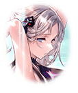

202308053 限定クエスト  ウルズの泉と過ごす日々 後編　ストーリー ウルズの泉と過ごす日々 後編　ストーリー 7 - ウルズの泉と過ごす日々-6 ウルズの泉と過ごす日々-6 ウルズの泉と過ごす日々-6 戦闘後

[View script in lisp](../scripts/202308053.txt)

フリズスキャールヴは
フラベルムやキル姫達を指示し
魔獣と戦い始める

【パンドラ】
フラベルムが
「揺らぎ」を起こしたのかしら？

騒ぎを聞きつけ、パンドラ達も
泉のそばに駆けつけていた

【マナナン】
それは違うと思うなー

【マクリル】
フラベルムは怒ってるだけ
その程度は「揺らぎ」の原因じゃない

【マクリル】
恐いけど…

【ウルズ】
ならばやはり泉の穢れが
魔獣を引き寄せているのですね？

【マナナン】
泉の穢れは負のものであっても
純粋なエネルギーだから
魔獣は興味ないんじゃない？

【マクリル】
言い切れないけど
そんな気がする…

【ミーミル】
じゃあ一体…

「揺らぎ」の原因は「寂しさ」だ
とマスター

【ミーミル】
ま、マスター様…？

【ウルズ】
…寂しさ、それって――

【ティルフィング】
魔獣が現れたのですね

【ミーミル】
ティルフィング様！

【フリズスキャールヴ】
来たか、ティルフィング

【ティルフィング】
ありがとう、フリズスキャールヴ
かつてのアナタもこうして…

【フリズスキャールヴ】
皆まで言うのは無粋じゃな
それにそなたにはこの世界という
大きな借りもあるからな

【フリズスキャールヴ】
今は友として世界を守るため戦う
そのほかは駄賃代わりじゃ

【ティルフィング】
…アナタがこの世界を愛してくれて
本当によかったと思います

【ウルズ】
ティルフィング様、一体…

ティルフィングは息を整え
ユグドラシルを見据える

【ティルフィング】
…………よし

【ティルフィング】
ユグドラシル
私はもう、大丈夫だから

ティルフィングの言葉を
受けたかのように魔獣が消え
泉は静寂に包まれた

【ティルフィング】
「揺らいで」いたのは、私です

【ミーミル】
えっ…ティルフィング様が？

【パンドラ】
そう、ティルフィングが――え？

【マナナン】
それは反則

【マクリル】
それはお手上げ…

【ウルズ】
…………

皆が驚く中
マスターとウルズは
納得した顔を浮かべていた

【ティルフィング】
きっと、マスターには
あの夢が見えていたのですね

【ティルフィング】
私が原点となった
この世界を育もうと必死だった
何もない世界の頃の夢…

マスターは頷く
名前も思い出せないキル姫を探した
あの日々を思い起こしながら

【ティルフィング】
そして…ユグドラシルと共に在った
ウルズは私のこの「揺らぎ」を
どこかで感じていたのですね

【ウルズ】
ごめんなさい、ティルフィング様
でも、確証が持てなくて…

【ウルズ】
それに私の想いは
もう孤独ではないティルフィング様
には不要なものだと感じていたのです

【ティルフィング】
不要なんて、そんなことありません
ウルズは少し、優しすぎですよ？

【ミーミル】
あの、一体どういうことなのですか？

【ティルフィング】
まず、ウルズの泉が現れたこと
そしてここに魔獣が現れたのは
分けて考えるべきだったの

【ウルズ】
泉に穢れが溜まって
こちらの世界に来てしまったのは事実

【ウルズ】
浄化の方法も間違いではなかった

【ティルフィング】
そして、泉が現れてからは
新たに私が問題を発生させた

それがあの、夢…
とマスターは確認するように話す

【ティルフィング】
はい、私が抱いていた孤独
ウルズの泉がそれを増幅させ
私の心を「揺るがせ」たのです

【フリズスキャールヴ】
あれは多くの感情の受け皿じゃ
永くそばにいれば、より強くもなろう

【ティルフィング】
そんな
フリズスキャールヴがいてくれたのも
気付けたきっかけ…

【フリズスキャールヴ】
旧い世界の話じゃ
そなたにしか伝わらぬ

【ティルフィング】
面倒見がいいのは変わりませんね

【ティルフィング】
…そしてウルズやミーミルのように
優しいユグドラシルが永い時の中で
抱いたのが私を救いたいという想い

【ウルズ】
それこそが、意思なき意志…っ！

【ティルフィング】
そうです、ウルズ
事態が大きくなってしまったのは
ふたつの事柄がほぼ同時に起きたから

【ティルフィング】
時系列ではどちらがどう
と言えるけれど、元を辿れば
かつてそうだったからこうなった

【ティルフィング】
それを解消するには
私がもう寂しくないことを
ユグドラシルにちゃんと伝える…

【ティルフィング】
それと同時にマナの浄化を進めるには
みんなと一緒にリゾートで過ごすのが
一番だと思います

【フラベルム】
…………事情は理解しました

【フラベルム】
問題がないのであれば
泉への立ち入りを禁止する
必要もありません

問題解決の糸口が見つかったこと
とは別に、リゾートの再開に
喜びの声が上がるのだった

【ティルフィング】
ミーミルがラグナロクを思う者達の
願いから生まれたように…

【ティルフィング】
ウルズは私とユグドラシルの思いから
生まれたのでしょうね

【ウルズ】
そして泉の穢れによって
この世界に顕現し、
ティルフィング様と出会った…

【ウルズ】
私が漠然と抱いていた使命
その任はこちらの世界に来た時から
始まっていたようなものでしたね

【ティルフィング】
ウルズは私のせいで
振り回してしまったようなもの…

【ウルズ】
その先の言葉は言わないでください
私の憂いはユグドラシルの憂い

【ウルズ】
心配する必要がないのだとわかれば
私の使命も果たされるのですから

【ウルズ】
理解はできたものの
意思なき意志が聞こえないのは
元に戻ってから考えるとします

【ウルズ】
また、長くユグドラシルと
一緒にいられるのですから…

【ミーミル】
聞こえなかったのですか…？

【ウルズ】
あ、え、っと、それは、そう！
言葉の綾というものですよミーミル

【ウルズ】
姉である私が
嘘を吐く訳ないでしょう

【ティルフィング】
ふふ、ウルズは嘘を吐いてない
立派に使命を果たしたのですから

【ウルズ】
…ええ、ですから
これからの日々も辛くはありません

【ミーミル】
これから…

【ティルフィング】
ミーミル？

【ミーミル】
あ、あの、ウルズさん！

【ウルズ】
急に大声を出してどうしたんです？
泉のように広大な心で
聞いてあげますから普通に話して？

【ミーミル】
ウルズさんもティルフィング様も
一緒にリゾートで過ごしましょう！

【ウルズ】
先ほどの話を聞いてなかった？
私とティルフィング様はそのつもりよ

【ティルフィング】
ふふふ

３人はまるで家族のように
笑い合い、残された日々を過ごした

【ミーミル】
すっかり元通りですね

【ウルズ】
泉の浄化も完了です

【ウルズ】
リゾートの撤去も
ありがとうございます

【フラベルム】
本来はずっとこのままが
よかったです

【パンドラ】
土産にスライダーくらい
持っていけばよかったのに

【マクリル】
次元が違うところに
大きな建造物を持っていくのは
負荷がかかって危険だよ？

【マナナン】
それこそ「揺らぎ」と似たような
大変なことになっちゃうかも

【ウルズ】
それは避けたいですね

【フリズスキャールヴ】
あれは純粋で強大な存在じゃ
大変な務めじゃが、頼んだぞ

【ウルズ】
ティルフィング様から聞きました
アナタはかつての世界で永い時を
ユグドラシルで過ごされたのですよね

【ウルズ】
先輩の激励として
受け取っておきます

【フリズスキャールヴ】
先輩…はは、そう来たか

【ティルフィング】
…ほら、ミーミル

【ミーミル】
…ウルズさん、これを

【ウルズ】
これ、工芸体験で作ったイヤリング…

【ウルズ】
あの時、魔獣が現れて
途中になってしまったのでは…

【ミーミル】
どうしても気がかりで
あの後完成させに行ったのです

【ミーミル】
ウルズさんとの思い出が欲しくて…

【ウルズ】
…次元の違う物を持っていくのは
危険だって話をしたばかりですよ？

【ミーミル】
そう、ですね…

【ウルズ】
けれど、小さな物であれば
大きな齟齬は生まれないでしょう

【ミーミル】
ウルズさん！

【ウルズ】
…それと、アナタにこれを

【ミーミル】
これは…っ！

【ウルズ】
結果的にお揃いね

【ウルズ】
私がいなくなっても
妹が寂しがらないように
と私もあの後作ったの

【ウルズ】
…道理であの職人さん
ニヤついていた訳ですね

泉が輝き始め
徐々に消えていく

【ミーミル】
ウルズさん…

【ウルズ】
消える訳ではありません
元に戻るだけですよ、ミーミル

【ウルズ】
ティルフィング様…

【ティルフィング】
ええ、本当にありがとうウルズ

【ウルズ】
――はい

【ウルズ】
…ミーミルもマスターも
それに多くの友がそばにいる

【ウルズ】
ユグドラシルの憂いはもうありません

【ウルズ】
私は向こうに戻ってからも
これからも泉の管理人として
メンテナンスを続けていきます

【ウルズ】
この日々、とても楽しかったです
ありがとうミーミル

【ウルズ】
私の妹として
ティルフィング様のこと、よろしくね

【ウルズ】
それじゃあ…

別れの言葉を残し
ウルズは帰っていく

【ミーミル】
…………

イヤリングを握りしめ
ウルズがいた場所を見つめるミーミル

「きっとまた会えるよ」
慰めではなくマスターは
本心でそう思い、口にした

【ミーミル】
いえ…

【ミーミル】
もう会うことがないのが
正常なんで、す…

【ティルフィング】
ミーミル

今にも泣きだしそうなミーミルを
ティルフィングが優しく抱きしめた

Next: [202308060](202308060.md)

[Back to index](index.md)
