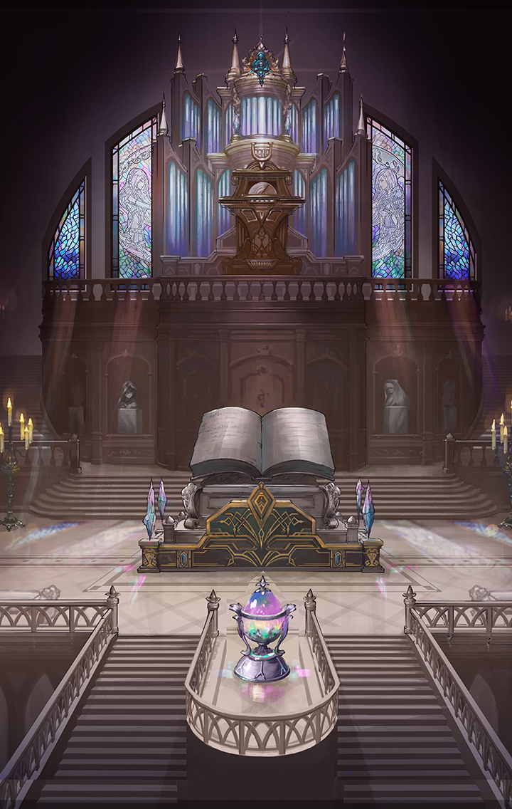

202316010

[View script in lisp](../scripts/202316010.txt)

【ロンギヌス】
…………

【ロンギヌス】
ああ…
忘れたまま生きてきたことを
お許しください

【ロンギヌス】
私は…知りました
思い出しました…

【ロンギヌス】
自分自身の罪深さを…
犯してしまった過ちのことを…

【ロンギヌス】
それなのに…過ちを正してくれた
方に恩返しできないままなんて…

【ロンギヌス】
報われてほしいんです
皆さんに幸せになってもらいたい
もちろん、彼女にも…

【ロンギヌス】
どうか…

【ロンギヌス】
…………！？

【ロンギヌス】
今の声は、もしかして…

【ロンギヌス】
ああっ
お願いします、どうか――

【メギド】
ロンギヌスが教会に籠もってから
九日経ったわ…

【メギド】
今朝で十日目…
様子を見ても良い頃よね

【メギド】
ロンギヌス、大丈夫？
お祈りに集中しすぎて
貴方の体が…あら？

【メギド】
ロンギヌス？
ロンギヌス！
どこにいるの！？

【メギド】
…………

【メギド】
そんな…
どこにも見当たらない

【メギド】
九日間、教会で祈りを捧げ続けると
言っていたのに…

【メギド】
どこにいってしまったの？

【ミーミル】
旅の記録七百二十三日――

【ミーミル】
これは…とても立派な図書館ですね
マスター様、ご覧下さい

選択肢:
- 本がたくさんある → [select_label_01](#select_label_01)へ
- カシウスの功績だね → [select_label_02](#select_label_02)へ
- 迷いそう… → [select_label_03](#select_label_03)へ

これは…とても立派な図書館ですね
マスター様、ご覧下さい

#### select_label_01:
 → [select_label_end](#select_label_end)へ

【ミーミル】
こちらの書物は誰でも読むことが
できるそうです
すごいですね

#### select_label_02:
 → [select_label_end](#select_label_end)へ

【ミーミル】
はい！
カシウスさんはご自身の理想を
形にすることができたようです

#### select_label_03:
 → [select_label_end](#select_label_end)へ

【ミーミル】
サポートならミーミルにお任せ下さい

#### select_label_end:

【マナナン】
アハハハ！
広くて静かで楽しいね♪

【マクリル】
ううう…
本だらけで薄暗くて怖いよ

【ミーミル】
おふたりとも、図書館ではお静かに
走ってはいけません

【ミーミル】
ああっ…
行ってしまいました

【ミーミル】
マスター様
おふたりを連れ戻してまいりますので
少しお待ちください

選択肢:
- 一緒にいこう → [select_label_04](#select_label_04)へ

マスター様
おふたりを連れ戻してまいりますので
少しお待ちください

#### select_label_04:

【ミーミル】
はい
それでは一緒に

【ミーミル】
マナナンさんとマクリルさんは
どちらに行かれたのでしょう？
本棚が並んでいて視界が悪いですね…

【ミーミル】
…あちらにいらっしゃるのは？

【盤古】
…………

【ミーミル】
もしかして盤古さんでは？

【盤古】
えぇ！？
誰…？どうして、我のことを…？

【ミーミル】
突然、失礼致しました
私はミーミル
マスター様の専属補佐官です

【ミーミル】
盤古さんのことはユグドラシルの
記録で存じ上げておりました
こちらで何を？

【盤古】
ここ…居心地いいから…

【ミーミル】
なるほど
確かに過ごしやすい環境です

【盤古】
うふふ
そ、そうだろ…

【ミーミル】
私、ユグドラシルで多くの記録を
読ませていただいていたので、
親近感も湧きますね

【ミーミル】
珍しい本もありそうです
とても興味があるのですが…
ところで、こちらに――

【盤古】
きょ、興味があるのならっ
そなたに面白いものを――

【盤古】
…………

【ミーミル】
あ！失礼致しました
言葉が重なってしまいましたね
盤古さんから、どうぞ

【盤古】
うぅっ…

【盤古】
…………ん？リク、カイ、クウ、
もう少し…頑張れ…？
えっと…

【盤古】
よし！
興味があるのなら…

【盤古】
わ、我がそなた達に…とっておきの
本を…見せてやろう

【ミーミル】
あ、ええと…

選択肢:
- それは楽しみだね → [select_label_05](#select_label_05)へ

あ、ええと…

#### select_label_05:

【盤古】
うふふ
つ、ついてきて…

【盤古】
ここ…普通の人は…入れないんだ
と、特別に我が…案内してやろう
ふふっ

【ミーミル】
随分、奥まった場所に来ましたけれど
こちらにある本は…

【盤古】
「虚構神書」…「創世神書」…それと
「喪失原典」
全部…歴史書、みたいなもの…だ

【ミーミル】
ですが、こちらに載っている年表は
私の知っているものとは
異なっているようにお見受け致します

【盤古】
そ、それは…この世界とは――

【盤古】
キャー！

【ミーミル】
盤古さん、驚かせてしまって
すみません

【ミーミル】
マスター様、ティルフィング様からの
ご連絡のようです

【ティルフィング】
聞こえますか、ミーミル？

【ミーミル】
はい、ティルフィング様
どうされたのでしょう？

【ティルフィング】
実は…異族が現れたんです

選択肢:
- 異族！？ → [select_label_06](#select_label_06)へ

実は…異族が現れたんです

#### select_label_06:

【ティルフィング】
信じられないかもしれませんが…
急いで異族の出現した町、
トーキョーに向かって下さい！

Next: [202316021](202316021.md)

[Back to index](index.md)
