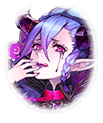

[View script in lisp](../scripts/202316120.txt)

【マサムネ】
何とか辿り着いたな
さて、ここで元凶が見つかれば
良いのだが…

【アルテミス】
皆、警戒を怠らないように
行きましょう！

【与一】
あ！誰かいます！
あれは…

【ロンギヌス】
…………

【マサムネ】
ロンギヌス！
…見た目も雰囲気も異なっておるな

【アルテミス】
あれが聖鎖による支配ですか？

【ミーミル】
きっとそうです！
ティルフィング様からお聞きしました

【ミーミル】
魔王のお三方が警告していかれた
とのことですっ

【アスモデウス】
特別に教えてあげる
アンタ達の大切なお仲間がね
天使に取り憑かれるわよ

【ティルフィング】
天使に、取り憑かれる？
意味がよく分かりません…

【ベルゼブブ】
キャキャキャキャキャ♪
ベル達がこの世界に顕現できたのって
な～んでだ？

【パンドラ】
それは…私が箱を開けたからでは
ないの？

【ウルズ】
まあ！
パンドラさん、そのようなことを…

【ベルゼブブ】
ブブーッ！
あのときも言ったでしょ～
それは本質じゃないの

【パンドラ】
なるほど
完全に理解したわ

【パンドラ】
私が開けなくても、
誰かが箱を開ければ、あなた達は
顕現したということね

【ベルフェゴール】
パンドラ…あなたって本当に
愚かねぇ
可愛いわぁ

【ティルフィング】
アナタ達が顕現したのには、
二つの段階があるはずです

【ティルフィング】
一つは存在を維持するための力
これは人々の欲望ですね
欲望は失われることがないから…

【ベルゼブブ】
ティルフィング、せいか～い！
欲望が高まれば高まるほど、
ベル達は強くなれるんだよ～

【アスモデウス】
それじゃ、あと一つは？

【ティルフィング】
絆や縁、といったものです
アナタ達のことを誰かが覚えて
いること…それが最低条件のはず

【ベルフェゴール】
だいせいか～い
美しい木偶は頭も切れるのねぇ

【アスモデウス】
私達のことはパンドラが覚えていた
だから顕現できたの

【ベルゼブブ】
そういえばティルフィングも
似たような経験してるよね～
キャキャキャキャキャ♪

【ティルフィング】
記憶…強い繋がり…
存在を維持するための力…
まさか…！

【ウルズ】
つまり、この儚げ美少女ウルズも
ティルフィング様との強い絆が
あったから顕現したのですね

【アスモデウス】
そこの小さいのは黙ってなさい
弄ぶには幼すぎるわ

【ウルズ】
な、何てことをっ…
やはり禍々しい者達は
浄化しなければなりませんっ

【ティルフィング】
落ち着いて、ウルズ

【ティルフィング】
…アナタ達魔王が
人々の欲望によって
強化されるのであれば

【ティルフィング】
天使もまた、人々の理性や
信仰心によって力を増す
そういうことですね

【ベルフェゴール】
いいわねぇ
少し前、とても嫌な気配…
天使の気配を感じたのよぉ

【ベルフェゴール】
誰かさんが熱心に祈りでも
捧げたんじゃないかしらぁ
あとは…

【ベルフェゴール】
私達みたいにぃ、強い縁を持つ者が
いればぁ…天使が顕現するかもねぇ
気をつけた方が良いわよぉ

【ベルゼブブ】
天使がお姉ちゃん達の味方とは
限らないもんね
キャキャキャキャキャ♪

【ティルフィング】
…警告、ありがとうございます

【マサムネ】
ロンギヌス！
拙者の声が聞こえるか！？

【アルテミス】
天使に意識を
乗っ取られないでください！
気持ちをしっかり持って！

【ロンギヌス】
…………

【ロンギヌス】
…神の国が復活します

【ロンギヌス】
それにより、全て救われるんです
全て…

【ロンギヌス】
邪魔をしないで下さい
私の信仰は決して揺らぎません

【マサムネ】
ぬぅっ…
何だ、この光は！？

【ミーミル】
…………！？

【ミーミル】
また…！
今のは、はっきり感じました
私の中で、確かに旗がっ

【アルテミス】
…いけません！
皆、周りをっ

【レーヴァテイン】
チッ…
これ、まずったかも

【与一】
囲まれてしまいました…！

【ロンギヌス】
神の国の復活を妨げる者達に
裁きを！

Next: [202316130](202316130.md)

[Back to index](index.md)
