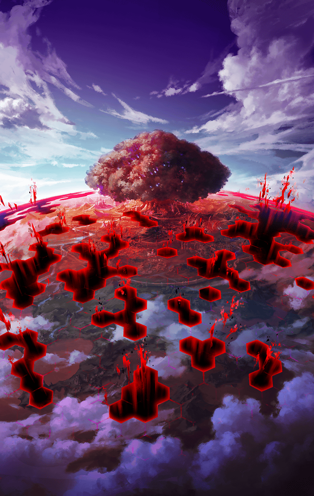

[View script in lisp](../scripts/210010010.txt)

[View source in markdown](210010010.md)

遙か昔――
神々に反抗した
白き正義の執行者達がいた――

苛烈な戦いの果て、
彼女達は――

**【ガブリエル】**
まったく…創造主たる私達に刃向かう
など愚かしいことをするものだと
思っていましたが…

**【ガブリエル】**
それもこれも全て貴女のせいですよ
ラグナロク

**【ラグナロク】**
みんな！顔を上げなさい！
私達の攻撃は確かに効いているわ！
今こそ神の軛を断ち切るとき！

**【ガブリエル】**
そう…それですよ…貴女のその“力”
キラーズを安定させキラープリンセス
の能力を向上させる“力”

**【ガブリエル】**
何故、貴女がそれを持っているのか
分かりませんでしたが、ようやく
理解しました

**【リベリオン】**
戦いながらごちゃごちゃと！
随分、余裕じゃねえか!!

**【ガブリエル】**
当然です
思い知らせてあげましょう！
私達に刃向かう愚かさをっ

**【ラグナロク】**
くぅっ…何とか堪えて…えっ？

**【ラグナロク】**
カハッ…！

**【リベリオン】**
ラグナロク！
てっめえええええええええ！

**【ガブリエル】**
これですね…“バイブス”
キラープリンセスには本来宿る
はずのないマナの亜種

**【ガブリエル】**
これのせいでキラープリンセスは
貴女に惹きつけられ、その力を
向上させていたのです

**【ガブリエル】**
どうやらユグドラシルに少々問題が
あるようですね…修正が必要ですか

**【エルキュール】**
よくもラグナロクを！

**【グラーシーザ】**
そうぞうしゅであろうと、むえきな
せっしょうはせいぎにはんするぞ！

**【ガブリエル】**
どうしました？
全く痛痒を感じませんね
バイブスがなければこの程度ですか

**【ミネルヴァ】**
…まさか、本当にラグナロクからの
加護が失われたと言うんですか？

**【ダモクレス】**
う～ん…クレス、何だか上手く
力が出せないよ～…

**【リベリオン】**
おい！一旦、退くぞ！
ラグナロクはまだ息がある…
体勢を立て直すんだっ

**【ガブリエル】**
おや？そういえば、しつこい蠅が
もう一匹残っていましたね
貴方は完全に消去しましょう

**【リベリオン】**
冗談じゃねえ！
こんなところで終わるわけには
いかねえんだよ！

**【エルキュール】**
そうです…まだ終われません！
彼女の意思を…希望を消させは
しない！

**【キラープリンセス達】**
やあああああああああ！

**【ラグナロク】**
ああ…意識が…

**【ラグナロク】**
こんなところで…歩みを止めるわけ
には…いかないのにっ…

**【ラグナロク】**
私には…私達には…まだ――

#### select_label_loop:

選択肢:
- 諦める → [select_label_01](#select_label_01)へ
- 目を開く → [select_label_02](#select_label_02)へ

私には…私達には…まだ――

#### select_label_01:
 → [select_label_loop](#select_label_loop)へ

**【ラグナロク】**
もう…これ以上は…だけどっ…

#### select_label_02:
 → [select_label_end](#select_label_end)へ

#### select_label_end:

**【ラグナロク】**
そう、まだ！
まだ…私は…戦える！

**【ラグナロク】**
誰にも私の歩みを止めさせはしない！
たとえそれが神であったとしても！！

**【ガブリエル】**
フッ
まだ抵抗するのですか、無様な

**【ガブリエル】**
…………何っ？
奪い取ったバイブスが、
ラグナロクに引き寄せられる…！

**【ガブリエル】**
させはしません！

**【ラグナロク】**
いいえ、返してもらうわ
その“力”！

**【リベリオン】**
…ったく、ここは退くべきだってのに
仕方ねぇな！

**【ガブリエル】**
そのようなもの、
通用しないと――

**【ラグナロク】**
ありがとう
一瞬でいい
隙が欲しかったの

**【ガブリエル】**
今の貴女の攻撃など…むっ？
バイブスが！？

**【ラグナロク】**
確かに返してもらったわ
さあ、みんな
仕切り直しよ！

**【ダモクレス】**
やった！
ラグナロクが元気になった！
クレスも力が湧いてきたよっ

**【グラーシーザ】**
いまふたたび、
せいぎをしっこうするとき！

**【エルキュール】**
希望を示しましょう！

**【ガブリエル】**
思い上がるのもいい加減にしなさい
被造物ども！

**【エルキュール】**
この光で、全てを包み込む！

**【ガブリエル】**
ガハァッ…！
そんなはずが…創造主たる私が
被造物如きに負けるなど…

**【ラグナロク】**
それこそ傲慢よ！
私達はあなた達に創られた存在
かもしれない

**【ラグナロク】**
けれど、生まれ出でた者達はやがて
自らの足で歩き出す

**【ラグナロク】**
七つの光よ、御旗に集え！
神の軛から全てを解き放つ
皆の力を…今！

**【ガブリエル】**
させません…
させませんよ、この…
出来損ないどもがぁぁぁっ！！

**【グラーシーザ】**
このせいぎがさばく！

**【ダモクレス】**
クレスの愛の力、
見せてあげよー！

**【フライシュッツ】**
かいしんのいちげきーっ！

**【ネス】**
規律に従い、あなたを罰します

**【ミネルヴァ】**
これが答えです！

**【スイハ】**
雲をも射抜く、我が一撃！

**【ガブリエル】**
おのれぇぇっ…！
愚か者ども…貴女達には
絶望こそ相応しいぃぃっ

**【エルキュール】**
絶望を希望で飲み込みます！

**【ラグナロク】**
白き意志は、誰にも砕けはしない！

**【ガブリエル】**
ぐああああああぁぁっ…

**【リベリオン】**
やった…
やりやがった、あいつら！

**【リベリオン】**
フレンネルは勝てないと踏んでいた
のに、ガブリエルを倒してみせた…
何て奴らだっ

**【グラーシーザ】**
せいぎはかつ！
あーっはっはっは！

**【ミネルヴァ】**
油断しないで下さい
まだ終わってはいませんよ

**【ラグナロク】**
旧き支配者の魂に終焉を
私達は歩み続けるわ

**【ガブリエル】**
愚かですね…
これで勝った気でいるとは…

**【ラグナロク】**
旧き支配者があなただけでないことは
理解しているわ
私達はその悉くを撃ち倒す

**【ラグナロク】**
そうして、世界に真の平和を
もたらしてみせる！

**【ガブリエル】**
ああ、愚かです…
実に愚か…貴女達はこの世界の
ことを何も理解していない…

**【ガブリエル】**
何のために世界が創られたのか…
何のためにあなた達が創られたのか…
何のために――

**【ガブリエル】**
異族が創られたのか

**【ガブリエル】**
じきに思い知ることとなるでしょう…
貴女達の愚かさが、いつか貴女達を
襲うことになります…

**【ガブリエル】**
それを…観察できないのは…
少々残念…ですね…

**【ラグナロク】**
世界が創られた意味？
それは、どういうことなのっ？

**【ガブリエル】**
ふふふ…ははははは――

**【ラグナロク】**
くっ…
まるで呪いのような言葉を残して
いったわね…

**【エルキュール】**
大丈夫ですか、ラグナロクっ？

**【ラグナロク】**
…ええ、私は平気よ
ガブリエルは消滅したわ

**【エルキュール】**
では、私達の勝利ですね！

**【ミネルヴァ】**
浮かれてはいられません
まだ神の軛から完全に解き放たれた
わけではありませんから

**【フライシュッツ】**
は～い
ミネルヴァちゃん、はぐだよ
はぐ～♪

**【ミネルヴァ】**
いきなり何をするんですかっ？

**【フライシュッツ】**
そんなに難しい顔してちゃ、
めっ！だよ～

**【フライシュッツ】**
今は素直に勝利とみんなの無事を
喜ぼうよ～っ

**【グラーシーザ】**
ははは！
フライシュッツの言うとおりだ

**【エルキュール】**
困難は続くでしょうけれど、
希望はあります！

**【ラグナロク】**
そう…その通りね！
どんな困難が待ち受けていようとも
私達は必ず勝利する

**【ラグナロク】**
さあ、皆！
このまま足を止めずに！

**【リベリオン】**
とんでもない土産話ができたぜ
天上世界はあいつらに任せておけば
大丈夫だな

**【リベリオン】**
俺に残された時間はあまり無ぇ
フレンネルとできるだけ打ち合わせて
地上に戻るとするか

**【リベリオン】**
あの八人のキル姫がフレンネルの
手助けをしてくれれば全て上手く
いくはずだ

ラグナロク達八人のキル姫は
神々の軛から天上世界を解放した――

彼女達と協力し、フレンネルは
ユグドラシルの側に天上世界を
統べる教会を設立する――

その名はラグナロク教会――

教会によって世界は統治され、
人々は平穏な日々を送った――

やがて、キル姫達が天上世界に
増えていく――

彼女達を管理・統制するため
キル姫のもつキラーズと適合する
バイブスを持つ者――

奏官が教会によって任じられた――

だが、強大な力を持つキル姫を
従えた奏官達はやがて、教会の命令を
拒むようになる――

少しずつ教会の権威は弱まり、
奏官達は手を組んで独自の同盟
「ギルド」を作っていった――

そしてギルド同士が睨み合い、
互いのキル姫を戦わせ、覇権を
争うようになっていく――

そんな折、天上世界に“蝕”が
訪れた――

**【リベリオン】**
何やってんだ、てめえら！
人間同士で争ってる暇があったら
地上で悪魔どもと戦いやがれ！

再び天上世界に現れたリベリオンに
よって地上世界の存在が明かされ――

**【奏官１】**
悪魔ねぇ
うちの姫達の力を試すには
うってつけじゃねぇか

**【奏官２】**
地上世界…
新天地でなら俺達が支配者になる
ことも夢じゃないぞ！

**【奏官３】**
世界の救済、それこそが私達の
真の目的だったのですね
行きましょう、皆さん

**【奏官４】**
勝手にやってろ
地上のことなんざ知ったことじゃない

**【奏官５】**
あいつは何者だ？
この世界は…本当は何なんだ？

様々な思惑が渦巻く中、
多くの奏官達がキル姫を連れて
地上へと降りていった――

**【ティルフィング】**
今度こそ決着をつけましょう
バアル！いいえ、ベルゼブブ！！

**【バアル】**
キャハハハハ！
もう世界も何もかもどうでもいいや！
ティルを食べられるのなら！

**【バアル】**
ティルフィングウウウウウウウ！！

**【ティルフィング】**
これで終わりよ！

**【バアル】**
あああああ…もう…食べられない
なんて…イヤアアアアアアアアアア…

**【ティルフィング】**
…処理、完了

キル姫は地上を支配していた悪魔との
戦いに勝利した――

地上世界は再び人類のものとなり、
平和な日々が訪れるかに思われた――

しかし、もたらされたのは新たなる
争いの日々――

地上に降りてきた幾人もの奏官達が
キル姫を利用して覇権を争う
そんな世界だった――

霊装支配という新たな技術の確立に
より、一時期、世界は三つの国にまで
まとまる――

だが、統一は成し遂げられず、
再び多数のギルドが小国を形成する
乱世へと戻ってしまった――

それから幾星霜――

争いはやまず、ただ大規模な戦もなく
世界は微妙なバランスを保って
存続していた――

そんな二つの世界を
世界樹ユグドラシルが
静かに見守り続けている――