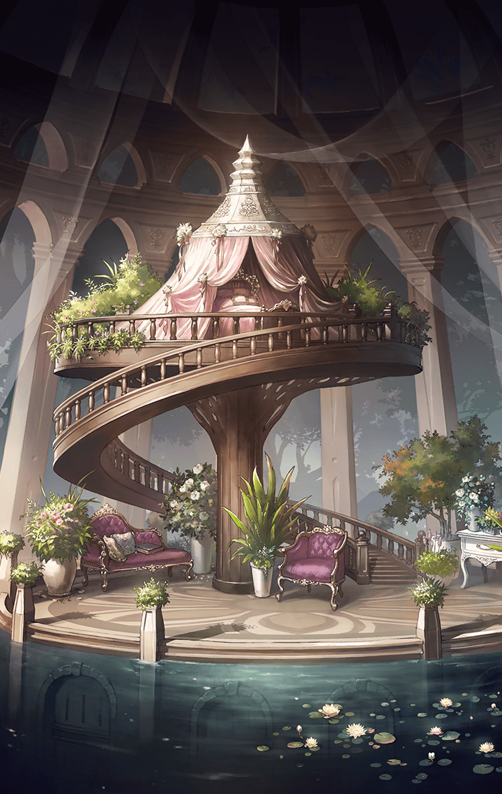

210101030

[View script in lisp](../scripts/210101030.txt)

【アルマス】
それで、ティルフィングを
送り出したのっ？

【ユグドラシル】
ええ…
あの子は記録を遡っていったわ

【アルマス】
追うわよ、ラグナロク！
急げば間に合うわ

【ラグナロク】
待って
気になっていることが
幾つかあるの

【ラグナロク】
それについて聞いてからでも
遅くはないはずよ

【アルマス】
気になることって…
あるには、あるけど…

【ユグドラシル】
…………

【ラグナロク】
まず、ティルフィングとは
以前も会ったことがあったのね？

【ユグドラシル】
ええ、そうよ
あの子は世界の「真実」に触れて…
ここを訪れたの

【ラグナロク】
世界の真実？
ユグドラシルの寿命が尽きようと
しているということ？

【ユグドラシル】
…そうね

【アルマス】
だったら、何で偽物の世界樹を
作ったりしてるのよっ？

【アルマス】
そんなことするより世界樹を
延命させる方法を考えるべきでしょ！

【ユグドラシル】
…………

【ラグナロク】
ユグドラシル…
ティルフィングの目的について
教えて

【ユグドラシル】
それは、あなた達も知っているはずよ
あの子達は永遠の理想郷を創って
“終焉”を回避するつもりなの

【ラグナロク】
その結論に達するまでの間に、
ティルフィングが何を考えたのか
あなたは知っているはず

【ユグドラシル】
ごめんなさい…
それは私が話して良いことではないわ

【ラグナロク】
そう…
それなら、次の質問よ

【ラグナロク】
どうして記録を遡ると、“終焉”に
ついて知ることができるの？

【アルマス】
あ！それは私も思ったわ
「始まりのとき」まで遡れるって
言ってたわよね

【アルマス】
でも、それって「最初」でしょ？
「最後」じゃないわよね

【ラグナロク】
ティルフィングは「輪廻」という
単語も口にしていた
まるでウロボロスみたいね

【アルマス】
えっと…誰だっけ？

【ラグナロク】
円環の理を表す幻獣よ
ずっと前に地上世界で討ち取られた
はずだけど…

【ラグナロク】
それはともかく、何故、
ティルフィングはあなたにお願い
してまで記録を遡っていったの？

【ラグナロク】
「始まりのとき」に何があるの？

【ユグドラシル】
…それは、あなた達自身の目で
確かめるべきね

【ユグドラシル】
すでに管理権を有している
あなたを止めることは、
私にはできません

【ユグドラシル】
きっと二人ともティルフィングを
追うのよね

【アルマス】
もちろん！
彼女と話さないといけないことが
色々あるのよっ

【ラグナロク】
ユグドラシル…
“終焉”とは何なの？

【ラグナロク】
私はてっきり、ユグドラシルの
寿命を指しているのだと思って
いたのだけれど…

【ユグドラシル】
その考えは間違っていないわ
“終焉”は私を終わらせる者…

【ユグドラシル】
確かな姿形をもって迫り来る
“終わり”そのものよ

【ユグドラシル】
だから、あなた達も気をつけて
“終焉”に捕まってしまえば…

【ユグドラシル】
あなた達も取り込まれ、
そこで“終わる”ことになる

【ユグドラシル】
だから…もし遭遇したら全力で
逃げて

【アルマス】
逃げてって言われても…
どんな姿をしてるのよ？

【ユグドラシル】
その心配は必要ないわ
だって…

【ユグドラシル】
遭遇すれば必ず分かるから

【アルマス】
…………！！

【ユグドラシル】
う…ううっ…

【ラグナロク】
ユグドラシルっ？
…ごめんなさい
無理をさせてしまったわ

【ユグドラシル】
いいの…
私は、全てを受け入れる…

【ユグドラシル】
どうか、あなた達の旅路に…

【アルマス】
…眠ったみたい

【ラグナロク】
行きましょう、アルマス
あまり具体的なことは
聞けなかったけれど…

【ラグナロク】
それもティルフィングに会って
話ができれば、きっと解決する

【アルマス】
そうねっ
私達も記録を遡るわよっ

Next: [210101040](210101040.md)

[Back to index](index.md)
