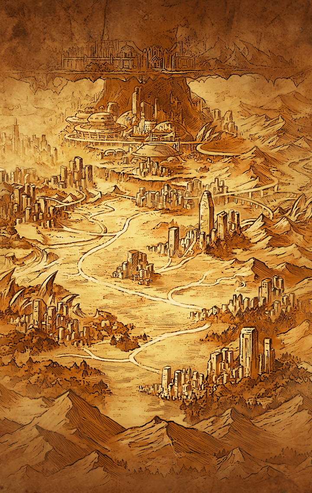

ついにティルフィングと相対した
アルマスとラグナロク

しかし、彼女達を“終焉”の
黒い霧が覆う

地底に降りたカミト達は、
結界の中で自問自答を繰り返す
カシウスとウロボロスを見つけた

結界を破ろうと苦心する彼らに
魔獣化したキラーメイルが襲いかかる

分断されたカミト達
さらにフォルカスも姿を現し、
リサナウトと対峙した

ヴァジュラとマサムネの協力もあり
カミトは魔獣化したキラーメイル
二人を正気に戻す

だが、その反動で彼は意識を失って
しまった

正気に戻った天沼矛とデュランダルは
事情を知り、自らの為すべきことを
見出す

二人はカシウスとウロボロスが座す
結界へと走り出した

運命の糸が織り成し続ける――

**【カシウス】**
…………

**【カシウス】**
わたしは何のために生まれたの？
どうして生きているの？

**【カシウス】**
分からない…
元いた場所は失われてしまった…

**【カシウス】**
わたしの存在意義を説明してくれる
人はどこにもいない…

**【カシウス】**
まるで胸にぽっかり穴が空いたよう…
空虚なわたしは、何のために生きて
いるの…？

**【老婆】**
おや、お嬢ちゃん
見ない顔だね

**【カシウス】**
わたしは旅をしているの…
自分が何のために生きているのか
知るために

**【老婆】**
あれ、まあ
若いのに難しいことを考えているん
だね

**【カシウス】**
お婆さん
あなたは何のために生きているの？

**【老婆】**
私かい？
私はもう十分生きたからね
今は特にないよ

**【カシウス】**
特にないの？
胸に穴が空いたような感じはしない？

**【老婆】**
あれあれ
寂しかったんだね…
そうだ、私の家にお出で

**【老婆】**
孫が生まれたばかりでねぇ
ほら、こっちだよ

**【カシウス】**
わたしは自分の生きる意味を…
待って

**【老婆】**
ほら、可愛いだろう
孫娘のユニアだよ

**【母親】**
カシウスさん、抱いてみる？
まだ首が据わってないから
気をつけてね

**【カシウス】**
…温かい

**【母親】**
ふふっ♪
そうでしょう

**【カシウス】**
あなたは何のために生きているの？

**【母親】**
えっ？
私…私は、やっぱり今はこの子の
ためかしらね

**【老婆】**
私もユニアが立派に育ってくれる
ことが生き甲斐だよ

**【カシウス】**
そう…

**【カシウス】**
ユニアは温かかった…

**【カシウス】**
この町にいれば、自分が何のために
生きているのか分かるかも…
もうしばらく、ここにいよう…

**【ユニア】**
あ！
カシュ姉！カシュ姉！

**【カシウス】**
わたしはカシウス…
ユニアは何度言っても覚えないね

**【ユニア】**
カシュウス？

**【カシウス】**
カシウス…

**【ユニア】**
カシュウス！

**【母親】**
あらあら
本当にユニアはカシウスさんが
好きね

**【ユニア】**
ママもすき～っ

**【カシウス】**
不思議…
まだ、わたしが生きている意味を
見出せていないのに

**【カシウス】**
こうして過ごしているだけで、
胸の奥がじんわり温かくなる…
わたしの空虚さが埋められていく…

**【ユニア】**
カシウス！
見て見てっ
新しい服を買ったの

**【カシウス】**
また買ったの？
服はそんなにたくさん必要ない
ユニアは買いすぎ

**【ユニア】**
そんなことないよ！
このくらい普通っ
カシウスももっとオシャレしたら？

**【カシウス】**
オシャレ…それはわたしが生きている
意味に関係があるもの？

**【ユニア】**
また言ってる～
カシウスって時々、変なこと
言うよね

**【ユニア】**
ねえ、カシウス聞いて！
この前…隣町の人に告白され
ちゃった♪

**【カシウス】**
隣町の…ユニアが最近、頻繁に
話題に上げている人？

**【ユニア】**
そう！
そうなのっ
その人がねっ

**【ユニア】**
「君は僕の全てだ！」って
恥ずかしいよね～♪

**【カシウス】**
その人にとって、ユニアが生きている
意味ということ？

**【ユニア】**
ちょっ…！
も～、カシウスったら、も～っ

**【カシウス】**
ユニア、顔が赤いわ
熱が上がっている

**【ユニア】**
カシウスが変なこと言うからでしょっ

**【カシウス】**
わたしは疑問を口にしただけ…
何のために生きているのか、
知りたいから

**【ユニア】**
しょうがないな～
カシウスはカシウスのままでいるのが
一番だよっ

**【カシウス】**
わたしのままで？

**【ユニア】**
そんなことより、
その人がねっ

**【カシウス】**
ユニア、結婚おめでとう

**【ユニア】**
ありがとう、カシウス！
隣町の新居にも遊びに来てねっ

**【カシウス】**
うん…

**【カシウス】**
そういえば…随分、長い間、
この町に留まってる…

**【カシウス】**
まだわたしが何のために生きている
のか見出せていない…
でも…

**【カシウス】**
ここにいたいと思ってる
胸の奥がじんわり温かくなるの…

**【カシウス】**
このまま、ここにいても…