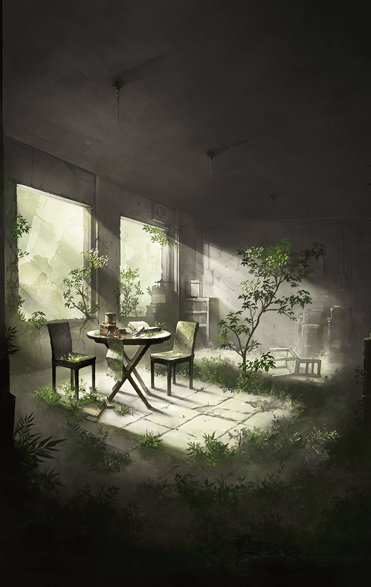

[View script in lisp](../scripts/210112041.txt)

**【デュランダル】**
見えたぞ
あれがカシウスとウロボロスの
結界だ

**【天沼矛】**
オレ達が力を合わせれば、きっと
破ることができます！
一気に突っ込みましょう！

**【デュランダル】**
いいだろう
聖剣デュランダルの真価を
示してみせる

**【デュランダル】**
くっ…！

**【天沼矛】**
ぐあっ…！

**【天沼矛】**
これは…思っていたより強力ですね
でも、諦めません！

**【デュランダル】**
このくらいで退いては私の騎士道に
反する
勝負はここからだ

**【天沼矛】**
ハハッ！
とても頑丈ですね…

**【デュランダル】**
ただ闇雲に突っ込んでも
効果は薄そうだな

**【マサムネ】**
拙者も助太刀致そう
結界を破りたいのは、
こちらも同じ故

**【デュランダル】**
淑女に助けを乞うのは私の騎士道に
反するな…

**【マサムネ】**
女だからと侮らないでもらおう
我が世界蛇の毒牙は決してそなた達に
劣るものではない

**【天沼矛】**
すみません
デュランダルは君を侮っている
わけではないんです

**【天沼矛】**
ただ、オレ達は皆が笑顔で暮らせる
世界を求めてキラーメイルになり
ました

**【天沼矛】**
それなのに、君達にも戦いを強いる
結果になっている…
それが心苦しいんです

**【デュランダル】**
君が剣を取ることなく生きていける
世界…そのために私が剣を取る

**【マサムネ】**
気遣いには感謝しよう
だが、今は共闘すべきときだ

**【ヴァジュラ】**
うんうん
いいこというな！

**【マサムネ】**
ヴァジュラ！
…いいだろう
そなたは拙者が相手をする

**【ヴァジュラ】**
待ちなって！
結界を破りたいんだろ？
あたしも手伝ってやるよ

**【マサムネ】**
何を言っている？
そなたはカシウス殿に頼まれて
ここを守っていたのだろう？

**【ヴァジュラ】**
それはそうなんだけど～
キミ達を見てたら、ひょっとしてと
思ってな

**【ヴァジュラ】**
カシウスは邪魔すんなって言ってた
けど、キミ達は「邪魔」どころか
あいつを助けてくれるのかも

**【ヴァジュラ】**
それに、カミトが命がけで助けた
その二人、なかなか良さそうだから♪

**【マサムネ】**
そのような理由で…
呆れてものが言えん

**【ヴァジュラ】**
まあ、ちょっと聞きなって
カシウスと会ったのは
けっこう前のことでね…

**【ヴァジュラ】**
そのときのあいつは…
空っぽだったんだよ
あたしのせいでもあるんだけど…

**【マサムネ】**
そのようなことが…

**【デュランダル】**
なるほど
やはり私達の出番だったようだ

**【天沼矛】**
そうですね！
笑っていられる世界を作りたくて
キラーメイルになることを選んだ

**【天沼矛】**
そんなオレ達だからこそ、
彼女にしてあげられることが
きっとあります

**【ヴァジュラ】**
よっしゃ！
結界破りは、あたしに任せな！
どんな困難もあたしの豪運の前に跪く

**【デュランダル】**
運か…
そのような曖昧なものに
委ねるつもりはないが

**【天沼矛】**
ここで意地を張っても
失礼なだけですね

**【ヴァジュラ】**
そうこなくっちゃな！
派手にぶちかますぞ

**【マサムネ】**
…心得た
今は結界破りに集中するとしよう

**【魔獣】**
ギイイイイイイイイイ！！

**【天沼矛】**
さっきの残党ですか？
こちらに集まってきますね

**【デュランダル】**
大した障害ではない
蹴散らし、結界を破る！

Next: [210112043](210112043.md)

[Back to index](index.md)
