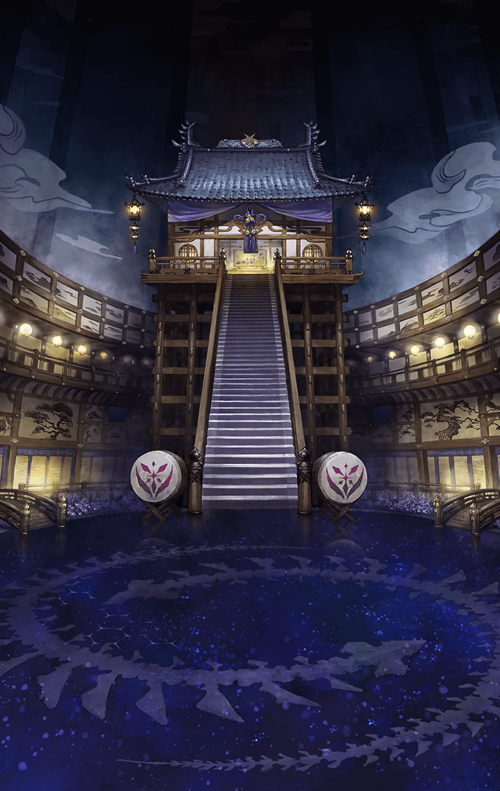

[View script in lisp](../scripts/210131121.txt)

[View source in markdown](210131121.md)

**【ヘレナ】**
フライシュッツ、
アナタはどうしてここに来たんだ？

**【フライシュッツ】**
マサムネちゃんとパラシュちゃんを
止めるためだよっ

**【フライシュッツ】**
インテグラルキラーズが、
また剪定をしてるって聞いたから
手分けして止めることにしたの

**【パラシュ】**
無駄なことをしてるね

**【フライシュッツ】**
そんなことない！
…パラシュちゃん達こそ、
どうしてまた剪定を？

**【フライシュッツ】**
ユグドラシルの管理権はラグナロク
ちゃんが取り戻して、パラシュちゃん
達の計画は頓挫したはずなのに…

**【パラシュ】**
確かに予定通りにはいかなかったよ
とても悔しかったな…

**【マサムネ】**
あのとき、拙者達に力が足りなかった
それだけのことだ

**【パラシュ】**
そうだね
ボク達の理想と君達の理想
それがぶつかったとき…

**【パラシュ】**
より強く理想に向けて高みを目指した
方が勝利した
そう受け止めている

**【パラシュ】**
だからこそ、今度はボク達の理想が
勝つ

**【ヘレナ】**
そうは言っても、これって同じことの
繰り返しじゃないかな？
どうせまた止められるよ…ふふっ

**【パラシュ】**
それはない
ティルフィングをユグドラシルに
送り込んだ時点で…

**【パラシュ】**
修正されたボク達の計画は
大きく前進しているよ
あとはどれだけ高みを目指せるか

**【パラシュ】**
各々の理想のために天上世界で
選定を行っているんだ

**【フライシュッツ】**
ティルフィングちゃんはユグドラシル
に入って何をしようとしてるの？

**【ヘレナ】**
“終焉”に関係することを調べている
と聞いた覚えがあるぞ

**【パラシュ】**
“終焉”か…
そうだね
ティルフィングは――

**【マサムネ】**
パラシュ、それ以上喋るな！

**【ヘレナ】**
おっと…
危ないな、マサムネ
いきなり何をするんだ？

**【マサムネ】**
抜かすな、間諜め
やはり早めに斬り捨てておくべき
であった

**【パラシュ】**
…まさか！
ボクとしたことが…

**【マサムネ】**
ようやく気づいたか、パラシュ
こやつ、フライシュッツに質問すると
見せかけて…

**【マサムネ】**
拙者達に話をさせておった

**【マサムネ】**
フライシュッツを捕らえたというのも
嘘であろう
そなたらは手を組んでおるな？

**【ヘレナ】**
何のことだか分からないな

**【ニール】**
アナタ達が勝手に喋っただけでしょ
ヘレナは悪くないわよ

**【マサムネ】**
屁理屈をこねるな！
直ちに斬って捨てる！

**【パラシュ】**
そうだね…
ボク達を騙しきれたのなら
認めてあげられたけど

**【パラシュ】**
見破られる程度のものなら、
理想の高みには届かないよ

**【ヘレナ】**
う～ん…
ヘレナは戦いたくないんだけど

**【マサムネ】**
問答無用！

**【パラシュ】**
叩き潰す！

**【ヘレナ】**
わわっ！？

**【フライシュッツ】**
ヘレナちゃん！
おねーちゃんに任せて！