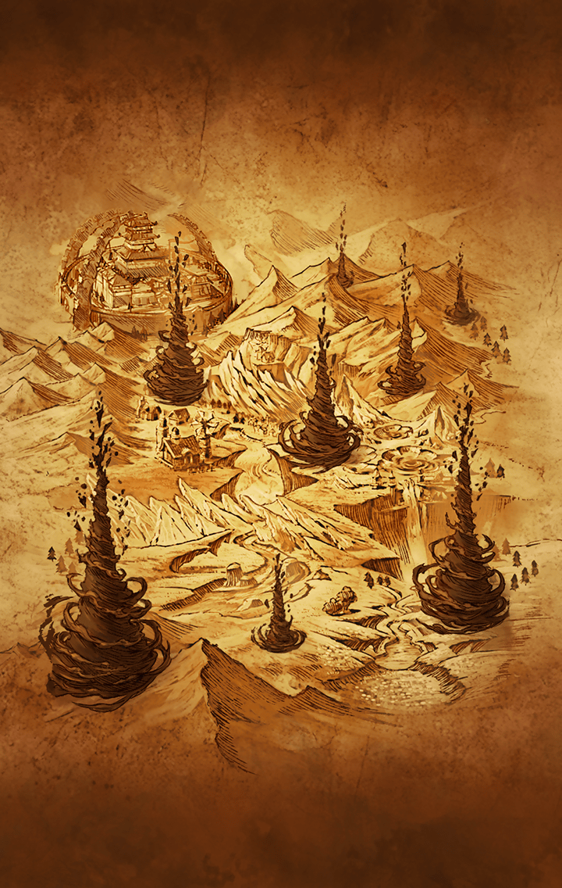

[View script in lisp](../scripts/210132011.txt)

再び剪定を始めたインテグラル
キラーズを止めるため

スイハとフライシュッツは
マサムネ城を訪れた

二人は城下町で、打倒マサムネを
掲げて集まった者達と出会う

雑賀、草薙剣、八咫鏡、天沼矛と
協力し合うことになり、
城に乗り込んだ彼女達だったが…

そこにヘレナと名乗る謎のキル姫が
現れ、引き返すよう忠告してきた

城内でバラバラになりながらも
最上階を目指すスイハ達

ヘレナの妨害を乗り越えて
フライシュッツは最上階に
辿り着く

囚われの身になりながらも
マサムネ、パラシュと話をするが、
不意にマサムネが刀を抜いた

マサムネはヘレナをスパイと断じ、
亡き者にしようとする

フライシュッツはヘレナを庇って
負傷しながらも城の外へと
脱出した

運命が描き出されていく――

**【草薙剣】**
ぐぬぬぬぬ…
最上階はすぐそこだというのに
上る方法は何かないんか！？

**【八咫鏡】**
飛んでいこうにも、瓦礫で道が
塞がっておるからのう…

**【草薙剣】**
この際じゃ！
外から攻めるのはどうじゃ！？

**【雑賀】**
その案、狙い撃ちされたら
オシマイってことで不採用に
なったっすよね

**【草薙剣】**
ぐぬぬぬぬ…
窓から外は見えとるというのに…

**【スイハ】**
草薙剣の言う通り、窓から出て
一階分上ることができれば
最上階に入れる…

**【スイハ】**
でも、そこをマサムネ達に狙われたら
あまりに無防備過ぎて危険…

**【スイハ】**
早くしないと…
フライシュッツ、大丈夫かな…

**【天沼矛】**
…あら！
今、上で何か物音が…
あらあらーっ

**【八咫鏡】**
何じゃ！？
今のはフライシュッツでは
なかったか？

**【スイハ】**
間違いありません
それにヘレナの姿もありました

**【スイハ】**
フライシュッツとヘレナが
抱き合うようにして落ちていった
ように見えたけれど…

**【スイハ】**
何があったんだろう…
助けに向かった方がいいよね

**【スイハ】**
皆さん――

**【雑賀】**
伏せるっす！

**【スイハ】**
えっ？

**【パラシュ】**
はああああああああ！

**【草薙剣】**
何じゃ、何じゃ！？
最上階までの道を塞いどった瓦礫が
吹き飛びおった…

**【パラシュ】**
これもヘレナの仕業みたいだね
ボクにとっては何の障害にも
ならないけど

**【雑賀】**
パラシュ！
皆、戦闘準備よろしくっす

**【マサムネ】**
ほう
迷いなく撃ったな
悪くない判断だ

**【パラシュ】**
マサムネ、ボクを庇う必要なんて
ないよ

**【マサムネ】**
拙者がたまたま、そなたの前に降りて
きただけのことだ

**【マサムネ】**
元より、あんな銃弾でそなたが手傷を
負うとは考えておらぬ

**【マサムネ】**
さて…
拙者はこの者達を始末するとしよう

**【パラシュ】**
ボクはヘレナとフライシュッツを
片付けてくるよ

**【スイハ】**
ヘレナとフライシュッツ？
ヘレナはパラシュ達の仲間では
なかったのかな…

**【スイハ】**
どっちにしろ、フライシュッツの
ところに行かせはしない！

**【スイハ】**
マサムネ！パラシュ！
あなた達の相手は、私です！

Next: [210132020](210132020.md)

[Back to index](index.md)
