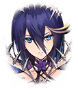

210142111 インテグラルノア編(擬彩されし不可逆世界編) 第14章 ラルゴカタストロフィ―激突― 第２話 決着の刻-11 戦闘前

[View script in lisp](../scripts/210142111.txt)

【ムー】
うはっ…！
こっちまで戦闘の余波が届きやがる

【グランテピエ】
どちらも死力を尽くしてる、ね

【ヘレナ】
本当に見守るだけでいいのか？
テピ姉さんはエンシェントに勝って
欲しいんだろ？

【グランテピエ】
その方がいいとは思っているけど、
私達が割り込んだらダメなんだよ

【グランテピエ】
彼女達の中で決着をつけないと
この先は見出せないから

【ソロモン】
周辺の警戒は任せて
彼女達の戦いを誰にも邪魔させないわ

【カリス】
どんな深手を負ってても、
カリスちゃんがミラクル起こして
みせるから安心してね！

【グランテピエ】
うん
今はエンシェントのみんなを信じよう
それから…

【グランテピエ】
インテグラルキラーズのみんなの
ことも

【マサムネ】
せやああああああ！

【スイハ】
はあああああ！

【マサムネ】
そうだ！
もっとそなたの強さを示せ！
強者こそが世界を担うのだ

【スイハ】
私の刃は強さを示すために
あるのではありません
困難を切り拓くためにあるのです

【マサムネ】
同じことだ
打ち破らねば己の意思を示すことは
できぬ…それが世の道理

【マサムネ】
この一戦こそ、まさにその証では
ないか！

【スイハ】
確かに私達は決着を望みました
しかし、それはあなた達を否定する
ためではありません

【スイハ】
いまだ道は闇の中です…
それでも、より良い未来を掴むため
歩み続ける

【スイハ】
あなた達とともに！

【マサムネ】
くどい！
もはや終焉は免れぬ！
拙者達は不倶戴天の敵！

【マサムネ】
斬って捨てねば前に進めぬのだ！

【スイハ】
たとえ幾度斬られようと、
決して折れることはありません！

【スイハ】
あ…ガハッ…！

【マサムネ】
紙一重といったところか…
そなたの強き魂、見せてもらった

【マサムネ】
…見事だ

【スイハ】
あなたも…

【フライクーゲル】
ヘ～イ！
わたしのワンマンショォォォ～！！

【ネス】
ううっ…
動きがでたらめですっ
規律正しくありません…

【フライクーゲル】
きみもヘアピィになろうよ～っ
自分で自分を縛るなんてノンノン！

【フライクーゲル】
わたしがきみの枷を
摘芯《ピンチ》して
フリーダムにしてあげるよ！

【ネス】
余計なお世話ですっ
常識にとらわれていたことは
ラグナロクにも指摘されました

【ネス】
規律を破るあなた相手なら
わたしだって力の節制はしません！

【ネス】
常識を超えた力、お見せします！

【フライクーゲル】
イエーイ！
そうこなくちゃ！

【ネス】
全力でいきます！
えええいっ！

【フライクーゲル】
オーマイガッ…！？
イッツ、アメイジング…

【フライクーゲル】
きみらしい戦い方だね
ソークゥール

【ネス】
お褒め頂き、恐縮です

【フライクーゲル】
でも…このままじゃベリィサァッド
みんなを…ヘアピィにしないと！

【ネス】
キャアアアア…！？

【フライクーゲル】
ああ…
とっても…ホットなバトルだったね…

【アルテミス】
消えなさい！

【ミネルヴァ】
させません！

【アルテミス】
ハァ…ハァ…
しつこいですね…

【ミネルヴァ】
私達にも…譲れないものがあります
そのためなら…

【アルテミス】
命も惜しくないと…？
その高潔さは…好ましいものです

【アルテミス】
ですが…あなた達は、キル姫は、
消え去らなければなりません

【ミネルヴァ】
その考えに至った経緯…
恐らく私達は…理解しています

【ミネルヴァ】
だからこそ…
決着をつけるべきだと…
判断しましたっ

【アルテミス】
穢れた私達に…理想の未来は存在
しません…分かるでしょう？

【アルテミス】
あの子達の正体を知ったので
あれば…！

【ミネルヴァ】
だからこそです！
この歪で不完全な世界でも…
理想の世界を目指したいんです！

【アルテミス】
穢れた私達に…
そんな未来は訪れません！

【ミネルヴァ】
未来は訪れるものではなく、
そこに向かって進むものです！

Next: [210142121](210142121.md)

[Back to index](index.md)
