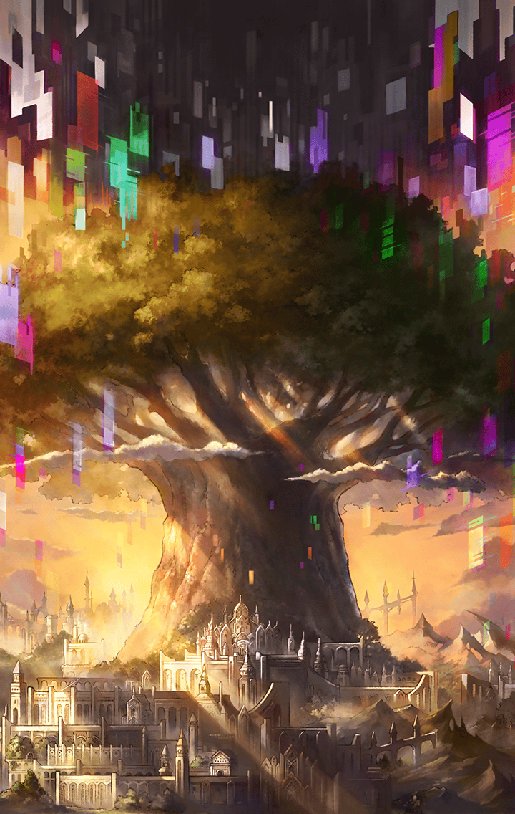
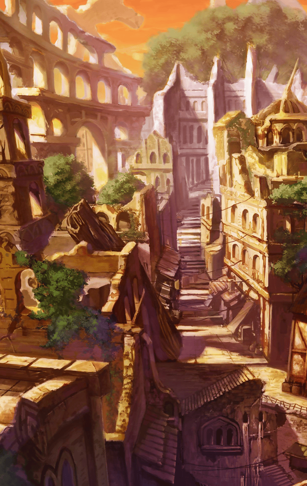

[View script in lisp](../scripts/210151010.txt)

世界への絶望から"終焉"を望む
アロンダイトとロンゴミアント

二人と戦っているうちに、
アルテミスとフライクーゲルが
暴走してしまう

仲間の助けもあり、グランテピエ達は
二人の暴走を解くことに成功するが

"終焉"の脅威が迫っていることを
改めて思い知る

もはや一刻の猶予もないと知り、
エンシェントキラーズは
インテグラルキラーズとの決着を望む

同じ頃、インテグラルキラーズもまた
エンシェントキラーズとの戦いに
決着を望んでいた

グランテピエ達ディスラプターズが
見守る中、両陣営が全てを賭けて
激突する

皆が倒れる中、エルキュールが
レーヴァテインの剣を弾き飛ばし
勝敗は決した

しかし、レーヴァテインは諦めず
その身を棄てて戦おうとする

そんな彼女を抱き留めたのは
グランテピエだった

戦いを終えた彼女達に
グランテピエは協力して"終焉"に
抗って欲しいと求める

そのとき、ユグドラシルから
三人の暴走したキル姫が現れた

運命が描き出されていく――

**【三人】**
アアアアアアアアアアアアアアアアア
アアアアアアアアアアアアア！

**【グランテピエ】**
いこう、みんな！
アルマス達の暴走を解いて
あげないと

**【ソロモン】**
…待って、グランお姉様！
グラウが膨大なマナを検知したわ
これって、まさか…

**【ミネルヴァ】**
いけません…！
ラグナロクが…こちらに銃を向けて
いますっ

**【アルテミス】**
あんな遠くから、
ここまで届くはずが…

**【ソロモン】**
私の計算によると…
この一帯は火の海と化すわっ

**【グランテピエ】**
ソロモンがそう言うなら、
間違いないよ
みんな、急いで逃げて！

**【ラグナロク】**
アアアアアアアアアアアアアアアアア
アアアアアアアアアアアアアアア！！

**【ミネルヴァ】**
何て凄まじい威力――

**【グランテピエ】**
アルテミス！
レーヴァテイン！
良かった…

**【アルテミス】**
ようやく合流できましたね…
他の方々は？

**【ミネルヴァ】**
安心して下さい
皆さん、無事です

**【グランテピエ】**
一旦、バラバラになったけど、
自然と同じ所に集まってきたんだ
これも絆の為せる業、だね

**【カリス】**
あ～っ！
アルテミスとレーヴァテインだ
二人とも怪我してない？

**【カリス】**
わたしがすぐに癒して
あげるからね～っ

**【アルテミス】**
それは必要ありません
それよりも…

**【ミネルヴァ】**
これからのことを話し合わないと
いけませんね

**【ソロモン】**
話は聞かせてもらったわ

**【レーヴァテイン】**
急に出てこないでよ…

**【ソロモン】**
すでに最適解は導き出しているの
これが作戦計画書よ

**【グランテピエ】**
ありがとう、ソロモン

**【グランテピエ】**
ラグナロクとティルフィング、
そしてアルマス…

**【グランテピエ】**
三人の暴走をみんなの力で解こう

**【グランテピエ】**
えっ？
今の音って…

**【グラウ】**
強大なマナを検知…
三体のキル姫が接近してきます

**【ソロモン】**
何てことかしら…！
作戦を皆に伝える時間がないわっ

**【アルテミス】**
それでも、やるしかありません

**【グランテピエ】**
うん
大丈夫だよ
きっと道は拓ける

Next: [210151021](210151021.md)

[Back to index](index.md)
