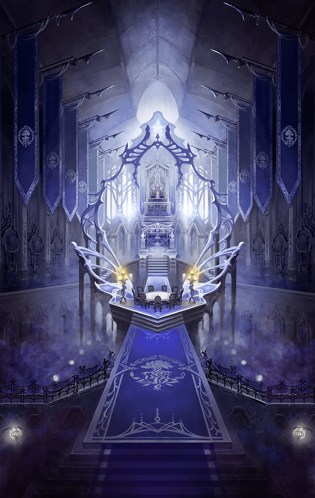

210161043 インテグラルノア編(擬彩されし不可逆世界編) 第16章 中心部決戦―エクリプス― 第１話 妖精の国-4 戦闘後

[View script in lisp](../scripts/210161043.txt)

【アルマス】
せいっ！

【グランテピエ】
たあっ！

【魔獣】
ガアアアアア…

【グランテピエ】
ふぅ…
こんなところにまで魔獣が出てくる
なんて…

【アルマス】
そんなことより、ティルヘルムは
どこにあるの！？

【アルマス】
それらしい建物なんか
どこにも見当たらないんだけどっ

【グランテピエ】
安心して、アルマス
もう着いたから

【アルマス】
着いた？
森が広がってるだけだけど…

【グランテピエ】
普通は分からないんだ
それがオベロン様の張った幻想結界の
凄いところだから

【グランテピエ】
でも、座標を把握していれば…うん
感じられる
ここだ

【グランテピエ】
アルマス、お姉ちゃんの手を握って
はぐれないように

【アルマス】
また、それ？

【グランテピエ】
お願いだから、ね

【アルマス】
…仕方ないわね

【グランテピエ】
うん
懐かしいな、この感じ
手、大きくなったんだね

【アルマス】
離すわよ…

【グランテピエ】
ダメだよ！
今から幻想結界を通り抜けるのにっ

【アルマス】
えっ…！？
ちょっ…何、これぇっ…

【ムー】
おおおおお！？
何もなかったところに…とんでもねぇ
魔力量の壁だああああ！！

【グランテピエ】
お願い…！
私達のことを…通してっ

【アルマス】
えええええ！？
さっきまで…ただの森だったはず…

【グランテピエ】
すごいよね
これがオベロン様の力だよ

【アルマス】
オベロン様って、誰？

【グランテピエ】
それはもちろん、ティルヘルムを
治めている妖精の王様だよ

【アルマス】
妖精の王様…

【グランテピエ】
さあ、アルマス
お城に行こう
きっと、そこにティターニアも――

【？？？】
ソレーヌ！
ルネ！
生きていたんですねっ

【アルマス】
わっ…
何なの、この小さな妖精？

【？？？】
二人とも、
すっかり大きくなりましたね
無事で良かった…本当に

【グランテピエ】
ティターニア…
心配かけて、ごめんなさい
私達…

【ティターニア】
お話は後で
オベロンにも顔を見せてあげて
下さい

【グランテピエ】
そう、だね
行くよ、アルマスっ

【アルマス】
ちょっと…！
私、何が何だか分からないんだけど…

【ティターニア】
オベロン！
ソレーヌとルネが帰ってきましたよ

【オベロン】
おおっ
予知は正しかったのだな
また、こうして会えるとは

【グランテピエ】
ただいま
急にいなくなって…
ごめんなさい

【オベロン】
事情は知っておる
そなた達のせいではない
よく無事であったな

【グランテピエ】
それが…あまり無事とは言えない
状況なんだ…

【グランテピエ】
アルマスが…記憶を失っていて…
ここにいたことも覚えてないの

【ティターニア】
そうなんですか、ルネっ？

【アルマス】
いや、ルネって誰よ
私はアルマスなんだけど

【ティターニア】
あ…そうでしたね…
ごめんなさい…

【アルマス】
…とにかく、私自身のことを
教えて欲しいの

【ティターニア】
あなたのことをお話しするのは
構いませんが、どうして記憶を…？

【オベロン】
ふむ…
アルマス、こちらに

【アルマス】
何？

【オベロン】
…なるほど
キラーズに細工が施してあるな

【オベロン】
アルマスよ
そなたは元々、キラーズに適合しては
いなかった

【オベロン】
そなたの中にあるキラーズは、
死に瀕しておったそなたの生命力を
維持するため…

【オベロン】
ティターニアが自らの力を分け与えて
繋ぎとめておったものだ

【アルマス】
私がキラーズに適合してない？
…って、その前に死にかけてたって
言った！？

【グランテピエ】
うん…
天上世界で少し話したよね
ティターニアに助けられたんだって

【ティターニア】
ですが、オベロン
今のアルマスは…
それにソレーヌ…グランテピエも…

【オベロン】
うむ
二人とも適合しておる
だが…

【オベロン】
アルマスのキラーズが記憶の一部に
蓋をしておるようだ

【オベロン】
キラーズを適合させた者が何らかの
意図をもって封じたのだろう

【グランテピエ】
あ…もしかして…

【グランテピエ】
ヴァリン博士が
気を遣ってくれたの、かな

【オベロン】
幼子に無理は禁物であったが、
今のそなたなら儂の力にも耐えうる
体力がある

【オベロン】
儂の力で蓋を外してやろう

【ティターニア】
オベロン！
強引なことは止めて下さいっ

【オベロン】
おお…すまん…

【アルマス】
いえ、構わないわ
やって、オベロン！

【アルマス】
私は思い出したいの
ううん…思い出さないといけない

【アルマス】
仲間のために
世界のために
自分自身のために

【ティターニア】
アルマス…
昔は体が弱くて泣き虫だったのに…
立派になりましたね

【ティターニア】
分かりました
あなたの決意を信じます

【グランテピエ】
お姉ちゃんが手を握っててあげるから
大丈夫だよ！
絶対のぜーったいに、ね

【オベロン】
では、いくぞ
そなたの記憶を解き放つ

Next: [210161050](210161050.md)

[Back to index](index.md)
