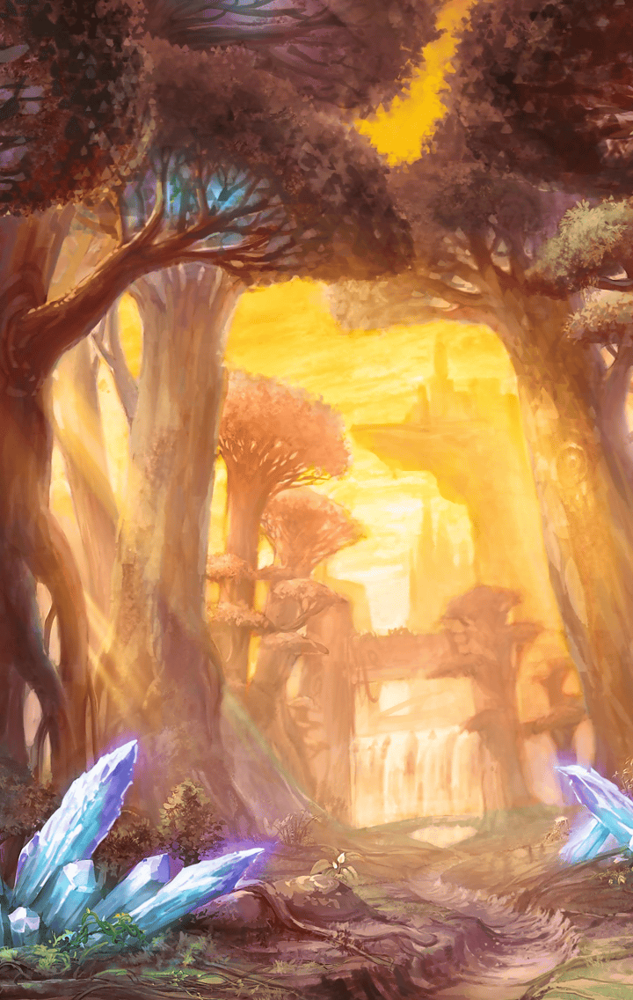

[View script in lisp](../scripts/210161060.txt)

**【ルネ】**
おねえちゃん、まってー！

**【ソレーヌ】**
ほら、走ったら危ないよ
お姉ちゃんはここにいるから、ね

**【ティターニア】**
二人とも、
すっかり元気になりましたね

**【ルネ】**
あ！
ティニだっ

**【ソレーヌ】**
こーら
ティターニア、だよ

**【ティターニア】**
ふふふっ
いいんですよ

**【ティターニア】**
二人でお散歩ですか？
くれぐれも、幻想結界から外には
出ないようにして下さいね

**【ルネ】**
はーい！

**【ティターニア】**
ふふっ
いいお返事ですね
うっ…

**【ソレーヌ】**
ティターニア！？
どうしたのっ…

**【ティターニア】**
何でもありませんよ…
失礼しますね…

**【ルネ】**
おねえちゃん…
ティニ、くるしそうだったよ

**【ソレーヌ】**
うん…

**【ソレーヌ】**
…………

**【ソレーヌ】**
妖精さん達がティターニアのことを
噂してた…

**【ソレーヌ】**
私達を助けた代償で…いつも体に
負荷がかかってるって…

**【ソレーヌ】**
このままだと…
ティターニアが消えてしまうかも
しれないって…

**【ソレーヌ】**
そんなこと…
でも、もし本当だったら…

**【ルネ】**
…おねえちゃん、おきてる？

**【ソレーヌ】**
どうしたの？
眠れないなら、お姉ちゃんのところに
おいで

**【ルネ】**
うん…
あのね…ようせいさんたちが
はなしてたの、きいちゃったの…

**【ルネ】**
わたしたちのせいで、ティニは
くるしいおもいしてるの…？

**【ソレーヌ】**
ルネも聞いちゃったんだ…
どうしよう…

**【ルネ】**
そんなの、イヤだよっ
どうしたらティニをげんきにして
あげられるのかな…？

**【ソレーヌ】**
それは…

**【ルネ】**
おねえちゃん！
このおはなをさがそうっ

**【ソレーヌ】**
どうしたの？
その本、植物図鑑、かな
難しいの読んでるね、偉いね

**【ルネ】**
あのねっ
ティニがかみかざりにしてる
おはななのっ

**【ルネ】**
これをあげたらティニ、げんきに
なるとおもうんだっ

**【ソレーヌ】**
ふふっ
そうだね
じゃあ、探しにいこうか

**【ルネ】**
うん！
おねえちゃん、
て、つないでー

**【ソレーヌ】**
はい
…お花を探すなら、やっぱり
あっちかなあ

**【ソレーヌ】**
幻想結界に近いから、
出ないように気をつけないと、ね

**【ルネ】**
うーん…
みつからない…

**【ソレーヌ】**
もう日が暮れそう…
そろそろ帰ろうか

**【ルネ】**
えーっ…
もうちょっと…あ！
あのおはなっ

**【ソレーヌ】**
あ、ルネ！
走ったら危ないよ…あれ？

**【ソレーヌ】**
ここ…いけない！
いつの間にか結界の外に出てる…
ルネ！

**【？？？】**
おい！
何で、こんなところに子どもが
いるんだ！？

**【？？？】**
何だ、この子ども達…
内包しているマナが異常な数値だぞ

**【ルネ】**
ひっ…
オジサンたち、だれ…？

**【ソレーヌ】**
ルネ！

**【？？？】**
ついに見つけたぞ…
きっと妖精に違いない！
捕まえろ！

**【ルネ】**
イヤーっ…！
おねえちゃぁぁん…

**【ソレーヌ】**
やめて！
妹を離してっ…

**【？？？】**
二人とも確保だ！
俺達は運が良いぞ

**【？？？】**
妖精の国を探していたら、
こんな上等な実験体を
見つけられるなんてなっ

**【研究員１】**
これは興味深い…
妖精に育てられた人間の子ども
しかもキラーズを有している

**【研究員２】**
二人ともキル姫化はしていないな
どういうことだ？

**【研究員３】**
まだ幼すぎるからでは？
姉の方は適合させられそうだが

**【ルネ】**
ううっ…

**【ソレーヌ】**
大丈夫だよ…
お姉ちゃんがついてるからね

**【ソレーヌ】**
お願いです
私はどうなってもいいから
妹には何もしないで下さい

**【研究員１】**
ほう…
取引ができる立場だと思って
いるのか？

**【研究員２】**
まあ、いいじゃないか
妹の方は実験に耐えられるほど
体力があるとは思えん

**【研究員３】**
もう少し大きくなるまで
姉の方で実験を行おう

**【研究員１】**
フン！
では、まず姉の方をキル姫化する

**【ルネ】**
おねえちゃん…

**【ソレーヌ】**
大丈夫…
ルネは私が守るから
絶対のぜーったいに、ね

**【ソレーヌ】**
あ…あああああああああああ…！？

**【研究員３】**
キラーズの活性化を確認
適合率は９０％を超えている
いけるぞ！

**【ソレーヌ】**
私の中から何かが…
湧き上がってくる！

**【研究員２】**
成功だ
キラーズ、グランテピエに完全に
適合した

**【研究者１】**
バハムートの獣刻も問題ない
…いや、力が安定していないな
チッ

**【研究者２】**
やはり力が強大過ぎるようだ
制御の方法が課題だぞ

**【研究者３】**
見てみろ
実験体の体も随分と成長している
バハムートの影響だろうな

**【ソレーヌ】**
グランテピエ…？
これが…私…

**【グランテピエ】**
何で…？
体が大きくなってる…
変な…感じ…

**【研究員１】**
キル姫、グランテピエ
我らの崇高な目的のため、
その身を捧げてもらうぞ

Next: [210161070](210161070.md)

[Back to index](index.md)
