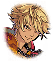

[View script in lisp](../scripts/210171051.txt)

【ムラマサ】
せいっ！

【シユウ】
うがあああ！

【ゴーレム】
ゴオオオオオオオオ…

【シユウ】
うがあああ！
うぞうむぞうがわいてくる…！

【ムラマサ】
斬っても斬ってもきりがありません

【アフロディーテ】
こんな人形相手では、美も愛も
感じられませんわ…

【ヴァナルガンド】
数で優位に立てるはずが、
こちらが不利になってしまって
います

【ヴァング】
おい、リサナウト！
このままじゃ押し潰されるのが
オチだぞっ

【リサナウト】
心配しなくてもいいわ
言ったでしょ
私達の勝利は確定しているの

【ヴァング】
何でそんなに余裕があんだ！？
また時間を操るつもりかっ？

【リサナウト】
その必要はないわ
あと…少しだから

【巨大死霊】
ＧＹＡＡＡＡＡＡＡＡＡＡＡＡＡＡＡ
ＡＡＡＡＡＡＡＡＡＡＡＡＡＡＡ！！

【ムラマサ】
巨大な魔物が、また増えました…！

【巨大死霊】
ＧＹＡＡＡＡＡＡＡＡＡＡＡＡＡＡＡ
ＡＡＡＡＡＡＡＡＡ…！？

【イチイバル】
おや…？

【ゼロ】
これ以上、好き勝手はさせねぇぞ
デカブツども！

【アルテミス】
ようやく準備が整ったよ
作戦決行だ

【アポロン】
みんな！
朝日を浴びて良い汗をかこう！

【ミョルニル】
朝からうるせぇな…

【トライデント】
迷惑をかけた分、ここで挽回して
みせる

【八咫鏡】
うぬらの相手は我らだ！

【ロンギヌス】
また魔物退治か…
一掃してやるよ

【ダグダ】
うむ
ここで不動の盾となろう

【アスクレピオス】
そんなわけだから、周りの魔物は
僕達に任せて、君達はあっちに
集中してていいよ

【ヴァング】
キラーメイルじゃねぇか！
…見覚えのない奴が指揮してる
みたいだが

【リサナウト】
想定より３０秒遅かったけど、
ポイント減点はなしにしておいて
あげるわ

【リサナウト】
ダーインスレイヴ、グングニル、
ヴォータン、手伝ってあげて

【ダーインスレイヴ】
いいだろう
巨大な異形であっても、
その咎を償わせる

【グングニル】
数ばかりなら、つまらぬ争いだ
すぐに鎮めてみせよう

【ヴォータン】
この戦場を最も早く駆け抜け
蹂躙するのは、この私よ！

【カミト】
兄貴！

【ヴァング】
カミト、やっと来たな！
待ってたぜ
お前、その腕…

【カミト】
義手が壊れてしまって…
でも、大丈夫！
僕はやれるよっ

【ヴァング】
いい目してんじゃねぇか
心配はいらないみたいだな

【アスカロン】
遅くなってすみません！
私達も全力で戦いますっ

【グリモワール】
フォルカスはあそこね
あいつは私達が相手するわ！

【ヴァング】
そういや、ティルフィングは
どうした？
レーヴァテインもいねえな…

【カミト】
うん
実は…

【ゼロ】
はあああっ！

【ゼロ】
おいっ
この化け物ども、増える一方だぞ
どうなってやがる！？

【ティルフィング】
これは…“終焉”の気配を感じます
アレが迫っている影響で…

【レーヴァテイン】
ティル、どうする？

【ティルフィング】
コマンドキラーズと戦うために
ユグドラシルへ向かいたいのですけど
…放っておくわけにもいきませんね

【ティルフィング】
この魔獣達が“終焉”の影響による
のなら、尚更です

【レーヴァテイン】
それなら…私もここでティルと
一緒に戦う…

【ティルフィング】
ありがとうございます
ただ、カミト達は…

【カミト】
ごめん
僕達はユグドラシルに行かせて
もらうよっ

【ゼロ】
こっちは俺達に任せろ！
そこのキラープリンセスも
手伝うんだろ？

【テュルソス】
そうだね
元々、私達は町を守る役割だったし

【グリダヴォル】
いたずらに死者を増やすのは
私の望むところじゃない

【ゼロ】
よし、決まりだ！
お前らは行け！

【カミト】
あ、ありがとうございます！

【アスクレピオス】
ちょっと待った
君にも一緒に来てもらうよ、ゼロ

【ゼロ】
ああん？
その声は…腹黒メガネか

【アスクレピオス】
君は相変わらず、力押しの脳筋だね
とはいえ、戦闘力とカリスマ性は
評価しているんだ

【アスクレピオス】
ここの魔物は彼女達だけで十分、
対処できる
それよりやって欲しいことがあるんだ

【ゼロ】
やって欲しいことだと？
またろくでもないこと考えてるんじゃ
ないだろうな

【アスクレピオス】
酷いな
僕の作戦がろくでもなかった試しが
一度でもあったかい？

【ゼロ】
数限りなくだ！
くそっ…さっさと用件を言え！

【カミト】
…それで、ティルフィング達には
町を守ってもらってるんだ

【ヴァング】
そいつは助かる
これで心置きなくコマンドキラーズと
戦えるぜ！

【ヴァング】
お前はしっかり、
フォルカスを連れ戻してこい！

【カミト】
うん！
いこう、兄貴！

Next: [210171060](210171060.md)

[Back to index](index.md)
