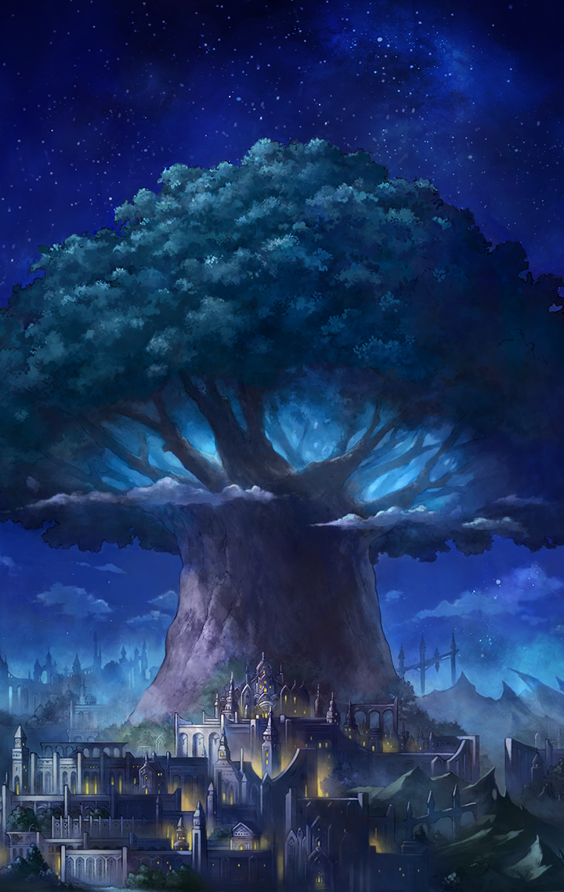

[View script in lisp](../scripts/210182120.txt)

【アルマス】
むう…

【グランテピエ】
追いつけなかった、ね…

【アルマス】
悔しいわね…
やっぱり“終焉”に近づくのを
覚悟で、このまま――

【フォルカス】
はぁっ！

【アルマス】
わっ？
ビックリした…

【ヒョウハ】
よっしゃあ！
やっと出られたぞ

【アスカロン】
ここは…天上世界ですね

【グリモワール】
まったく…
ひどい罠だったわ…！

【グランテピエ】
君達、今までユグドラシルの中に
いたの、かな？

【フォルカス】
はい…
フリズスキャールヴを追っていたの
ですけれど…

【ヴァナルガンド】
途中で無数の鎖に襲われて…
油断していました

【如意金箍棒】
何とかみんな抜け出せたけど、
フリズスキャールヴを
見失っちゃったね…

【アルマス】
お姉ちゃん、もしかして…

【グランテピエ】
うん
もう一人、グレイプニルがいるって
言ってたから、彼女じゃないかな

【フォルカス】
それで、フリズスキャールヴは
どこに？

【アルマス】
ついさっきユグドラシルに戻って
いったわ
仲間を連れてね

【フォルカス】
仲間ですか…
その者もやはり“終焉”と繋がって
いるキル姫なんですね？

【グランテピエ】
うん
一度、集まって話をした方が
良さそう、だね

【ティルフィング】
…あの、マスター

【ティルフィング】
…………

【ティルフィング】
…ごめんなさい

【ティルフィング】
私達は理想郷を…
せっかくマスターが…ううっ…

選択肢:
- ずっと見ていたよ → [select_label_01](#select_label_01)へ
- 君は悪くない → [select_label_02](#select_label_02)へ
- ただいま → [select_label_03](#select_label_03)へ

私達は理想郷を…
せっかくマスターが…ううっ…

#### select_label_01:
 → [select_label_end](#select_label_end)へ

【ティルフィング】
あ…マスター
私も、いつもマスターを近くに
感じていました

#### select_label_02:
 → [select_label_end](#select_label_end)へ

【ティルフィング】
…やっぱり、
マスターは優しいですね

#### select_label_03:
 → [select_label_end](#select_label_end)へ

【ティルフィング】
え…お、おかえりなさいっ
ふふっ

#### select_label_end:

【ティルフィング】
私達は、永遠の理想郷を創ることが
できませんでした…

【ティルフィング】
ですが、新しい理想を見つけました
誰も犠牲にならない道を

【ティルフィング】
また、お力を貸していただけますか？

選択肢:
- 当然だ！ → [select_label_04](#select_label_04)へ
- もちろん！ → [select_label_04](#select_label_04)へ

また、お力を貸していただけますか？

#### select_label_04:

【ティルフィング】
ありがとうございます、
マスター！

【ティルフィング】
今度こそ、やり遂げてみせます
皆と、マスターと一緒に

【ラグナロク】
…ということよ

【フォルカス】
“終焉”に与する新たなキル姫…
もう猶予はなさそうですね

【アルマス】
そういうこと
だから、お願い
全員の力を合わせて欲しいの

【アルマス】
そうじゃないと、“終焉”には
対抗できないわ

【グランテピエ】
私達はもちろん賛成だよ

【ティルフィング】
私達も覚悟を決めました
レーヴァテインもすぐこちらに
来てもらいます

【ラグナロク】
私達も異論はないわ
コマンドキラーズと共闘することもね

【フォルカス】
世界を守りたいのは私達も同じです
“終焉”と戦うのなら手を組める
でしょう

【アスカロン】
私達も一緒に戦います！

【アルマス】
うん
みんなの気持ちは――

【リサナウト】
私達もいるわよ

【アルマス】
わっ！？
また急に現れて…

【グランテピエ】
リサ、地上は大丈夫？

【リサナウト】
心配いらないわ
ちなみにティファレト達にも
連絡はしてあるから

【アルマス】
あの三人も来るってことね
それじゃ、準備を整えて

【アルマス】
ユグドラシル内部に乗り込むわよ！

【ユグドラシル】
ううっ…あ！

【ユグドラシル】
ああ…もうすぐなのね…
もうすぐ、ここに…

【ユグドラシル】
ええ、分かってるわ
これが私達の運命なのだから…

【ユグドラシル】
たった一度きりの邂逅を
恐れたりはしない
私の“終焉”

Next: [210191010](210191010.md)

[Back to index](index.md)
