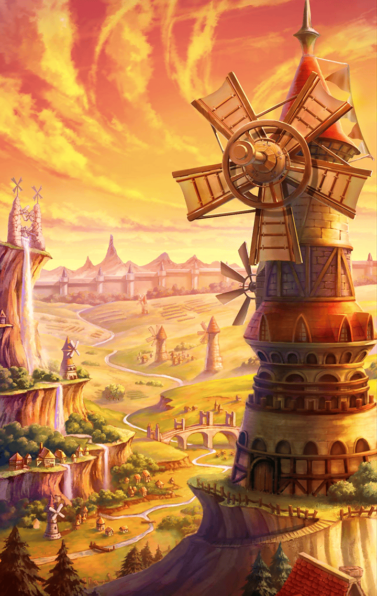

**【%(userName)s】**
今日も世界は平和だ

**【%(userName)s】**
もちろん小さな争いごとはあるけれど
概ね穏やかに暮らしている

**【%(userName)s】**
皆が幸せに過ごせる世界
そんな理想郷みたいな日々が続いて
いるのに…

**【%(userName)s】**
何故か満たされない自分がいた

**【%(userName)s】**
どうしてなのかは分からない
ただ…
ずっと心に引っ掛かっている…

**【アルマス】**
あっと！？
ごめんなさいっ

選択肢:
- 大丈夫だよ → [select_label_01](#select_label_01)へ
- ………… → [select_label_02](#select_label_02)へ

あっと！？
ごめんなさいっ

#### select_label_01:
 → [select_label_end](#select_label_end)へ

**【アルマス】**
良かった
久し振りの町だったから、
ちょっと余所見してて…

#### select_label_02:
 → [select_label_end](#select_label_end)へ

**【アルマス】**
どうしたの？
ボーッとしちゃって

#### select_label_end:

**【アルマス】**
お詫びに、これあげるわ
元気が出るわよっ

**【アルマス】**
チョコレート
さっき良いの買ったんだ♪

**【アルマス】**
どう？
美味しいでしょっ

**【アルマス】**
…ねえ
チョコレートをじっと見て
そんなに珍しいものじゃないわよ

選択肢:
- 何か忘れている気がする → [select_label_03](#select_label_03)へ
- 誰か足りない気がする → [select_label_04](#select_label_04)へ

…ねえ
チョコレートをじっと見て
そんなに珍しいものじゃないわよ

#### select_label_03:
 → [select_label_end1](#select_label_end1)へ

**【アルマス】**
忘れ物？
一緒に探してあげよっか？

#### select_label_04:
 → [select_label_end1](#select_label_end1)へ

**【アルマス】**
誰か足りないって…
あなたの知り合い？

#### select_label_end1:

**【アルマス】**
あっ！
…急に走り出して
どうしたのかしら？

**【グランテピエ】**
アルマスーっ
どこにいったの、かな？

**【アルマス】**
あ、いけないっ
お姉ちゃんが捜してる…

**【住民１】**
無くしたもの？
何を無くしたんだい？
…え？特徴も何も分からない？

**【住民２】**
人を捜してるのかも、ねぇ
名前も知らない人を捜してるって…
あんた、頭おかしいんじゃないか

**【住民３】**
いや、無くしたものが何なのか
分からないまま聞かれても…

**【住民４】**
そりゃ、あんたの気のせいだよ
寝て起きたら全て忘れてるさ

**【ロンギヌス】**
随分、思い詰めていますね…
この教会はいつでも誰でも歓迎
致しますので

**【ロンギヌス】**
主は、いつもあなたの側におわします
ずっと見守り続けているんです

**【ロンギヌス】**
…………

**【ロンギヌス】**
誰かがいない気がする…
その思い、少しだけなら分かります

**【ロンギヌス】**
私も以前、旅立つ勇気をくれた人が
いたように思うことがあるんですけど
…全く思い出せません…

**【ロンギヌス】**
そもそも、そんな経験、私はして
いないはずなのに…

**【アルテミス】**
全世界の戸籍を調べたい？
あなた、からかっているんですか…

**【アルテミス】**
役所はそういう場所ではありません！
…誰かをお捜しなら、まず名前と
特徴を仰って下さい

**【アルテミス】**
…キル姫かもしれない？
それでしたら、一つ確認できることが
ありますよ

**【アルテミス】**
こちらがキル姫の一覧です
この中にあなたの捜している
キル姫はいますか？

**【アルテミス】**
いないのでしたら、そんなキル姫は
存在しません
そういうことです

**【アルテミス】**
…………あの

**【アルテミス】**
これは、あくまで私個人の見解
なのですけれど…

**【アルテミス】**
そのキル姫は、あなたと特別な絆が
あったのかもしれませんね

**【アルテミス】**
存在していたらの話ですよっ
この一覧の中にいないのですから
考えられませんけれど！

**【アルテミス】**
けれど…
理想を求めて歩み続けた背中を、
私も見たことがあるような…

**【アルテミス】**
そんなはず、ないのに…

**【フライクーゲル】**
ヘ～イ！
ヘアピィしてるぅ？

**【フライクーゲル】**
アウチッ…
そんなサァッドな顔してちゃ
ヘアピィが逃げちゃうよ！

**【フライクーゲル】**
…ワッツ？
誰か捜してるの？
誰も知らない人を？

**【フライクーゲル】**
オウ！
イッツ、アメイジング

**【フライクーゲル】**
バット…もし記憶を摘芯《ピンチ》
してたのなら、忘れてるだけかも
しれないね

**【フライクーゲル】**
世界中のどこにもいないキル姫
世界そのものが記憶を無くして
しまったのかも…

**【フライクーゲル】**
…あれ？
ピンチって…

**【フライクーゲル】**
うーん…
何だか、わたしも少しサァッドな
気持ちになっちゃった…ホワイ？

**【マサムネ】**
そこの者、止まれ
ここより先は関係者以外立ち入り
禁止だ

**【マサムネ】**
…キル姫を捜している？
残念だが、ここにそなたの求める者は
おらぬ

**【マサムネ】**
早々に立ち去るがいい
…いや、待て

**【マサムネ】**
そなたが捜しているのは…
剣ではないのか？

**【マサムネ】**
…不意にそのような気がしただけだ
拙者の目の前で、ついに高みに至った
剣持つ者

**【マサムネ】**
あれは…夢幻の類であったのか…

**【マサムネ】**
…捜し続けるのなら、助言をやろう

**【マサムネ】**
外ばかりに目を向けず、内に目をやり
己を見つめ直すことも肝要だ

**【マサムネ】**
一見して遠回りな道の方が、
存外に近道なのやもしれん

**【パラシュ】**
植物園にようこそ
君も薔薇が目当てかい？

**【パラシュ】**
…キル姫を捜している？
花に興味があるわけじゃないのか
だったら帰ってくれ

**【パラシュ】**
こんなところで時間を潰している
場合じゃないだろう
君の求めるものを一心に捜さないと

**【パラシュ】**
…自分を見つめ直したい？
ふぅん
それは悪くないね

**【パラシュ】**
匂いは記憶と繋がりやすいというよ
ここに咲いている花々が捜索の
手がかりになるといいね

**【パラシュ】**
…どうしたんだい？
随分、長いこと
そこにいるね

**【パラシュ】**
ああ、それか…

**【パラシュ】**
コスモス…
理由は分からないけど、
この花を見ると…

**【パラシュ】**
何かを思い出しそうになって…
胸が苦しくなるんだ
だから、あまり見たくない…

**【パラシュ】**
そういえば、コスモスの花言葉は…

選択肢:
- 色褪せぬ純潔 → [select_label_05](#select_label_05)へ

そういえば、コスモスの花言葉は…

#### select_label_05:

**【パラシュ】**
確か「乙女の純真」だったかな
…何だい、「色褪せぬ純潔」って？
そんな花言葉…

**【パラシュ】**
色褪せぬ純潔…
汚れ無き純潔な存在…
ボク達を導く…

**【パラシュ】**
何でだ…
何も思い出せないのに…
思い出せないから…胸が苦しいっ

**【パラシュ】**
ボク達は…
なあ、君なら分かるのかっ？
ボク達が何を忘れてしまったのか…

**【パラシュ】**
あ、君っ…！
…走っていってしまった

**【？？？】**
ああ、マスター…！
止めて下さい…

**【？？？】**
どんなに捜しても、私を見つける
ことはできません…
もう、私は…

**【？？？】**
この世界の外で、世界全体を観測する
存在になりました
それに…

**【？？？】**
長い長い時を過ごすうち、
自分自身の姿を思い出すことが
できなくなってしまったんです…！

**【？？？】**
どうしたって…
アナタの前に姿を現すことは
できません

**【？？？】**
お願いです、マスター
どうか、私のことは諦めて…
