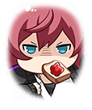
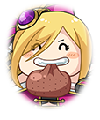
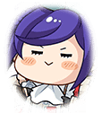

[View script in lisp](../scripts/210290051.txt)

多くの食料に恵まれた国
ふくよか連合

連合の名の通り、国内には
いくつかのグループが存在し、
国の体裁を保っている

和食を好む“和食家”
好きなものを食べる“満腹結社”
食事と運動を好む“健康騎士団”

それらが纏まっていたのは、
連合盟主としてマサムネが
いたからである

しかし彼女は突然姿を消し、
やむなく妹ムラマサが盟主を
引き継いでいる

連合盟主としての力が足りないと
実感するムラマサは、
七人の勇者を捜すことを決意する

【雑賀】
ケホッ…ケホッ…
あ～、そろそろ出発っすか

【トライデント】
おまたせ～！
ピクニックみたいで
楽しみだな～☆

【ムラマサ】
はむはむ…んっ…
雑賀、トライデント
よろしくお願いします

その旅の途中、
レーヴァテインと戦う
シユウ、ヴァナルガンドを見かける

【アイムール】
遅刻者アイムール、
防衛行動に移ります

アイムールの乱入で
なんとか危機を乗り越えたものの、
レーヴァテインは逃げてしまう

【シユウ】
ヴァドはいっつもやさしいんだぞ！
こころもからだもでっかくて
だきついたかんしょくもばつぐんだ！

【ヴァナルガンド】
あらあら～
今、冬毛ですからね～

暴走するレーヴァテインを追うため
二人も旅についてきてくれることに

目的地は連合の派閥の一つ
“満腹結社”だった

結社の近くまで来たところで、
正体不明の生物に囲まれ
窮地に追い込まれたムラマサ達

【異族？】
ぷぎぃぃぃっ…！
（腹減ったぞー！飯をよこせぇ！）

【シユウ】
なんだ、こいつらー！

【ムラマサ】
くっ…囲まれた

【？？？】
その醜怪な姿、許しません！

【異族？】
ピギイィィィ…
（死ぬ前に、特上寿司…
食べたかったな…）

【ムラマサ】
そなた達は…？

【アフロディーテ】
究極な美とは、
触りたくなるような丸みに宿る
―そう、それは私のことです！

【エロース】
エロースよ
ふふっ…エロースの恋の魔法、
かかってくれた？

【ミストルティン】
ひゃっ…ミストルティンです
あ、あの…お怪我は…
な、なんでもないです

アフロディーテの圧倒的自信に
勇者としての力を感じた
ムラマサだったが

三人はすぐさま
いなくなってしまう

【ブラフマーストラ】
アタシはブラフマーストラ
“満腹結社”の幹部さ
アタシのダンス見ていきなよっ

【トライデント】
わぁお！
派手なお姉さんだね～☆

ようやく“満腹結社”に
到着したメンバーは
明るい女性からの歓待を受けるが

【ルーン】
健康騎士団のルーン様が
来てやったんだ！
とっとと顔出せよっ

“満腹結社”と対立する
“健康騎士団”のルーンが
攻めてきた

なんとか仲裁し、“健康騎士団”の
拠点に案内してもらうが、
そこでは…

【デュランダル】
『食事は優雅に静かに』が
騎士のたしなみですわ
負けるわけにはいきません

【ロンゴミアント】
挑まれたからには受けるしか
ありませんね…
さあ、横綱相撲を見せてあげます

夕飯の献立をめぐって
騎士達が決闘を行っていた

【ムラマサ】
な、なるほど…
それは難しい…

【シユウ】
ちゃーしゅーおおもりだ！

【ルーン】
それなら
最後まで起きてた奴が
献立を決めるってことで！

Next: [210290053](210290053.md)

[Back to index](index.md)
