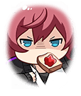

[View script in lisp](../scripts/210290061.txt)

【テュルソス】
ほらほら～！
杯が空いてるよ？

【タスラム】
盟主はやっぱ
ニンニクマシマシだよな！
ほら、どんどん食え！

【ムラマサ】
…ゲイボルグ
お二人を止めて下さい

【ゲイボルグ】
その程度の飯ハラ、
ご自身で対応しなさい

宴会組のハラスメントに耐えつつ、
仲間と合流したムラマサ
遺跡について共有する

そこに乱入してきた
レーヴァテインとフライクーゲルを
正気に戻したのもつかの間

【シャルウル】
ムラマサ様！
マサムネ様の行方がっ…
あぁっ…お茶がっ…！？

シャルウルが、
マサムネ発見の報せを告げる

【マサムネ】
…拙者は、
食わねばならん！

【アポロン】
ちょっときつい、かも？
熊（お姉ちゃん）！もっと頑張って！

【青龍偃月刀】
お金が切れて
馬も動かなくなりましたし
ここは一旦退きましょう

【ヴォータン】
バカを言うな！
この程度の相手に退くなどっ…！？
くっ、パネルが外れないだと…！？

なんとかマサムネを捕らえ、
一安心の面々だが、

【スラーンド】
うぉら～！
あたしの魅力を味わいなさい

【レシェフ】
あたしの空中殺法を
見せてあげる！

“満腹結社”のメンバーに
襲撃を受けてしまう

【ムラマサ】
何者！？

【アイムール】
遅刻者アイムール
護衛します

敵を撃退したものの、
結社の真意を知るべく
“満腹結社”頭首プタハと相対した

【プタハ】
よく来てくれた盟主殿
せっかくの機会だ
夕餉を食べていかれないか？

【ムラマサ】
っ…そ、そんなことより
拙者の命を狙う、
その理由をお聞きしたい

二人の話し合いは平行線に終わり、
ついに結社はムラマサに
攻撃を仕掛ける

【ワズラ】
世界を押しつぶす
ワズラの大質量攻撃、
受けなさい

【アロンダイト】
う…これは夢よ…
そうよ、これは幻に違いないわ
ならば、目の前に立つ者は斬ります

【ナーゲルリング】
ひとまず私とネズミ達の後ろに
隠れててもらえますか？

追っ手を軽々と打ち倒す
アロンダイトに助けられたムラマサは
仲間と合流を果たす

【マサムネ】
もぐっ…
やはり握り飯は美味いな

そこで待っていたのは、
元気な姿を見せるマサムネ

【マサムネ】
ムラマサ、見ないうちに
大きくなったな
さて、これからいかにする？

【ムラマサ】
はい！
今一度、プタハと相対し、
その真意を問いただします！

Next: [210290063](210290063.md)

[Back to index](index.md)
