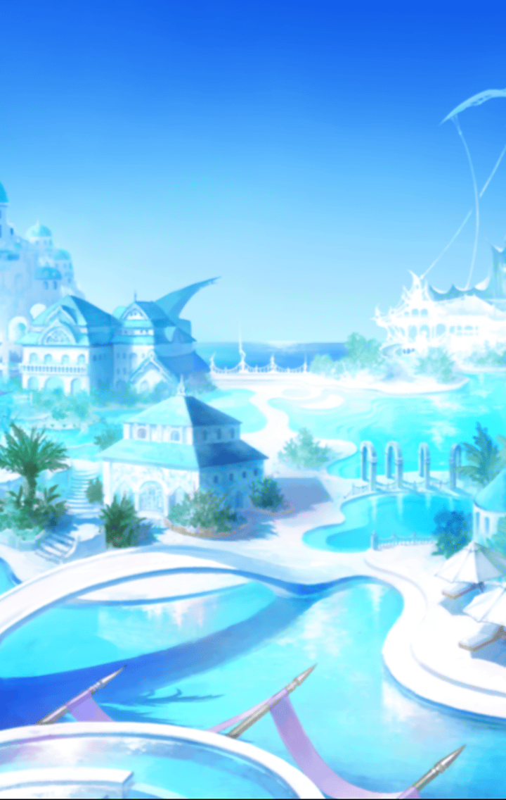

[View script in lisp](../scripts/210290071.txt)

ふくよか連合の一角、
盟主の拠点にて―

三国会談を行うべく
マサムネを王国への使者とする
ムラマサ

共存の道を進むふくよか連合
しかし、ダイナマイト帝国の進軍が
始まる

【ムラマサ】
ただちに国境の守りを固めて下さい
ただし、こちらから討って出ないよう

【シャルウル】
承知しました

一方、連合へ攻め入ろうと考えていた
フォルカスは
ムラマサからの書状に混乱していた

【フォルカス】
会合ですか…
そうですね
受けましょう

【パラシュ】
ボクは反対だよ、陛下

【フォルカス】
…あなたの気持ちも分かるけれど、
話し合いの余地は―

【パラシュ】
そんな悠長なことを言っていたら
…そうだ…この島は滅ぶんだよ！

【フォルカス】
パラシュッ！？

正気を失ったかのように
走り去るパラシュ

【カラドボルグ】
大変よ、陛下！
パラシュが隊を率いて突撃をっ！

【フォルカス】
仕方ありませんっ…！
このまま攻撃を仕掛けます！

一方のぽっちゃり王国にも
連合からの使者がやってくる

【ケラウノス】
盛り上がってるとこごめんね～
連合からの使者が来たよ～？

ケラウノスに連れられてきた
連合の使者マサムネは、
連合との同盟を打診する

対価は連合の食料

【アスカロン】
…わかりました
そのかわり
一つだけ約束してください

【アスカロン】
帝国への攻め方は
私達が決めます

【マサムネ】
…それは当然のこと
一切口を挟まぬ

【メギド】
よろしいのですか、陛下
マサムネにはなにか企みが
ありそうですわ

【アスカロン】
はい…なので、
急いで呼んできて欲しい方が…

【シストルム】
ボクがお役に立てると
思うのにゃ！

【アスカロン】
シストルム！？
どうして本棚の隙間に？

【シストルム】
ご主人様はなんでも
お見通しなのにゃ

※早送りの範囲が広いですが、
バグではありません

三国入り乱れての戦闘が続き、
ついに決着の時が訪れる

【ティルフィング】
三国統一を果たし頂点に立った者は
島のために生贄になります
それでも良いですね？

【フォルカス】
覚悟は出来ています
私が食べられなくても
皆がお腹いっぱいになれば！

【ムラマサ】
食料のために命を掛ける…
武士として誉れに思います

【アスカロン】
私が生贄になって
皆に食料をっ！

Next: [210290073](210290073.md)

[Back to index](index.md)
