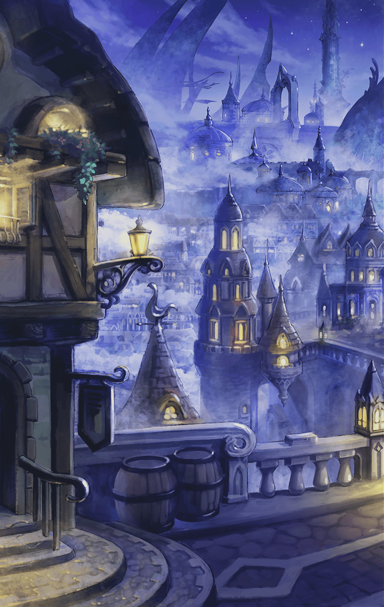

[View script in lisp](../scripts/210410070.txt)

**【ベガルタ】**
ねぇ赤ずきん
あっちに綺麗なお花があったよ
おばあさんにプレゼントしよう

**【モラルタ】**
まぁ、狼さん
いいことを教えてくださって
ありがとう

無事ハロウィンを終えたのだが
ふたりはとても楽しかったらしく
衣装を脱ごうとしない

**【モラルタ】**
狼のお腹って
内側からじゃ切り裂けないのかな

**【ベガルタ】**
…うーん
私はお腹の中から切り裂かれた
ことがないからわからないよ？

**【モラルタ】**
そっかぁ
それじゃあお話はここまでだね

**【ベガルタ】**
うん、お腹切られなくてよかった

**【モラルタ】**
ねぇ、ベガ
私気になってることがあるの

**【ベガルタ】**
私もそれが気になっていたのよ、モラ

二人の世界に浸っていたはずの
四つの瞳がマスターのほうを向く

**【ベガルタ】**
トリックオアトリートって
お菓子をくれなきゃいたずらするぞ
…っていうこと

**【モラルタ】**
お菓子はたくさん貰ったから
いたずらはしなかったんだよ

**【ベガルタ】**
いたずらって、どんなこと？

**【モラルタ】**
やってみなくちゃわからない

マスターは背筋に汗が伝うのを感じた

**【モラルタ】**
ねぇ、マスター、お願いがあるの

**【ベガルタ】**
だけど、お菓子はいらないの
むしろ、いっぱい私があげるね

**【モラルタ】**
だから、私達に…

**【モラ＆ベガ】**
いたずらさせて！

逃げる間もなく捕らえられ
二人のいたずらの餌食になる
マスターだった

Next: [210421211](210421211.md)

[Back to index](index.md)
