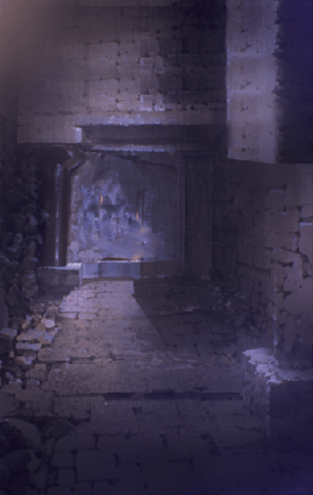

210513051 限定クエスト バレンタインイベント バレンタイン狂想曲 ストーリークエスト バレンタイン狂想曲  5 - 第4話 「友人として」 バレンタイン狂想曲 第4話 バレンタイン狂想曲 第4話 戦闘前

[View script in lisp](../scripts/210513051.txt)

【アスカロン】
――ぐっ…う、うう…っ？
私、気を失って…？

【フェイルノート】
………う………うう………

【アスカロン】
っ…！！
皇帝陛下っ、ご無事ですか…！？
あ…き、傷がっ…！

【フェイルノート】
…っ！
平気よっ、このくらい…っ

【アスカロン】
もしかして、私を守るために…？
そんな…私のせいでっ、陛下が傷を…！

【フェイルノート】
落ち着きなさい、アスカロン…
感情に流されやすいところ、
お前の良くない癖よ

【フェイルノート】
それより、あの男…
なかなか小癪な罠を
仕掛けてくれたじゃない

【フェイルノート】
けれど、落ちた先がここだったのは
幸運だったわ…ふふっ

【アスカロン】
幸運…？
どっ、どういうことですか？

【フェイルノート】
この牢を出てすぐのところにね…
皇帝の間につながる隠し通路があるの

【フェイルノート】
あの男、それを知らずに
私たちをここに閉じ込めたんだわ

【アスカロン】
隠し通路…じゃあそこを通れば、
兵に見つからずに
皇帝代理のもとへ…！？

【フェイルノート】
そういうことよ
さあ、こんな牢…
さっさと出てしまいましょう

【フェイルノート】
牢を壊すのは…
お前の得意分野ね、アスカロン？

【アスカロン】
えっ？
わ、私ですか！？

【フェイルノート】
お前に宿るサイクロプスの呪い…
それがもたらす怪力なら、
この程度の牢はすぐに破れるはずよ

【アスカロン】
は、はいっ！
それは…確かにそうですが…

【フェイルノート】
…アスカロン？
何をためらっているの？

【アスカロン】
も…申し訳ありません、陛下…

【アスカロン】
こんな大事な時に、
言うべきことではないと
わかっているんです、でも…

【フェイルノート】
…ああ…
なるほど、そういうこと…

【アスカロン】
…へ、陛下っ！？
どうして私の手を…？

【フェイルノート】
わかっているわ…
お前、自分の中の呪いを
まだ怖がっているのね？

【アスカロン】
っ…！！

【フェイルノート】
いつまでも怖がりなお前に…
もう一度、私が教えてあげる

【フェイルノート】
恐れてはだめ
恐れを妬みなさい

【フェイルノート】
お前を突き動かすのは嫉妬…
レヴィアタンが司る、
「妬ましい」という想い

【フェイルノート】
それこそがお前の強さなのよ
だから…どうか恐れないで

【アスカロン】
嫉妬…
妬むことが、私の強さ…？

【フェイルノート】
ええ…
いいかしら、アスカロン？
これは皇帝としての命令じゃないわ

【フェイルノート】
かつてお前と共に歩むと、そう誓った
ひとりの友人としてのお願いよ

【アスカロン】
…！！

【フェイルノート】
――ゲバルトを、倒しましょう

【フェイルノート】
そのための一歩を、今…
踏み出してはくれないかしら？

【アスカロン】
っ…！
はいっ！！

【アスカロン】
…やってみせる
私の中の恐怖に
打ち勝ってみせる…！

【アスカロン】
陛下のために――
いえ、ひとりの友人のために！

【アスカロン】
傷だらけの姿で、
私に勇気を授けてくれた…
大切な存在のために！

【アスカロン】
…はぁあああぁぁあああッ！！

【アスカロン】
はぁっ、はぁっ、はぁっ…！
や、やった…！

【フェイルノート】
上出来よ、アスカロン…！
行きましょう、
ゲバルトのもとに…！

【ケイオスリオン兵】
…侵入者だっ！
牢を抜け出たぞ、追えーーーっ！！

Next: [210513053](210513053.md)

[Back to index](index.md)
