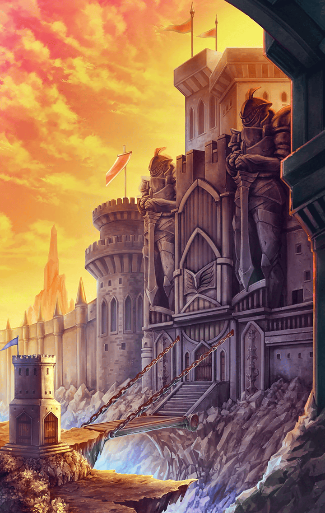

[View script in lisp](../scripts/210752020.txt)

**【ヒョウハ】**
はーっ…
でっかい壁だなーっ

**【ヒョウハ】**
中心に近づくにつれて何かと
豪勢になってくとは聞いてたけど、
こんなに堅牢とは

**【ヒョウハ】**
町の規模も大きそうだ
ここなら、異族について
何か情報が得られるかも

**【警備兵１】**
止まれ、そこの女！

**【ヒョウハ】**
何だよっ

**【警備兵２】**
お前、キル姫だな
奏官はどこにいる？

**【ヒョウハ】**
あいにく、マスターはいないんだ
ラグナロク教会に向けて
一人で旅してる

**【警備兵３】**
キル姫が一人で旅だと？
怪しいな…

**【警備兵４】**
お前、マロニの町から来たスパイでは
あるまいな！？

**【ヒョウハ】**
マロニの町？
どこだよ、それ

**【警備兵１】**
とぼけるな！
あそこに見える隣町に決まってる
だろうが！

**【ヒョウハ】**
あー…あれか
あっちにも町があるんだな

**【ヒョウハ】**
あっちも高い壁で囲まれてる
この辺の町ってどこもあんな感じ
なのか？

**【警備兵２】**
しらばっくれおって！
捕らえろ！
尋問して吐かせてやる！

**【ヒョウハ】**
おおおい！？
何だよ、それっ…

**【ヒョウハ】**
何とか逃げ切ったけど
酷い目にあったな…

**【ヒョウハ】**
あっちの町はやめておこう
マロニの町に行ってみるか

**【ヒョウハ】**
こっちも堅牢そうだなあ
何でこんなに防備を固めてるんだ？
もしかして、異族の影響とか…

**【警備兵１】**
そこの女、止まれ！

**【ヒョウハ】**
こっちもかよ…！

**【警備兵２】**
お前、キル姫だな！
さてはブラオの町から来た
スパイか！？

**【ヒョウハ】**
違うってば！
それ、向こうの…ブラオの町だっけ？
そっちでも言われたんだよっ

**【ヒョウハ】**
何なんだよ、あんたら！
あっちの町と仲悪いのっ？

**【警備兵３】**
仲が悪い…だと？
こんなことになったのは
ブラオの町のせいだろうが！

**【ヒョウハ】**
あたしに言われても知らないって！

**【警備兵４】**
しらばっくれおって！
捕らえろ！
尋問して吐かせる！

**【ヒョウハ】**
ああ、もう！
何でそうなるんだよーっ

**【ヒョウハ】**
疲れた…

**【ヒョウハ】**
何であたしがスパイ扱いされないと
いけないんだ…

**【ヒョウハ】**
ただ一晩、宿屋のベッドで
ゆっくり眠りたかっただけなのに…

**【ヒョウハ】**
今夜はこの辺で寝るしかないな…
結局、野宿かよっ

**【ヒョウハ】**
…………寝よ

**【？？？】**
あの…
もし…

**【ヒョウハ】**
んんっ…？
うおっ！
もう朝かっ

**【如意金箍棒】**
はわわっ！

**【ビコウ】**
ウキーッ！

**【ヒョウハ】**
おっと、驚かせてごめん
…ん？猿？

**【如意金箍棒】**
この子はビコウよ
あなたが倒れているのを
見つけてくれたの

**【ヒョウハ】**
ああ、そうなんだ

**【ヒョウハ】**
この猿、あたしの胸を触ってた
ような気がしたけど…
気のせいかな

**【如意金箍棒】**
ねえ、大丈夫？
どこか具合が悪いのかしら

**【ヒョウハ】**
ああ、いや
そんなんじゃないんだ
単に野宿してただけ

**【ヒョウハ】**
本当は近くの町に泊まりたかったん
だけど、入れなくてさ

**【如意金箍棒】**
そうだったのね…
今はブラオの町もマロニの町も
厳戒態勢だから

**【ヒョウハ】**
厳戒態勢？
物騒だな…

**【如意金箍棒】**
ええ…
最近、頻繁に戦いが起きているの