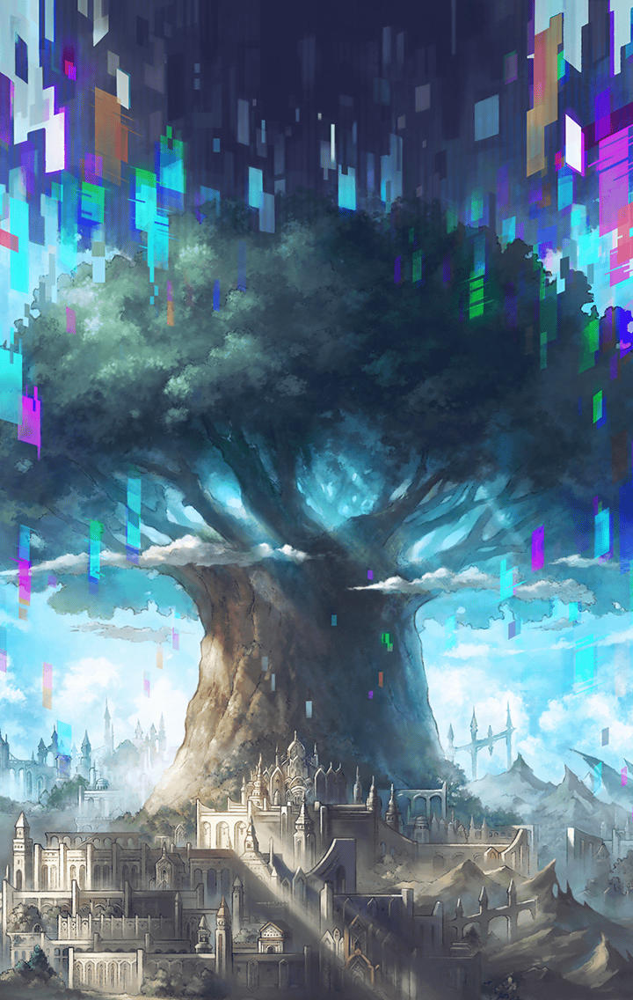

[View script in lisp](../scripts/210801040.txt)

その頃、ラグナロク達は――

【ラグナロク】
ミネルヴァ、
それじゃ少しの間、留守をお願いね

【ミネルヴァ】
はい
ラグナロクも気をつけて下さい

【ミネルヴァ】
ユグドラシルの内部は未知の世界です
どんな危険があるか…

【ラグナロク】
慎重に動くから
必ず有益な情報を手に入れて
戻ってくる

【ラグナロク】
私がいない間、
エルキュールのこと…よろしくね

【ミネルヴァ】
まだ落ち込んでいるようですが、
彼女はきっと大丈夫です
信じてあげましょう

【ミネルヴァ】
では、行ってらっしゃい

【ラグナロク】
うん
行って来ます

【ラグナロク】
ユグドラシルの中に入ったけれど、
この辺りは表層に過ぎない

【ラグナロク】
天上世界と地上世界を行き来する
だけなら、この表層を伝って
いけば良いのだけれど…

【ラグナロク】
私がコマンドキラーズの
フォルカスに天上世界への侵入を
許したとき…

【ラグナロク】
もう少し奥の方で、人の姿をした
何かを見た気がする…
あれに気を取られたせいで…

【ラグナロク】
フォルカスの不意打ちを受けて
しまった
あれは一体、何だったの…？

【ラグナロク】
あっ！？
あそこにっ…

【ラグナロク】
えっ…！？
ここが、ユグドラシルの中っ？

【ラグナロク】
さすが世界樹ね…
全ての世界を内包しているという
ことかしら

【ラグナロク】
それよりも…
さっき見かけた人の姿を
確かめないとっ

【ラグナロク】
これ…ひょっとして、カミトの
身体？

【ラグナロク】
腹を貫かれた痕がある…
左手の義手…間違いなさそうね

【ラグナロク】
お腹の傷は…治療されてるから
大丈夫
あとは…

【ラグナロク】
いかにも即席って感じの結界を
破れば、きっとカミトはハリーの
身体から戻れるわ

【ラグナロク】
…でも、誰がこんなことを？

【ラグナロク】
カミトの身体はひとまずこのままに
して、もっと奥までいきましょう

【ラグナロク】
ユグドラシルに保管されている
記録を調べていけば、
世界の真実に辿り着けるはずよ

【ラグナロク】
えっ…！？
今のは…

【ラグナロク】
かなり深いところにあったような…
それに、近づいたら弾き返された

【ラグナロク】
何かある…！
もう一度、今度は丁寧に…
踏み込むっ

【ラグナロク】
…………

【ラグナロク】
軽い抵抗があったけれど、
入ることができた…

【ラグナロク】
恐らく、私にユグドラシルの管理権が
あるから…そうでなかったら、
さっきのように弾かれていたわ

【ラグナロク】
ここは…誰かの部屋のようだけれど…

【ラグナロク】
あそこの寝台に誰かが寝てる
無断で入ったことを謝らないと

【ラグナロク】
…………あの

【？？？】
…………

【ラグナロク】
寝てるようね…
でも、辛そうな顔をしてる…
大丈夫かしら…？

【ラグナロク】
この人は、いったい…

【？？？】
ううっ…
あら…？
どなた…？

【ラグナロク】
あ…ごめんなさいっ
決して怪しい者ではないのっ
私は――

【？？？】
ああ…ラグナロクね…
あなたもここに辿り着いたの…

【ラグナロク】
私のことを知っているのっ？

【？？？】
ええ、もちろん…
あなただけでなく、私は全ての…
ゴホッ…ゴホッ…！

【ラグナロク】
無理しないでっ
何か私にできることはある？

【？？？】
ありがとう、優しい子…
でも…いいのよ…
これは仕方ないことなの…

【ラグナロク】
重い病なの？
私の仲間に医療の心得がある者も
いるからっ

【？？？】
ふふふっ
その気持ちだけで十分よ…

【？？？】
これは…運命…
私はもう…長くない…

【？？？】
あとは、ただ…
“終焉”が訪れるのを…
静かに待つだけ…

【？？？】
ごめんなさいね…

【ラグナロク】
何故、謝るの？
大丈夫、きっと治るわっ

【ラグナロク】
明けない夜はない
癒えない傷もない

【ラグナロク】
あなたはまだ生きているのだから、
最後まで諦めないで！

【？？？】
そうね…
でも…もう限界なの…
本当に…ごめんなさい…

【？？？】
私がもっとしっかりしていれば…
あなた達に辛い思いをさせずに
済んだのに…

【ラグナロク】
何を言っているの？
あなたの病と私達には何の関係も…

【ラグナロク】
…………

【ラグナロク】
あなた、どうしてユグドラシルの中で
寝ているの？
まさか…

【？？？】
…気づいたのね、聡い子
ええ…あなたの想像通りよ…

【ラグナロク】
あなたは…あなたは…
ユグドラシルそのもの…！

【ユグドラシル】
本来なら…私の姿を…
あなたが認識することは…
できないのだけれど…

【ユグドラシル】
私の存在そのものが…
不安定になっているの…
だから…

【ユグドラシル】
あなたも…認識できる状態にまで…
“落ちて”しまっている…

【ユグドラシル】
まるで…本物の病人みたいな姿で…
今の私は…ここに…顕現しているの…

【ラグナロク】
そんな…
そんなっ…！
ユグドラシルが…こんなに弱って…

【ラグナロク】
先程、もう長くないと…

【ユグドラシル】
ええ…そうなの…
もうじき…私の下に“終焉”が
訪れるわ…

【ユグドラシル】
もっと長く…この世界を支えて
いたかったけれど…
本当に…ごめんなさい…

【ラグナロク】
何てことっ…！
ユグドラシルに何らかの異変が
起きているとは思っていたけれど…

【ラグナロク】
これほど大変なことになって
いただなんて…！

【ラグナロク】
…ユグドラシル、あなたを助ける
方法はないの？

【ユグドラシル】
ふふっ
同じことを…幾度か尋ねられたわ…

【ユグドラシル】
でも…これは自然の摂理…
私は…全てを委ねているわ…
ごめんなさい…

【ラグナロク】
諦めないで！
あなたが死ぬということは、
この世界そのものが…

【ラグナロク】
あっ…ああ…！？
そういう…ことだったの…？

【ラグナロク】
インテグラルキラーズは…
コマンドキラーズは…
そのためにっ？

【ユグドラシル】
あの子達も…あの子達なりの
考えで…抗っているようね…

【ユグドラシル】
私は…全てを受け入れるつもりよ…
彼女達が…そして、あなた達が
どのような選択をしても…

【ユグドラシル】
それを…受け入れるわ…
全て…あるがままに…

【ラグナロク】
ユグドラシルっ？
…眠ってしまったのね

【ラグナロク】
…早く、このことを皆に知らせないと
ユグドラシルの寿命が尽きようと
していることをっ

【ラグナロク】
地上に降りているアルマス達にも
急いで伝えないと！

Next: [210801050](210801050.md)

[Back to index](index.md)
