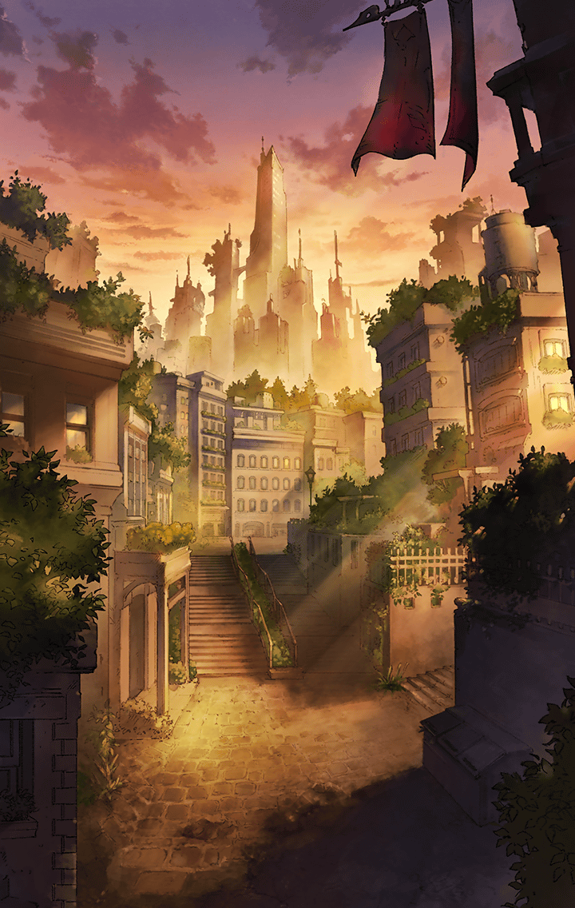

[View script in lisp](../scripts/210801070.txt)

一方、地上世界では――

**【ヴァナルガンド】**
マスターを害する者はすべて、
排除してみせましょう
ワタシの瞳からは逃れられませんよ

**【アフロディーテ】**
ふふっ
狂おしいほどの愛に包まれて
お逝きなさい！

**【エンクウ】**
ヴァナルガンドとアフロディーテが
何処からか獣を呼び出しおった…！

**【クレイ】**
雰囲気も違う…
何だろう、この感じは？

**【ツカサ】**
…………

**【クレイ】**
でも、これならきっと戦える
頼んだぞ、ヴァナルガンド！

**【ヴァナルガンド】**
わお～ん！
はい、マスター！

**【如意金箍棒】**
驚いたね…
こんな力を秘めていたなんて…

**【オルフェウス】**
ニョイさん！
あたし達もビート上げてこー！

**【如意金箍棒】**
ええ、そうね
ワタシ達だって、
負けないんだから！

**【ヴァナルガンド】**
やああああっ！

**【アフロディーテ】**
はっ！

**【如意金箍棒】**
えいっ！

**【オルフェウス】**
とりゃ！

**【エンクウ】**
ぬうっ…
どうにか凌いでおるが、
打ち倒せはせぬか

**【クレイ】**
二人とも良くやってくれている
あと一手、何か…

**【エンクウ】**
こんなとき、ムラマサがおれば…

**【エンクウ】**
いや、それを言っても
詮無きこと…

**【エンクウ】**
ぬっ？
今の感覚は…もしやっ？

**【エンクウ】**
ムラマサ…
そなたなのか！？

**【ムラマサ】**
主君！
主君、主君、主君！
今、参ります！

**【ムラマサ】**
拙者の全てを賭して！
今、お側にっ

**【エンクウ】**
そなたは、そなた自身にならねば
ならぬのだ

**【エンクウ】**
そのために刀を振りなさい
ただ、己自身と向き合うために

**【ムラマサ】**
辛いことがありました
苦しいこともありました
たくさん傷ついてきました

**【ムラマサ】**
けれど、それを悔いたことは
ありませぬ！
悔いがあろうはずもありませぬ！

**【ムラマサ】**
拙者は、拙者のために刀を振って
きたのですからっ
この傷は…痛みは…苦しみは…

**【ムラマサ】**
全て、拙者が拙者になるために…
精進してきた証

**【ムラマサ】**
これは拙者が選んだ道です！
目を閉じ、忘れてはならぬもの
なのです！

**【ルシファー】**
力を欲するのなら…
解放するがいい…己自身を

**【ムラマサ】**
内に眠る拙者の業…
全てを欲する“強欲”を、
解放致す！

**【ムラマサ】**
疾く駆けよ！
拙者を直ちに主君の下へ！

**【エンクウ】**
ここだ、ムラマサ！
拙僧はここにおるぞ！！

**【クレイ】**
エンクウ？
叫んでも、近くに来ているとは
限らないんじゃ…

**【ムラマサ】**
せぇい！

**【如意金箍棒】**
はわわっ？

**【オルフェウス】**
何々っ…？

**【ヴァナルガンド】**
ムラマサ！
来てくれたんですねっ

**【アフロディーテ】**
マスターの危機に駆けつけるなんて
愛を感じますわ♪

**【ムラマサ】**
主君に仇為す者は皆、
拙者の刀で吹き飛ばしてみせます！

**【オルフェウス】**
イラッとしたんだけど…
とりま、消えとく？

**【如意金箍棒】**
悪い子はお仕置きしないとね

**【ムラマサ】**
そなた達の好きにはさせません！
“次元跳躍”！

**【如意金箍棒】**
あれれっ？

**【オルフェウス】**
どこ行ったし！？

**【ムラマサ】**
せやあああ！

**【オルフェウス】**
何、今のっ…？
意味不なんだけどっ

**【如意金箍棒】**
ビックリだよー…

**【エンクウ】**
何と…！
あの二人を攪乱してみせるとはっ

**【ツカサ】**
今のうち…

**【クレイ】**
エンクウ！
この隙に、ここから離れよう

**【ヴァナルガンド】**
マスター、こちらです！

**【アフロディーテ】**
さあ、共に参りましょう♪

**【ムラマサ】**
主君！

**【エンクウ】**
うむっ
よくぞ帰ってきてくれた…
ムラマサ！

**【クレイ】**
どうにか逃げ切ったね…

**【エンクウ】**
油断は禁物であるが…
ひとまず皆、無事で何より

**【ムラマサ】**
主君…
お側を離れてしまい、
すみませんでした…

**【エンクウ】**
何を言う
そなたが生きていてくれただけでも
無上の喜びだというのに

**【エンクウ】**
少し見ない間に、
立派になったではないか

**【エンクウ】**
ムラマサ…
そなた自身の刀を見出したのだな

**【ムラマサ】**
主君っ
…はい！
拙者は…拙者はっ…

**【テュルソス】**
感動の再会を味わってるところ
悪いんだけど…
何がどうなってるの？

**【ヴァナルガンド】**
私達の変化についてなら、
道すがら話しましょう

**【アフロディーテ】**
早く合流した方が良さそうだものね

**【クレイ】**
合流？
誰とだい？

**【ヴァナルガンド】**
アスカロンとグリモワール、
それからシユウです

**【クレイ】**
セブンスキラーズってことかな？
どうして急に？

**【ヴァナルガンド】**
少し思い出したことがあるんです
理由も道すがらお話ししますので

**【クレイ】**
分かったよ
エンクウ、どうかな？

**【エンクウ】**
拙僧に異存はない
しかし、ヴァング殿達が何処に
いるのかは…

**【テュルソス】**
それなら手伝えると思うわよ
「ネオ・ラグナロク」の情報網を
拾えるから

**【エンクウ】**
テュルソス殿…
先程の加勢といい、かたじけない

**【テュルソス】**
いいのよ
こうなったら一蓮托生ね

**【ムラマサ】**
では、テュルソス
案内をお願いします