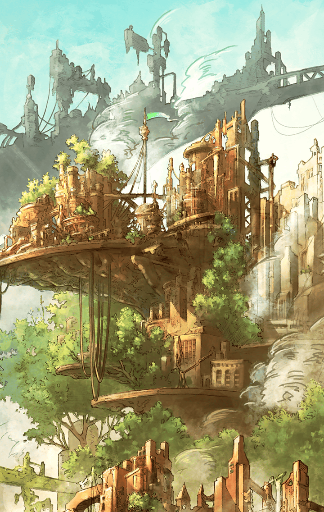

[View script in lisp](../scripts/221041223.txt)

[View source in markdown](221041223.md)

**【アバリス】**
これで、おじいさんと、
この集落の安全は守れたはず…

安心したその時、物陰に隠れていた
残兵が、仲間を呼びに行こうと
飛び出すのが見えた

**【アバリス】**
くっ…
逃すわけにはいきません！

**【アバリス】**
やっ！

アバリスの放った矢は風に乗り、
兵士を正確に射抜いた

**【アバリス】**
…そこも、私の領域です

アバリスは、すべてを見ていた
おじいさんに正体を告白して、
結果的にだましたことを謝ろうとする

**【アバリス】**
あの、おじいさん…ごめんなさい
私、実は…

**【おじいさん】**
はっはっは！わしはもう目も耳も
遠いから、なにが起きているのか
わからなかったよ

**【アバリス】**
…！
…ありがとうございます！

マスターも笑って、おじいさんに
お礼と別れを告げ、
二人はトレイセーマを後にした

次はどこへ行こうか、今度は住人に
迷惑をかけないようにしないと
と、マスターがいうと…

**【アバリス】**
それなら、あの国がいいでしょうね…
マスター、ついてきてください！

そういってアバリスは
マスターを先導していく

アバリスは、出発前より
すこし積極的になったかも…
と、マスターは感じていた