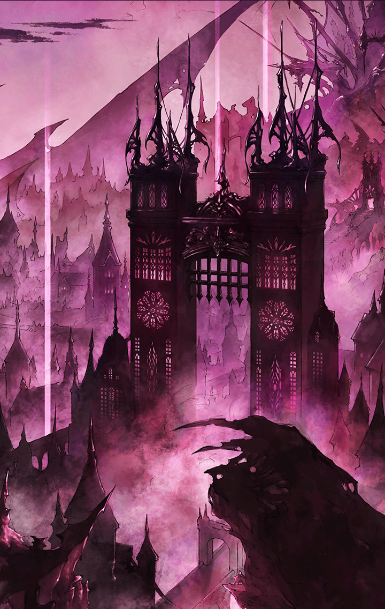

[View script in lisp](../scripts/221041231.txt)

**【アバリス】**
マスター、着きました
ケイオスリオンです

**【アバリス】**
領主によって自治されているので
トレイセーマのように規律違反で
いきなり捕まることはないかと…

アバリスはそう言いながら
落ち着かない様子であたりを見回す

やっぱり知り合いに会うのは不安？
とマスターが尋ねる

**【アバリス】**
はい…
いつもと違う格好ですし、
恥ずかしいです…

おじいさんにも褒めてもらったし、
自信を持っていこうよ
と、マスターはアバリスを励ます

それに今のアバリスを見たら、
きっと印象が変わるはずだ、と続けた

**【アバリス】**
確かに、そうですね…
今度は隠れずに、
頑張ってみます！

**【アバリス】**
こちらの集落は…
みんな忙しそうですね？
新年だからなのでしょうか…

ごちそうを作って運んだり、
食器を磨いたりと、すべての人が
忙しそうに走り回っていた

そのうちの一人がアバリスに気づき、
めずらしさから近寄ってくると、
周りの人も続いて集まってきた

**【アバリス】**
きゃっ！
あ、あの…

**【男性A】**
へー、綺麗な衣装だな

**【男性B】**
うん
とても似合っているよ

あっという間にアバリスは囲まれ、
綺麗な装束だ、とても似合っている
と、四方八方から褒められまくった

**【アバリス】**
あ…ありがとうございます…
マスター、あの…どうしたら…

その時、集落の長らしき男性が
やってきて、人々に向けて
作業に戻れと怒鳴り声をあげた

**【男性A】**
やれやれ、戻るとするか
お嬢さん、ありがとうな
久しぶりに、いいものが見れたよ

**【アバリス】**
あの…
どうしてそんなに
忙しそうなのですか？

**【男性A】**
いやね、
ここの領主が新年に豪華なパーティを
開きたいって言い出してね

**【男性B】**
それで、総出で
その準備をさせられているって訳だ

豪華なパーティってどんなものかな
と、マスターが興味を持った様子を
見て、アバリスはひとつ提案をする

**【アバリス】**
マスター、みんな忙しそうですし、
私たちもお手伝いしませんか？

**【アバリス】**
きっとパーティもすこしなら
見学できるでしょうし、雰囲気を
味わえると思いますよ？

マスターはアバリスの提案にのり、
二人はパーティの準備を
手伝うことにした

**【アバリス】**
…このお料理を、あちらに運べば
いいのですね？
マスター、いきましょう！

完成した料理を、マスターと
アバリスは会場へと運ぶ係になり、
二人は会場へと足を踏み入れる

**【アバリス】**
わぁ…
豪華ですねぇ…

会場には高価そうな家具や
食器などが並べられ、
すでに豪華な料理も飾られていた

**【アバリス】**
あちらにいるのが領主でしょうか
なんだか視線を感じます…
マスター、早く戻りましょう

会場にいた来客たちもアバリスに
注目していたが、そのなかでも領主は
熱い視線をアバリスに向けている

**【領主】**
おい！
そこの者、止まれ！

**【アバリス】**
…なにかご用でしょうか？
私たちは準備で忙しいのですが…

**【領主】**
ふふっ
その強気の態度も気に入った
私のものになれ

**【アバリス】**
それは、できません…
では失礼します…

**【領主】**
フン！
奴隷に拒否権などない
おい、あいつを捕らえろ

**【ケイオスリオン兵】**
はっ！

**【アバリス】**
…ここでは戦えません
いったん、逃げます！

アバリスはそう言うと、
マスターを抱えて会場から逃げ出した

アバリスたちはパーティ会場からも
集落からも離れた場所にある
荒野まで逃げてきた

**【アバリス】**
…追っ手がきたようですね
ここでなら、思い切りやれます！