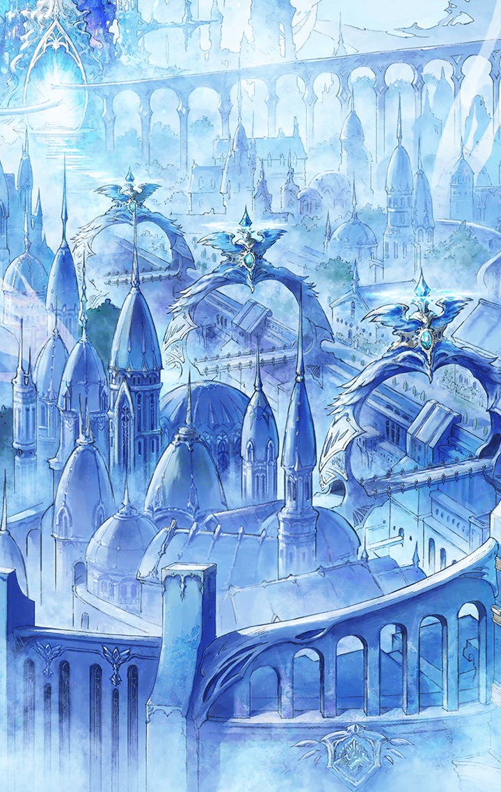

221041531 限定クエスト ウェディングイベント 契約と計画のブライダル 契約と計画のブライダル　ストーリークエスト 完璧な計画？ 完璧な計画？ 完璧な計画？ 戦闘前

[View script in lisp](../scripts/221041531.txt)

ブライダルイベントに湧く
ハルモニアの街で、マスターは
痛いほど視線を感じていた

美しい二人の花嫁を
連れているのはどんな人物かと
だれもが興味津々なのだ

注目に耐えかねたマスターは、
次はどこにいくの？早くいこう
と、ソロモンに話しかける

【ソロモン】
どこに行くかは、まだ言えないの…
私を信じて、ついてきてくれる？

マスターは、ソロモンに頷きながら、
わかった、なんだかドキドキするね
と、笑う

【ソロモン】
ふふっ…

そんな二人のやりとりを見ながら、
ロンギヌスも満足気に微笑む

【ロンギヌス】
よかった…順調そうですね
…こうして見ていると、
なにも問題がないように見えますが…

そう、心の中でつぶやくと同時に
ロンギヌスは、計画実行の前に
ソロモンから明かされた話を思い出す

【ソロモン】
私のプランは完璧なのに
マスターは採用してくれないのよ

【ソロモン】
それで、私はマスターに
信頼されていないと思ったの

【ロンギヌス】
ちなみに、その計画というのは
どういったものなのでしょうか？

【ソロモン】
ただの買い出し計画書よ？
効率を重視して綿密に計算した、
分刻みの完璧なスケジュールのね

【ソロモン】
マスターは苦笑いしたあと、
効率を下げて、時間に余裕をもたせた
計画に変更しようと言ったの

【ソロモン】
私の計画は完璧なのに
マスターに採用されなかった…
それは信頼が足りないからなのよ

【ロンギヌス】
おそらくマスターは、
細かすぎるソロモンの計画に戸惑って
苦笑いをしただけでしょう

【ロンギヌス】
今、目の前にいる二人の間には
はっきりと信頼関係を感じます

【ロンギヌス】
疑うことなくソロモンについていく
これこそが信頼されている証です

【ソロモン】
そろそろ出発するわよ
グラウ、道案内をお願いね

【グラウ】
承知しました
ルート検索を開始します

【グラウ】
…ソロモン、問題発生です
進行方向に兵を発見しました

今日はやけに兵が多いね
と、マスターがいうと、
グラウが答える

【グラウ】
本日のブライダルイベントを
警備するため、多数の兵が
出動したようです

【グラウ】
イベントに乗じて騒ぎを起こす
不審者を探しているのかもしれません

【ロンギヌス】
あ、兵がこちらに気づいたようです
マスターを見て、なにか言っています

天使人でないマスターが綺麗な花嫁を
連れているのが気に入らないようで、
兵はマスターをジロジロと睨む

【ソロモン】
私たちでマスターを隠しながら、
なるべく静かに通り過ぎるわよ

できるだけ目立たないように
兵の前を通り過ぎようとした
マスターたちだったが…

【ハルモニア兵長】
止まりなさい！
私の目はごまかせませんよ！

【ハルモニア兵】
花嫁を二人も連れ歩くなど汚らわしい
誇り高きハルモニアの民に
あるまじき行為です…

【ハルモニア兵】
怪しいですね…侵入者なのでは？
捕縛して、しかるべき処罰を…

ハルモニア兵はそういって
マスターの腕をつかみ、
連行しようと強く引っ張る

【ソロモン】
今すぐ、その手を放して
花嫁と一緒にいるだけで
捕縛だなんて理不尽すぎるわ

【ロンギヌス】
ソロモン…
彼らがおとなしく従うような
相手ではないとわかっていますよね？

そういうと、ロンギヌスは
武器を出して構えた
ソロモンも同じく戦闘態勢をとる

【ハルモニア兵長】
……っ！
なんと、武器を所持しているとは…
やはり侵入者でしたか

【ハルモニア兵長】
全員まとめて粛清します
さぁ、ここで罪を償いなさい！

Next: [221041533](221041533.md)

[Back to index](index.md)
