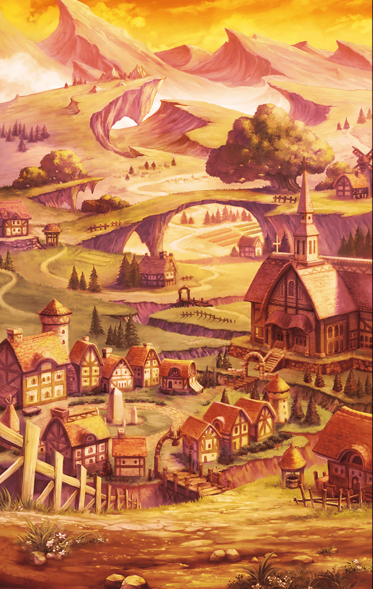

221051051 限定クエスト ハロウィンイベント 笑顔をくれなきゃ悪戯しちゃうぞ？ストーリークエスト 笑顔をくれなきゃ悪戯しちゃうぞ？ 5 - 笑顔をくれなきゃ悪戯しちゃうぞ？ 第4話 笑顔をくれなきゃ悪戯しちゃうぞ？ 第4話 笑顔をくれなきゃ悪戯しちゃうぞ？ 第4話 戦闘前

[View script in lisp](../scripts/221051051.txt)

【マサムネ】
なぜだ…
なぜ拙者の笑顔で
憑依が解けないのだ…

【アロンダイト】
…私の笑顔は
人を安心させられないのですか…

【ジャック】
ぼ、僕のせいで
お嬢ちゃんたちを
惑わせちゃったかな…

【アロンダイト】
ユニコーンは私に貞淑さをくれました
他人に対して笑顔を向けられる
そうなったと、思っていたのに…

【マサムネ】
世界蛇の毒が
拙者から感情を奪ったのか…？

笑顔を作るどころではなく
自己嫌悪に陥ってしまったふたりに
マスターも頭を抱える

【ジャック】
真面目な子たちだねぇ
不器用というか、なんというか

それが彼女たちのいいところでも
あるのだが、今は状況が状況だ
マスターは助言を送ろうとするも…

【マサムネ】
いや、主君
これは拙者らの問題ゆえ

【アロンダイト】
ええ、私たちの力で
やらせてください！

と、頑なな態度をとられてしまう
これは
少し時間を置く必要がありそうだ

その間に
マスターはジャックに尋ねる

ルタバガもジャックと同じ
ハロウィンの妖精のはず

それなのに、なぜ
ハロウィンを
恐怖で包もうとするのだろう、と

【ジャック】
ハロウィンは
悪霊を祓うお祭りでもあるんだけど

【ジャック】
ルタバガは
みんなが騒ぐばかりで
悪霊を祓うことを忘れてる

【ジャック】
本当に悪霊がやってきたとき
人はそれを祓えなくなってしまう
って心配してる

【ジャック】
だから町を恐怖で包んで
悪霊を祓うことの重要性を
再認識させたいんだって

【ジャック】
…みんなが
家に閉じこもっちゃったら
お祭りにならないのにね

二人は町の片隅で
笑顔を作る練習をしている

ここはマスターとして
そろそろ彼女たちに然るべき言葉を
送ってあげるべきだ…

選択肢:
- アロンダイト、にっこりして → [select_label_01](#select_label_01)へ
- マサムネ、口角を上げるんだよ → [select_label_02](#select_label_02)へ
- 二人の笑顔が好きだよ → [select_label_03](#select_label_03)へ

ここはマスターとして
そろそろ彼女たちに然るべき言葉を
送ってあげるべきだ…

#### select_label_01:
 → [select_label_end](#select_label_end)へ

【アロンダイト】
にっこりですね！
任せてくださいマスター
…こ、こうですか？ 

#### select_label_02:
 → [select_label_end](#select_label_end)へ

【マサムネ】
口角を…？
なるほど、さすが主君
的確な助言、感謝いたす！

#### select_label_03:
 → [select_label_end](#select_label_end)へ

笑顔が好き
ふたりはその言葉をしかと受け止め
そして…

#### select_label_end:

はぁっ！
という掛け声一閃
ふたりは気合を入れた表情を作り出す

なるほど、これは怖い
と、マスターも納得したが
口には出さずに心の中にとどめる

【ジャック】
たはは…
ん？　あそこにいるのって…

【ジャック】
あいつだ！
あいつがルタバガだ！

【ジャック】
憲兵の隊長の装備に取り憑いて
いるんだ！

【ジャック】
あいつをこらしめれば
きっと
しもべたちも逃げていくよ！ 

【マサムネ】
彼奴を討てばよいのだな？
ふっ、笑顔を作るより遥かに容易い

【アロンダイト】
その通りです、マサムネ
ともに鍛錬を積んだ私たちの技
見せてあげましょう！

【ジャック】
ルタバガは強敵だよ
ふたりとも
油断しないでね！

Next: [221051061](221051061.md)

[Back to index](index.md)
