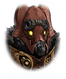

221051231 限定クエスト 賀正イベント 昇る陽、心に宿る陽 ストーリークエスト 昇る陽、心に宿る陽 第2話 「前略、歌合戦延長戦」 昇る陽、心に宿る陽 第2話 昇る陽、心に宿る陽 第2話

[View script in lisp](../scripts/221051231.txt)

初日の出を見に行こう
とティファレトの手を引いて
出発したマスター

だが、早速その行く手を
ハルモニアの兵士達によって
阻まれることとなった

【ティファレト】
なんとか退けることはできましたが…

【ティファレト】
新年明けてすぐなど
そういったハレの日は気分が高揚し
問題を起こす者が多かったので…

だから警備がいつもより厳重…
そうティファレトが話すように
この先も決して油断はできない

【ティファレト】
私があのような話をしてしまった
だからハルモニアへ行こうと
そう仰ってくださったのでしょう…

【ティファレト】
しかし、このように
厳重な警備をかいくぐって行くのは
あまり現実的ではありません

だとしても、ティファレトと一緒に
ハルモニアの初日の出が見たい
いいかな？と聞くマスター

【ティファレト】
あ、主様が
そうお決めになられたのなら…

マスターに従う
そう決めたティファレトの思いに
今だけは甘えようと思うマスター

そんなことを話していると
一際にぎやかな集団に出くわす

【ミトゥム】
～♪

【ティファレト】
あれは…ミトゥム？
そういえば歌合戦なる
催しを行っていると聞きましたが…

年末の恒例行事だからと言って
隊の姫達が集まり歌合戦をしていた
とは聞いたが、まだやっているらしい

姫達の大半はもう休んでいるようだが
中心だったミトゥムは
まだまだ元気いっぱいのようだ

【ティファレト】
それにしても、まだにぎやかなのは…
三国の兵士達までもが
集まってきているようです

無礼講にもほどがある
と頭を抱えるマスター

【ティファレト】
ミトゥムの歌には
人々を癒す力があります

【ティファレト】
それがあのように
作用しているならば
とても素敵なことですね

【ティファレト】
歌の力で国の境を越え
平和を作ることが
できるのかもしれませんね…

ティファレトはとても好意的に
この状況を見ているようだが…

【ケイオスリオン兵】
ヒャッハー！
この歌がたまんねぇぜ！

【トレイセーマ兵】
話がわかるじゃねぇか兄弟！
今夜は歌い明かそうぜ！

【ハルモニア兵】
おめぇらまだまだノリが足りねぇぞ！

【ミトゥム】
そこぉ！
喋ってないで
ミトゥムの歌を聞けええええ！

ミトゥムを中心にした
集団は癒しとは程遠い
盛り上がりを見せている

ミトゥムも思う存分歌えるのが
楽しいのか、それとも正月気分に
浮かれてか、普段よりも高揚していた

【ミトゥム】
あれ、マスター！
と、それにティファレト！

【ティファレト】
元気いっぱいですね、ミトゥム
歌合戦の決着はつきましたか？

【ミトゥム】
まだまだこっからが本番だぜ！
年内には決着をつけてやるんだ

今年は始まったばかりだが…
と頭を抱えるマスター

【ミトゥム】
まあ、ミトゥムの圧勝で
終わらせてやるけどなっ！

【ティファレト】
ミトゥムはとても楽しそうですね
ふふ、それもマスターのもとに
来られたから…でしょうか

【ミトゥム】
こんな風に好きに歌を歌えるし、
すっごく楽しいぜ！

【ティファレト】
そう…ミトゥムには
こういったにぎやかな
場所が似合う子だったのですね…

【ミトゥム】
？

【ミトゥム】
あ、それよりもさ！
ふたりも参加しにきたのか！？

【ミトゥム】
絶対そうだよな！
何十曲でもいいから歌ってってよ！

そういう訳じゃないけれど…
とマスターは言おうとするが
ミトゥムには話が通じなさそうだ

【ティファレト】
み、ミトゥム
マスターも困っていますよ？

【ミトゥム】
もーノリ悪いよマスタ～！

ミトゥムの勢いは止まらなさそうだ

【ティファレト】
あ、あはは…ですから主様
こういった日には気分が
高揚した者が問題を起こすのです…

【ミトゥム】
ミュージック、スタートぉ！

Next: [221051241](221051241.md)

[Back to index](index.md)
