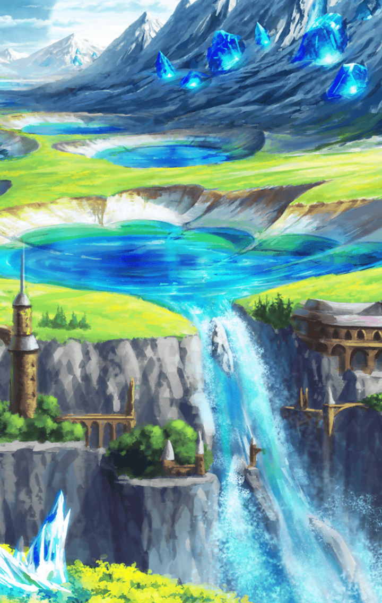

[View script in lisp](../scripts/221051613.txt)

**【ヒョウハ】**
ありがとうございましたっ！
…あ～っ、スッキリした～っ！

**【如意金箍棒】**
どう？
悩みは吹き飛んだ？

**【ヒョウハ】**
うっ、それは微妙だ…
もっとがんばらないと
ダメなのかな…

**【ヒョウハ】**
よぉおおおおしっ、
ともあれもう１戦っ！

**【？？？】**
たのもうっ！

**【ヒョウハ】**
っ！！
な、なんだ、誰だっ！？

**【？？？】**
ふふっ…
大した者じゃないさ

**【オティヌス】**
強いて言うなら、道場破りだよ
…なーんてね

**【ヘレナ】**
…くふっ

**【如意金箍棒】**
オティヌスちゃん、ヘレナちゃん！
どうしたの、こんなところまで？

**【ヘレナ】**
いや、特に用事はないよ

**【ヘレナ】**
たまたまこの近くを
通りかかっただけさ…くふっ

**【ヒョウハ】**
ウソつけ！
こんな山の頂上を
通りがかることあるか！

**【ヘレナ】**
ホントのことを言うと
フェイルノートに
話を聞いて来たのさ

**【オティヌス】**
ふふっ…それよりヒョウハ、
何やら悩んでるらしいじゃないか

**【オティヌス】**
はっきり言うけど…
普通の修業をするだけじゃ、
その悩みは解決しないよ

**【ヒョウハ】**
な、なんだって…！？
じゃあどうすれば…？

**【オティヌス】**
安心しなよ
あたし達がとっておきの知恵を
貸してあげる…ふふっ

**【ヘレナ】**
大船に乗ったつもりで
任せるといい…くふっ

**【如意金箍棒】**
フフフ…
なんだか賑やかになってきたね～
