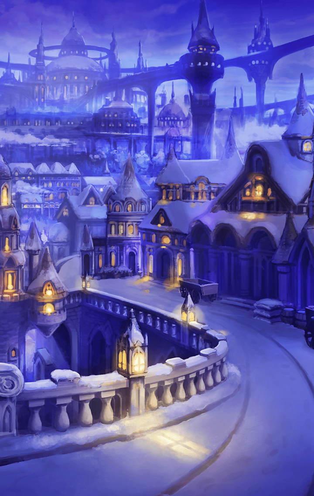

[View script in lisp](../scripts/221071041.txt)

[View source in markdown](221071041.md)

**【グリモワール】**
ふぅ…サンタ役も大変だわ
だけど、
イベントもいよいよ大詰めね

**【グリモワール】**
子ども達も喜んでくれたし…
今年も良いクリスマスになったわ！

満足気に街を歩く
サンタ役のグリモワール

そこにちょうど
マスター達一行が通りかかる

**【グリモワール】**
あら、キミ達サンタ役？
首尾は上々かしら？

**【シタ】**
はい？
いえ、違います！

**【シェキナー】**
そういう貴方こそ
サンタ役のようですね？

**【グリモワール】**
うん？そうよ！

**【シェキナー】**
ではお尋ねします…
このイベントの首謀者は
いったい誰なのですか？

**【グリモワール】**
あははっ、何言ってるのよ？
それは絶対秘密！
当たり前じゃない！

**【グリモワール】**
でぇ？
どうしてそんなことを
わざわざ聞くのかしら？

**【シェキナー】**
そんなの決まっています

**【シェキナー】**
サンタ・キャッチなどという
悪しき催しを始めた輩を
罰するためです

**【グリモワール】**
えっ？

**【シタ】**
これまでもいろんな
サンタ役の方に聞いたんですが、
結局答えてもらえず…

**【シェキナー】**
強情な方々でしたね
口を割っていれば、
わざわざ戦わずに済んだものを…

**【グリモワール】**
ち、ちょっと待ちなさい！
戦いってどういうこと？

**【グリモワール】**
まさか、キミ達は…
みんなにサンタ・キャッチを
やめさせようとしてるわけ…？

**【シタ】**
ええ、その通りです！

**【シェキナー】**
クリスマスとは本来、
聖人の降誕を祝うための行事です

**【シェキナー】**
その伝統を蔑ろにし、
聖人の品位を踏みにじる行為…

**【シェキナー】**
天使を霊装支配された身として、
見過ごすわけにはいかないのです

**【グリモワール】**
な、なななな…！！
ふざけんじゃないわよ！！

**【グリモワール】**
キミ達には見えないの！？
目いっぱい楽しんでる
町のみんなの姿が！

**【シェキナー】**
ええ、見てきましたよ
彼らは満足そうに笑っていた…

**【シェキナー】**
…けれどそれは、
サンタの名誉を汚してよい
理由にはなりません！

**【シェキナー】**
楽しさのためなら、
信仰など捨て置いても
構わないと言うのですか！？

**【グリモワール】**
ぐぬぬぬぬ…！！

**【シェキナー】**
むむむむむ…！！

意見を違え、お互いに睨み合う
グリモワールとシェキナー

その様子を
シタとマスターは
不安そうに見つめる…

**【グリモワール】**
ワタシは知ってるわ…
この町のみんなが…

**【グリモワール】**
年に一度のこの日が来るのを、
心の底から待っていたこと…！

**【グリモワール】**
みんなの幸せなクリスマスを…
これ以上邪魔するんじゃない！！

**【シェキナー】**
なっ…！

**【シタ】**
あ、熱い…！！

燃えたぎる業火を
怒りのままにまとう
グリモワール

**【シェキナー】**
いいでしょう…
そちらがその気なら…！！

対するシェキナーも、
弓を構えて迎撃態勢に入る

雪を溶かし尽くすほどの戦いが、
いま始まろうとしていた…

