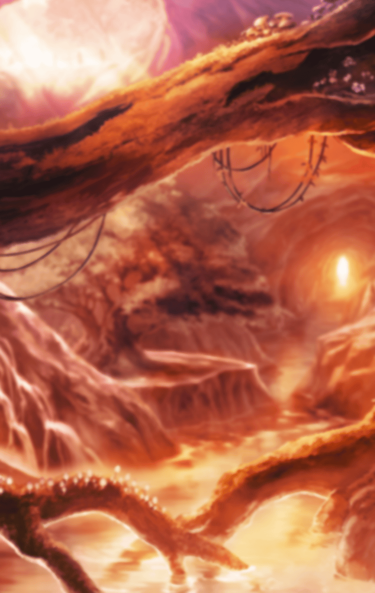

[View script in lisp](../scripts/221071341.txt)

[View source in markdown](221071341.md)

**【ソロモン】**
大丈夫
水量は増えてるけど
流れはまだ激しくない

**【ソロモン】**
これならそのまま
調査できそうね

そのまま潜っていくソロモン

**【ソロモン】**
思ったよりも深い…
呼吸には気をつけないと

**【ソロモン】**
過去のデータから考えて
あと１分程度は息を止められる

**【ソロモン】**
戻る時間も確保しつつ
ギリギリまで水底に近づく

**【ソロモン】**
きっとどこかに
赤い水の原因があるはず…

**【ソロモン】**
…！

**【ソロモン】**
見つけた…！！
これは…巨大な鐘！

**【ソロモン】**
ずいぶん古い…
全面が真っ赤に錆びてる…

**【ソロモン】**
山の上にあったっていう
大きな鐘…
滝つぼに落ちてたのね

**【ソロモン】**
きっと前日の嵐で
土台が崩れた…
というところかしら

**【ソロモン】**
赤色の原因は
この錆で間違いないわ
予測していた通り！

**【ソロモン】**
心配してるだろうから
戻ってフォルカスに
知らせなくちゃ…！

**【ソロモン】**
っ！？
な、なにこれ！？
水流が変わって…！

**【ソロモン】**
まずいっ、飲み込まれる…！！

**【ソロモン】**
～～～～っ！！

**【フォルカス】**
ソロモン！
ソロモーン！

**【フォルカス】**
そんな…このままじゃ
ソロモンが危ない！

**【フォルカス】**
どうしよう…どうすれば…！？

**【フォルカス】**
私を助けてくれた鐘は
もうない…

**【フォルカス】**
鐘が消えてから
私は神様に頼るようになった

**【フォルカス】**
また、神様に頼るしか
祈るしかない…

**【フォルカス】**
神様
お願いします

**【フォルカス】**
もしいらっしゃるのなら、
ソロモンを助けてください！

**【フォルカス】**
ソロモンは私達のためを
思ってやってくれているのです

しかし、辺りは静寂に
包まれたままであった

**【フォルカス】**
私は…私を救ってくれた
あの鐘のようにはなれない…

**【フォルカス】**
私は誰も救えないの？

**【フォルカス】**
私はあの鐘に救ってもらった
だから、私も誰かを救いたくて
巫女になったのに…

**【ソロモン】**
待っててね、フォルカス
神の祟りなんかじゃない証拠を
必ず見つけてくるから！！

**【フォルカス】**
そう…
私は今まで祈るだけだった

**【フォルカス】**
鐘のようにはできなかったから、
だから祈った

**【フォルカス】**
祈って…叶わなくて…
諦めるだけだった…

**【フォルカス】**
祈るだけじゃ変わらない

**【フォルカス】**
ソロモンのように
自分自身で変えないと
何も変わらないんだ

**【フォルカス】**
今助けます、ソロモン…！

水へと飛び込み
潜っていくフォルカス

**【フォルカス】**
水流が激しい…
こんな中で溺れたら、
もうどうにも…

**【フォルカス】**
お願い、ソロモン
無事でいてください…！

**【ソロモン】**
…………

**【フォルカス】**
っ！！

**【フォルカス】**
ソロモン…ソロモンっ！！

**【フォルカス】**
意識を失ってる…
でもまだ脈はある！

**【フォルカス】**
すぐに引き上げないと…
でもこの水流じゃ無理…

**【フォルカス】**
…そう
私はずっとこうして
諦めてきた

**【フォルカス】**
神様が決めたことなら
仕方ないと
何事も受け入れてきた

**【フォルカス】**
もし、ソロモンのように
行動をしていれば
何か変わっていたのかしら？

**【フォルカス】**
…違う
ソロモンはこれからを
変えようとしていた

**【フォルカス】**
ソロモンは
私や町の人達のために
行動してくれた

**【フォルカス】**
今度は私の番！

フォルカスが
ソロモンの身体を抱える
そして、流れに身を任せる

**【フォルカス】**
大丈夫
流れに逆らわず…

**【フォルカス】**
今だ！

岩場を見つけたフォルカスは
手を伸ばし、岩を掴む

そして、なんとか
水流から脱出することに
成功する

**【フォルカス】**
はあ、はあ、はあ…
助かった…

**【ソロモン】**
う、ううん…

**【フォルカス】**
ソロモン！
大丈夫ですか、ソロモン！

**【ソロモン】**
フォルカス…？

**【フォルカス】**
目を覚ましてくれましたね
よかったです

**【ソロモン】**
ありがとう
助けるつもりが
助けられちゃったわね

**【フォルカス】**
いえ、お礼を言うのは
私の方です

**【フォルカス】**
本当なら私が町のために
行動するべきだった…

**【フォルカス】**
あなたのおかげで、
そう気づくことができました

**【ソロモン】**
そう…

**【フォルカス】**
それより、本格的に
嵐が酷くなってきました

**【ソロモン】**
そうね
祟りと呼ばれた嵐と
同じ規模だわ

**【フォルカス】**
ここは危ないです
避難しましょう

**【ソロモン】**
そうね…

そのとき、大きな古木が
強風で倒されて二人に向かって
迫ってくる

**【ソロモン】**
っ！

**【フォルカス】**
ソロモン、危ない！

間一髪で古木を避ける二人
しかし――

**【ソロモン】**
帰り道が塞がれたわ
このままだと町に戻れない

**【フォルカス】**
ソロモン、迂回しましょう
時間はかかりますが、
町に戻って避難を呼びかけましょう

**【ソロモン】**
…フォルカス
う、うん
そうね

だが、流れてくる水の量が増し
岸への道が飲み込まれてしまう

**【ソロモン】**
…ここまで災難が続くと
神の祟りはあるんじゃないかって
思えてくるわ

**【フォルカス】**
諦めてはいけません
何か…何か方法は…？

そのとき、巨大な物が
轟音を立ててソロモン達の元へ
転がってくる

**【ソロモン】**
これは…沈んでいた鐘？

**【フォルカス】**
…厄を払う聖なる鐘

**【ソロモン】**
こんな鐘を叩いて、
この嵐が止めば苦労しないわよね

**【フォルカス】**
ソロモン、叩きましょう！

**【ソロモン】**
え？
でも、そんなことしても…

**【フォルカス】**
お願いします！
この鐘を叩いて音を出すのを
手伝ってください

**【ソロモン】**
…なにか考えがあるわけね
わかったわ

二人が交互に鐘を打つ

その鐘の音は嵐の騒音に
消されることなく、
どこまでも響き渡る

**【フォルカス】**
お願い…届いて！

そのとき、突如、
鐘にヒビが入り始める

**【フォルカス】**
え？

そして、鐘が割れて
崩れ果ててしまうのだった
