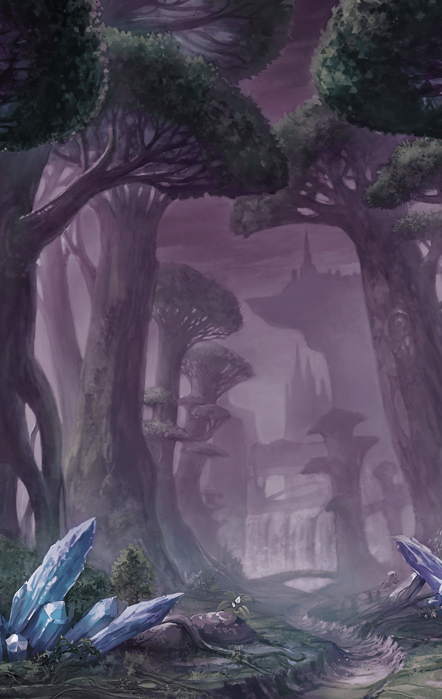
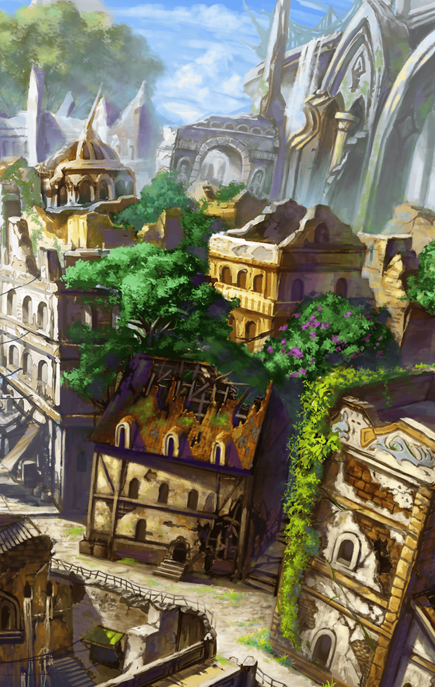

[View script in lisp](../scripts/221071351.txt)

**【フォルカス】**
そんな…

砕け散った鐘を前に呆然とする
フォルカス

**【ソロモン】**
…フォルカス

**【フォルカス】**
この鐘の音を聞けば、
みんながまた協力し合えると
思ったんです

**【フォルカス】**
みんなで協力して
避難してくれれば
みんなは助かるんじゃないかって

**【フォルカス】**
でも、その鐘も
砕け散ってしまいました
もう…終わりです

**【ソロモン】**
いや、そうでもないみたい

**【フォルカス】**
え？

遠くから人々の声が聞こえてくる

**【町人１】**
いたぞ！
巫女様だ！

**【町人２】**
この古木を橋として
使うんだ
協力して動かすぞ！

**【ソロモン】**
すごい団結力ね…

**【フォルカス】**
…でも、どうして？

**【町人１】**
鐘の音が届いたんです…！

**【フォルカス】**
っ！？

**【町人２】**
音を頼りにここまで来ました
きっとここに、巫女様も
いると思って

**【ソロモン】**
そんな…
鐘の音が町の人達の心を
動かしたってこと…？

**【フォルカス】**
そうみたいですね…

**【町人１】**
あの鐘の音を聞いて
目が覚めたんです

**【町人２】**
確かに鐘の音は
俺達の心の拠り所でした

**【町人３】**
だけど、今までの困難は
自分達の力で乗り切ってきたんだ

**【町人１】**
鐘がなくなったとしても、
みんなが協力すれば
なんとかなるって、気付いたんです

**【フォルカス】**
みんな…

**【町人２】**
さあ、二人とも安全なところに
避難しましょう

**【ソロモン】**
ええ、そうね
いきましょう、フォルカス

**【フォルカス】**
はい…！

**【フォルカス】**
町の建物には被害が出ていますが
怪我人は出ませんでした

**【ソロモン】**
まさに鐘の音が起こした
奇跡ね

**【フォルカス】**
そうかもしれません

**【フォルカス】**
奇跡といえば…

**【フォルカス】**
ソロモン
あなたに見せたいものがあります
一緒に来てくれますか？

**【フォルカス】**
見てください！

**【フォルカス】**
滝つぼの水が…
透明に澄み渡っています…！

**【ソロモン】**
…！！

**【ソロモン】**
本当だ…

**【フォルカス】**
とても綺麗ですね…

Next: [221071360](221071360.md)

[Back to index](index.md)
