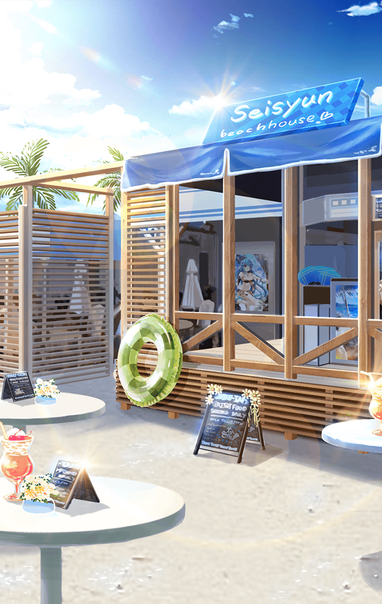

大ガエルの撃破に成功した
マスター達は“海の家”に帰還した

**【ティルフィング】**
アクアさん、このたびは
マスターのピンチを救っていただき
本当にありがとうございました

**【アクア】**
えっ？いやいやいや、
それほどでもあるけど
特別なお礼なんていらないわよ

**【アクア】**
こちらこそ、めぐみんとダクネスが
お世話になったみたいだし
なにより…もう友達、でしょ？

**【ティルフィング】**
友達…
そう言っていただけると
私もうれしいです

それからマスター達は
カエル討伐、及び、異族討伐
両クエストの報酬清算を行った

**【アクア】**
で、で、ねえ！どうなの！
クエストの報酬ってどのくらいの
お金になるのかしら！あー楽しみ！

**【めぐみん】**
は？アクアは討伐クエストに
参加してないのではないですか？

**【ダクネス】**
していたとしても
分配は貢献度に応じてだ
アクアの討伐数は…１／２か？

**【アクア】**
ええっ！？
さっきもカエルのお肉を拾って
討伐数のカウントを手伝ったのに！

**【アクア】**
それに大ガエルにとどめをさしたのは
私（とティルちゃん）だし！
確実にすんごい貢献度のはずよ！

**【デュリン】**
…はいはい
楽観的ねー、自称女神様は

「ははは…でもみんなが無事で
楽しそうで、いいと思うよ」
そう言って、マスターも笑っていた

その夜――

**【アクア】**
…え！
てぃ、ティルちゃん？
報酬のお金は、全部募金に…！？

**【ティルフィング】**
はい、“海の家”や近隣のお店が
カエルの襲撃と洪水で、かなり
壊れてしまったみたいなので…

**【ティルフィング】**
せめて、私達の報酬が
その修繕費の一助になればと…
マスターにも同意して頂けました

**【アクア】**
そ、そう…
カエルと、洪水の、修繕…
それは…いい話ね…

そしてマスター達には“海の家”と
周辺の浜辺の屋台から
豪勢なカエル料理が振る舞われた

**【ティルフィング】**
クエスト達成の慰労と、
修繕募金のお礼だそうです
皆さんで召し上がってください

**【ダクネス】**
おお！まさにフルコースだな
みんなも腹が減ってるだろうし
どんどん食べよう

**【めぐみん】**
ほう、カエルのソテーですか
このソースまったりとして
それでいてしつこくなく…

**【アスクレピオス】**
うんうん、カエルなんて食べれるの？
って思ってたけど、
意外にいけるわね！

**【シタ】**
はい！あのカエルが
こんな素敵なお料理になるなんて
驚きですね！

**【ティルフィング】**
確かに意外ですけど
本当においしいですね

**【アクア】**
はぁ…まったく儲からなかった
１ゼニーも儲からなかった…
だけど…

**【アクア】**
…っぷはー！
この世界にもシュワシュワがあるって
もっと早く教えてちょうだいよ！

**【アクア】**
もう飲みましょう！ヤケ飲みよ！
こっちの世界でも、シュワシュワと
カエルのから揚げって合うわね！

**【ティルフィング】**
ふふっ…
あ、そういえばちょっと
気になったんですが…

**【アクア】**
え？なに？

**【ティルフィング】**
アクアさんって
あの拳のほかには
どんな技をお持ちなんですか？

**【アクア】**
あら、見たいの？私の宴会芸

**【ティルフィング】**
宴会芸…？
お、お願いします！

**【アクア】**
普段は請われて
見せるものじゃないんだけど
今日は特別！花鳥風月～！

**【アクア】**
よっ！ほっ！それそれ～！

アクアがどこからか取り出した
扇子から、いくつもの
水のアーチが飛び出す

**【シタ】**
おお…すごい
どうやってるんです！？

**【アスクレピオス】**
あらゆるところから水が…
まるで神技だわ！

**【ティルフィング】**
素敵です…
なんだか、癒されますね

**【アクア】**
ふふ、私、水の女神ですから！
しかもアークプリーストですから！
そーれ、それー！！

笑顔に満ちた宴は続く

夜の間、そして
きっと明日からも――

さらなる冒険の世界が
このすばらしい仲間達とともに
待っているだろう
