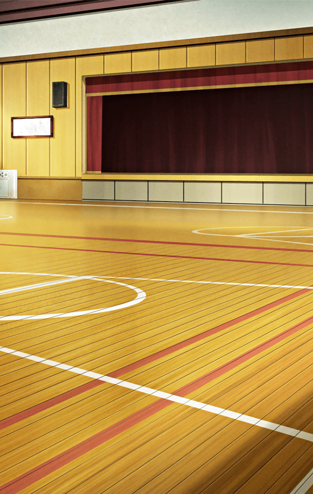

[View script in lisp](../scripts/241051210.txt)

**【メギド】**
よい子のみなさ～ん！
集まって～！

**【プタハ】**
「ファンキル幼稚園
きるひめといっしょ」！
はっじま～るぞ～っ！

**【プタハ】**
画面の向こうの我が子たち！
元気にしておったか？

**【プタハ】**
今日みなと遊ぶのは
我、プタハおかあさんと～？

**【メギド】**
メギドおねえさんですわ！
よろしくお願いいたします♪

**【プタハ】**
本日はファンキル幼稚園のみなと
ファンキル学園に
おじゃましておるぞ

**【メギド】**
みんな、いい子ばかりだから
メギドおねえさん、
とーっても嬉しいですわ！

**【メギド】**
それじゃ、まずはみんなで、
おねえさんたちといっしょに
なかよくお歌を歌いましょうね！

**【メギド】**
ファンキル幼稚園のみんなも
いっしょ、に…

**【レーヴァテイン】**
………

**【メギド】**
あ、あら？
ひとりだけ…？

**【メギド】**
ね、ねえ、他のみんなは？

**【レーヴァテイン】**
どっかいった…

**【メギド】**
えええーーーー！？

**【プタハ】**
な、なんということだ！
ちょっと目を離した隙に…！

**【プタハ】**
探しにゆくぞ、メギド！

**【メギド】**
はいっ！

**【メギド】**
あ、カメラカメラ

**【メギド】**
それじゃ、
画面の前のみんな
後でね！

**【レーヴァテイン】**
いってらっしゃい…

**【レーヴァテイン】**
………

**【レーヴァテイン】**
ふわぁあぁ…
…すやぁ

