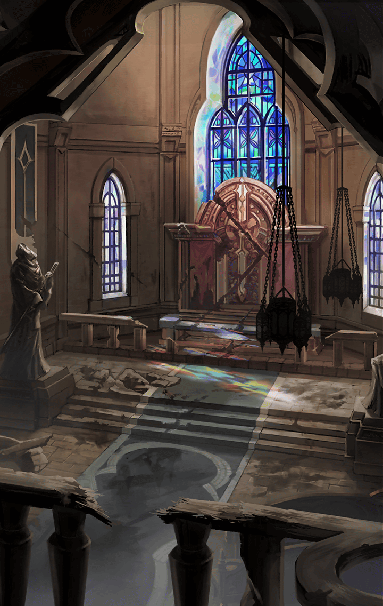

[View script in lisp](../scripts/241520253.txt)

[View source in markdown](241520253.md)

**【異族】**
――――――――！

**【イチイバル】**
ここにも音波を操る異族がいるっ
こちらも対抗するよ！

**【ラブリュス】**
おっけ～！
ラブリュスちゃんの歌声で、
みんな虜にな～れ♪

**【オルフェウス】**
戦いながら演奏するのは大変だけど
やってみせる！

**【異族】**
ガアアアアアアアア！！

**【シストルム】**
そんな攻撃効かないにゃ～！

**【ロジェスティラ】**
笛の音がやみましたっ
皆さん、早くここから逃げて下さい

**【町の人々】**
…えっ？
どこだ、ここは？

**【町の人々】**
私は…誰…？

**【イチイバル】**
意識は取り戻したようだけど、
全く逃げてくれないね…

**【シストルム】**
感情をなくしてるから異族を見ても
怖がらないのにゃっ
仕方ないにゃ

**【ラブリュス】**
ここで異族を殲滅しちゃえば
いいんでしょ！
悪い子にはおしおきだからね～っ

**【異族】**
―――――――――！

**【イチイバル】**
また音波攻撃かい
もう、その手は通用しない…

**【異族】**
――――――――――！

**【シストルム】**
にゃにゃっ？
ボクの………が…を鳴らさ……

**【ロジェスティラ】**
あれあれっ…
………のキー………も音が……

**【ラブリュス】**
何で歌…………

**【オルフェウス】**
あれっ？
みんなの音が聞こえなくなった…
それに声も…どうしてっ…？

**【オルフェウス】**
みんな！
………………！？

**【オルフェウス】**
あたしの声も聞こえないっ
何が起きたのっ…？