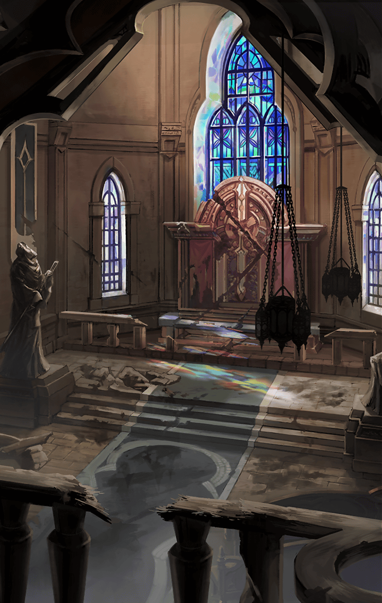

**【オルフェウス】**
その日から、あたしは楽器を
練習するようになった

**【オルフェウス】**
キラーズの影響かもしれないけど、
楽器の練習は楽しくて、自然と
作詞や作曲もするようになった

**【オルフェウス】**
リュディとは、あの平原でときどき
会ってた

**【オルフェウス】**
いつも「初めまして」だったけど
彼女の歌を聞くのは楽しくて
励ましてもらえた

**【オルフェウス】**
あんなに辛かった毎日が、彼女と
彼女の音楽のお陰で楽しいと思える
ようになっていったんだ

**【オルフェウス】**
本当は二人で音を合わせてみたかった
けど、あたしはまだ下手だから、
そんなこと言い出せなくて…

**【オルフェウス】**
一人、部屋で練習を続けてた

**【オルフェウス】**
そんな、ある日…

**【町人達】**
可哀想に…
まだ若かったのになあ

**【町人達】**
あまり長くはないって言われてた
そうよ…
それなのに毎日歌って…

**【オルフェウス】**
あ…お葬式だ…
誰が亡くなったんだろう？

**【オルフェウス】**
え…？
棺に載せてある、あのギターって…
リュディの…

**【オルフェウス】**
リュディは病を患っていた

**【オルフェウス】**
治る見込みはなくて、
本当は入院してないといけない
体だったって…

**【オルフェウス】**
でも、彼女は療養するより音楽を
選んだ
思い切り弾いて歌うことを望んだ

**【オルフェウス】**
そうしてリュディは亡くなった

**【オルフェウス】**
でも、彼女の音楽は残った
お葬式でも流れてた
みんな泣きながら…

**【オルフェウス】**
彼女の思い出話をして笑ってた
あたしの知らないリュディが
たくさんいた

**【オルフェウス】**
あたしは一人、部屋に帰って
それから…

**【オルフェウス】**
それから、ギターを弾いた

**【オルフェウス】**
そのとき、やっと分かったんだ
あたしが何をすればいいのか

**【オルフェウス】**
世界を救うために、あたしは
何がやれるのか

**【オルフェウス】**
あたしは音楽で世界を救う

**【オルフェウス】**
音楽になら、その力がある
あたし自身がどこまでやれるのかは
分からないけれど

**【オルフェウス】**
みんなを笑顔にする力が、
音楽にはある
みんなを癒す力が、音楽にはある

**【オルフェウス】**
この力を身につけることができれば
胸の奥で疼く使命感とも
向き合えるはずだ

**【オルフェウス】**
あたしは、一人で一生懸命、
ギターを練習した

**【オルフェウス】**
バンドを組んで楽しそうにライブ
したり、可愛い服を着て友達と
お喋りしたり…

**【オルフェウス】**
そういう明るい世界にも憧れてたけど
それは自分には手に入らないものだと
思ってた

**【オルフェウス】**
こっそりメイク道具を買って、
鏡の前だけでするオシャレ

**【オルフェウス】**
着ていく予定のない、可愛くて、
少し大胆な服…

**【オルフェウス】**
たまに町を出て、
リュディのいた草原で
自分の作った歌を演奏しながら歌う

**【オルフェウス】**
いつか、誰かがあたしの曲を見つけて
演奏してくれたら
歌ってくれたら

**【オルフェウス】**
それで、みんなが笑顔になって
くれたら…

**【オルフェウス】**
あたしの音楽で世界が平和になったら
最高だなって
それだけで報われるなって

**【オルフェウス】**
そう、思ってたのに…

**【オルフェウス】**
あたしの音楽じゃ、
誰の心にも届かない…

**【オルフェウス】**
みんなを笑顔に、なんて…
おこがましい夢だったんだ…
あたし…もう無理だよ…

**【オルフェウス】**
もう…消えてなくなりたい…

**【オルフェウス】**
…………

**【オルフェウス】**
…………？

**【オルフェウス】**
音が…聞こえる…
どこから…？

**【シストルム】**
にゃにゃにゃにゃにゃにゃにゃにゃ！

**【イチイバル】**
まだだよ
まだ…いける

**【ロジェスティラ】**
わたしだって…頑張ります…！

**【ラブリュス】**
アイドルを～
なめないでよね～っ！

**【オルフェウス】**
みんな…諦めてない…
音はほとんど消されてるのに…

**【オルフェウス】**
それでも抗って…
ほんの少しだけ聞こえてくる…

**【オルフェウス】**
ああ、いいなあ…
あたしもあんなふうに…
なりたかった…

**【オルフェウス】**
でも…あたしの音楽は…
誰にも届かないから…

**【？？？】**
ほんとに？

**【？？？】**
ほんとに、そう思ってるの？
あたしは…

**【オルフェウス】**
えっ…？

**【？？？】**
本当に自分の音楽が届かないって
思ってる？
違うよね

**【？？？】**
あたしはまだ、あたしの音楽を
奏でてないよね

**【オルフェウス】**
…………

**【？？？】**
みんなで演奏してたのは、
ラブリュスの曲

**【？？？】**
さっき一人で弾いたのは、
誰かに聞かれても良いように作った
“余所行き”の曲

**【？？？】**
あたしはまだ、あたしの音楽を
誰にも聞かせてない

**【？？？】**
心の奥から溢れ出す
魂の叫びを

**【オルフェウス】**
だけど…それはっ…

**【？？？】**
みんなを笑顔にって…他人の心を
震えさせようってのに…

**【？？？】**
自分が自分に嘘吐いてたら、
そんなもん響くわけないっしょ

**【？？？】**
リュディは最期まで自分を偽って
なかったよ

**【？？？】**
あたしも、あたしのビートを
世界に響かせなよ
みんなに叩きつけてやんなよ

**【？？？】**
そんとき初めて、
あたしの音楽が届くかどうか
分かるっしょ？

**【オルフェウス】**
ほらほら！
みんな待ってるし！
行くよ、あたし

**【オルフェウス】**
…怖いよ
そんなの、怖い
だって、言い逃れできなくなる

**【オルフェウス】**
生のあたしをさらけ出したら…
もう逃げ場がなくなっちゃうよ…！

**【オルフェウス】**
すごく怖いっ…
すごく怖くて…

**【オルフェウス】**
ああ…
うん
最高に…

**【オルフェウス】**
最高に、楽しそうだよね！

**【オルフェウス】**
あああああああああああああああああ
あああああああああああああああああ
あああああああああああああああ！！

**【オルフェウス】**
あたしのビートを
胸に刻めえええええええええええ！！