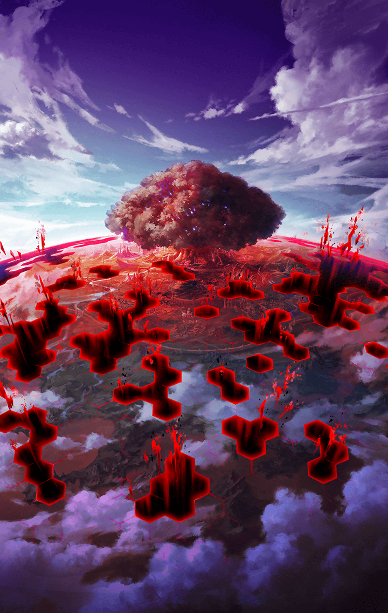

[View script in lisp](../scripts/241530010.txt)

[View source in markdown](241530010.md)

今となっては、遙か昔の話になる――

人類が地上で栄華を極めていた時代

突如、悪魔の軍勢が世界中に現れた

悪魔が率いる魔獣達に人類は為す術も
なく、このまま世界は悪魔に支配
されるかに思われた

だが、そこに一筋の光が差す
世界樹ユグドラシルの出現
そして――

伝説の武具、神器がもたらされたのだ

人類は神器からマナの亜種、
「キラーズ」を抽出する

その力を使いこなすには
幾多の困難と夥しい犠牲が必要で
あったが

人類は決して諦めなかった
ゼロからでも希望を見出し――

悪魔に対抗する存在を生み出した

キラープリンセス
後にキル姫と呼ばれるようになる
少女達である

しかし、人類の中には神器の活用を
良しとしない勢力もあった

彼らは神器を天上の神々に捧げて
救いを求めた

だが、それは天上世界に神器を
奪われるだけの結果となる

奪われた神器を奪還するため
キラープリンセスは
天上世界へと上った

ところが、新たな問題が発生する

天上世界に上がった彼女達は
幾多のイミテーションに分かれて
しまったのだ

記憶を失い、あてどなく彷徨う
キラープリンセス達は
とある存在と巡り会う

キラーズと共鳴するマナの亜種
「バイブス」を持つ者、
奏官と呼ばれし者達である

彼らを束ねる「ラグナロク教会」に
よって神器は管理されることと
なった

キラープリンセスは
イミテーション同士、戦い
「淘汰」されていく

やがて最後の一人、オリジナルに
戻ったとき、その者に神器が
与えられるはずであった

だが、奏官達は教会の思惑に反し、
神器を重視しなかった

自分のキラープリンセスを失う
リスクを冒してまで「淘汰」を
進めようとは考えなかったのだ

奏官達は彼女達を指揮し、
天上世界での覇権を奪い合うように
なっていく

やがて、地上から一人の使者が
訪れた

**【リベリオン】**
何やってんだ、てめえら！
人間同士で争ってる暇があったら
地上で悪魔どもと戦いやがれ！

使者の言葉に興味を覚えた奏官達は
キラープリンセス達とともに
地上へ降り立つ

奏官が指揮を執り、
今度は悪魔との戦いに
彼女達は身を投じていった

そして、人類は勝利を収める
地上の覇権は再び人類の手に戻った

ただし、それは新たな戦いの歴史が
幕を上げることに他ならなかった

強大な力を持つキル姫を従えた
奏官達は、地上世界の
支配者となるべく相争う

地上の人々と手を組み、
ときに取り込み、各々、勢力を拡大
させていったのだ

その中でも、大きな勢力が三つ現れた

彼らはキル姫を強化する新たな技術、
霊装支配《ギアハック》を
それぞれ完成させ

他の勢力を次々に平らげて、
その版図を拡大させていったのだ

奇しくも三国は人々への求心力を
高めるため、似たような手段を取った

すなわち、宗教である

**【教皇】**
大天使ミカエル様を信じなさい
神の慈悲は皆さんに永遠の救済を
与えて下さいます

**【ハルモニア国民】**
世界に永遠の救済を！

大天使ミカエルを信奉する
「調和教」によってまとまった
ハルモニア教皇国

そのキル姫達には天使の力が
聖鎖《ジェイル》された

**【皇帝】**
力だ！絶対的な力によって
全ては統一される！
それがルシファーとの契約だ！

**【ケイオスリオン国民】**
圧倒的な力で絶対的な統治を！

大悪魔ルシファーとの契約、
「明星教」の教えに同調した者達の国
ケイオスリオン帝国

そのキル姫達には悪魔の力が
D.plug《ドミネイトプラグ》された

**【議長】**
全ては円環の理によって繋がって
いくのです
全ての同胞達に平穏を

**【トレイセーマ国民】**
生々流転の運命に身を委ねます！

幻獣ウロボロスを至上と掲げ、
「輪廻教」に従う人々の集まり
トレイセーマ共和国

そのキル姫達には幻獣の力が
獣刻《プラント》された

他のキル姫を圧倒する力を持つ
彼女達の登場によって、地上世界の
勢力図は大きく変化し

ついにハルモニア教皇国、
ケイオスリオン帝国、
トレイセーマ共和国

この三国が覇権を争う時代へと
至ったのである

しかし、三国の力は拮抗した

幾度も戦いが繰り広げられたが、
決定的な事態は起こらず

三国は睨み合いを続けたまま
長き刻を経ることとなった――

やがて――