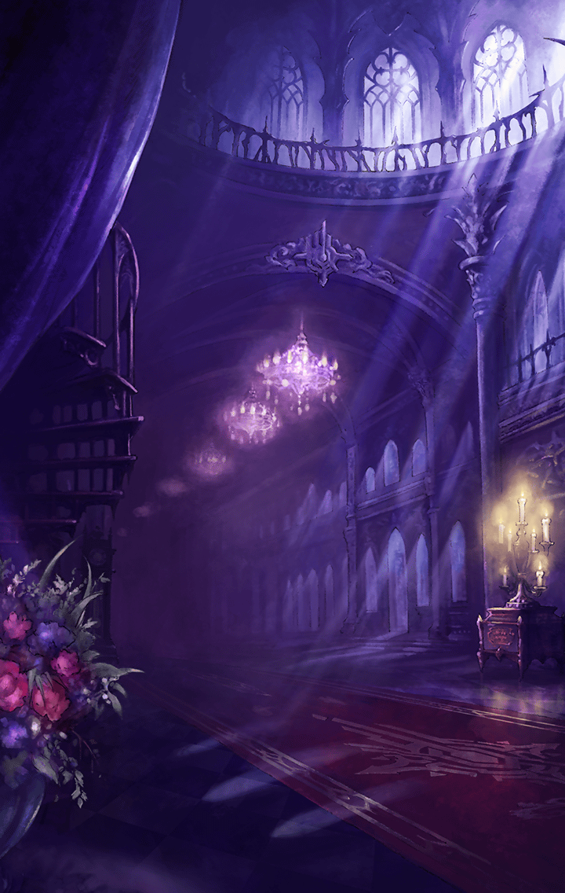

241531010 インテグラルノア編サイド インテグラルノア サイドストーリー インテグラルノア編セブンスキラーズサイドストーリー「巡る世界に大罪の祈りを-前編-」ストーリー 巡る世界に大罪の祈りを-前編-　1話 1 - 初めての再会　ステージ1 初めての再会-1 初めての再会-1

[View script in lisp](../scripts/241531010.txt)

【アスカロン】
…………

【アスカロン】
えっ？
ここは…帝都…？

【アスカロン】
私…さっきまで戦場にいて…
世界が壊れていってて…あれっ？

【アスカロン】
そうだ、ユグドラシル！
世界樹はっ…

【アスカロン】
…あります
青青と葉を茂らせて、枯れてなんて
いません…

【アスカロン】
何で…？
夢…？
でも、感触も確かに…

【イシューリエル】
アスカロン！
そんなところでボーッとしている
場合ではありませんわ

【イシューリエル】
皇帝陛下からの招集命令です
急ぎ、城に向かいますよ

【アスカロン】
は…はいっ
イシューリエル…

【イシューリエル】
…お待ちなさい、アスカロン
あなた、何か隠しごとをしては
いませんか？

【アスカロン】
えっ…？
いえ、そんなことは…

【アスカロン】
どうしよう…
相談してみた方がいいかな？
でも…

【アスカロン】
世界が滅ぶ夢を見たなんて
言ったら、笑われそう…

【イシューリエル】
…そうですか
まあ、いいでしょう
ただし

【イシューリエル】
もし、わたくしに嘘を吐いたら
その舌を抜いて差し上げます
からね

【アスカロン】
はい…

【イシューリエルのマスター】
どうした、イシューリエル？
行くぞ

【イシューリエル】
ええ、マスター
常にあなたの傍らに

【アスカロン】
はぁ…
マスターがいるなんて、
羨ましいっ…

【アスカロン】
私にはまだ適合するマスターが
現れていないのに…

【アスカロン】
弱気はいけません！
きちんと努力を続けていれば、
私にもいつかきっと

【アスカロン】
あ、いけないっ
招集命令がかかっているんでした
急いでお城に行かないとっ

【兵士】
全奏官及びキル姫、整列！
皇帝陛下がおいでになる

【芭蕉扇】
よく来たわね
妾のマスターの前に、皆、
跪きなさい！

【皇帝】
芭蕉扇…お前も少し控えていてくれ

【芭蕉扇】
あら、マスター
いいのよ、遠慮しなくても

【皇帝】
ううむ…まあ、いい
さて、よく集まってくれた、
我が帝国の誉れある勇士達よ

【皇帝】
今日、お前達を呼び集めたのは
他でもない…

【皇帝】
長きに渡る三国分割統治の時代に
終止符を打つときが来たのだ！

【奏官達】
おおおおおお！？

【奏官１】
陛下！
ついにハルモニアとトレイセーマを
討つときが来たのですね！

【皇帝】
然り

【皇帝】
我らの祖先が天上世界より降り、
地上を支配していた悪魔達を
滅ぼして後…

【皇帝】
ここケイオスリオン帝国の祖は
地上世界で財力と権力を有していた
「ビッグ４」の一角

【皇帝】
「CHÂTEAU」と手を組み、
ギルド勢力を拡大していった

【皇帝】
そして悪魔の力をキル姫に付与する
霊装支配、D.plugを開発し、
三大国家の一つにまで成ったのだ

【皇帝】
残るは同じ霊装支配技術を確立させた
ハルモニアとトレイセーマのみ
今まで三国の力は拮抗していたが…

【皇帝】
ついに先日、それを覆す力を
手に入れることができた

【奏官達】
何とっ！？
それは一体、どのようなものなの
ですかっ？

【皇帝】
まあ、待て
最重要機密だ
ただ、断言しよう

【皇帝】
この力があれば、
我らは他二国を必ず圧倒できる
そういう力だ

【皇帝】
次の戦いで全てが変わる
我がケイオスリオン帝国が
世界を統一するのだ！

【奏官達】
おおおおおおおおおおお！
ついに念願の統一が！

【奏官２】
陛下！
出陣はいつですかっ？

【皇帝】
うむ
開戦のときは一月後
戦場はバッファー平原だ！

【アスカロン】
えっ？

【アスカロン】
バッファー平原…ついさっきまで
私達が戦っていた戦場のはずです…

【芭蕉扇】
今、声を上げたのは誰かしら？
陛下のお話し中に無礼ね！

【アスカロン】
あ…す、すみませんっ…

【奏官達】
チッ…
これだからマスターのいない
キル姫は

【アスカロン】
ううっ…

【イシューリエル】
…………

【皇帝】
静かに
マスターの有無にかかわらず
実力のある者が正義だ

【皇帝】
一ヶ月後、その力を存分に
発揮できるよう、皆、戦いに
備えよ！

【奏官達】
ははーっ！
仰せのままに

【アスカロン】
三国の雌雄を決する戦い…
それが一ヶ月後に？
こんなことって…

Next: [241531021](241531021.md)

[Back to index](index.md)
