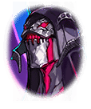

241544030 インテグラルノア編サイド インテグラルノア サイドストーリー インテグラルノア編セブンスキラーズサイドストーリー「巡る世界に大罪の祈りを-後編-」ストーリー 巡る世界に大罪の祈りを-後編-　4話 3 - 絆を胸に　ステージ3 絆を胸に-3 絆を胸に-3

[View script in lisp](../scripts/241544030.txt)

【フォルカス】
はああああああ！

【ルシファー】
ルアアアアアアアアアアアアアアアア
アアアアアアアアアアアアアアア！！

【フォルカス】
正義の業火に抱かれ、
朽ち果てなさい！

【アスカロン】
やりました！

【ルシファー】
ルアアアアアアアアアアアアア…

【グリモワール】
ルシファーの力が収まっていくわ
暴走を抑えられたみたいね

【ムラマサ】
周りの魔獣も崩れ去っていきます

【シユウ】
うがあああぁぁ！
シユウたちのかちだ！

【ヴァナルガンド】
これで解決なのでしょうか…
どうにも腑に落ちませんけれど…

【アフロディーテ】
そうですね…
ミカエルとウロボロスの姿も
見当たりませんわ

【フォルカス】
ともかく、これでルシファーを
制御することができるはずです
装置の起動を――

【ルシファー】
いや、その必要はない

【フォルカス】
ルシファー！？
この程度で倒せたとは思って
いませんでしたが…

【ルシファー】
フン！
今回ばかりは貴様らの手を借りる
より他なかった…

【ルシファー】
我の役に立てたことを誇りに思え

【グリモワール】
何なのよ、キミ！
偉そうにしてっ

【ルシファー】
偉そう？
違うな
我は偉大なのだ

【ルシファー】
故に当然の振る舞いをしているだけだ

【グリモワール】
はんっ！
“傲慢”を司る悪魔らしい発言ね

【グリモワール】
人間達に負けて、実験体扱いされて
きたくせに！

【ルシファー】
ククッ…
やはり貴様はいいな
我と波長が合いそうだ

【ルシファー】
我の呼びかけにも真っ先に応じると
思っていたのだが、存外、そっちの
小娘にまず届きおった

【アスカロン】
私、ですか…？

【ルシファー】
我が解放のヒントを教えてやった
であろう
グリモワールの“傲慢”を

【アスカロン】
あっ！
あのときの声は…あなただったん
ですね…

【アスカロン】
それなら、さっきの声も…？

【ルシファー】
そうだ
胸のこの辺りに厄介な装置が
取りつけられておってな

【ルシファー】
そのせいで己の暴走を止めることが
できなかった…
我も堕ちたものよ

【フォルカス】
それで私達に「胸を貫け」と…

【ルシファー】
お陰で自由の身となった
とはいえ…

【ルシファー】
散々、身体を弄り回されたせいで
まだ本来の力を取り戻せておらん
まったくもって忌々しい…

【アスカロン】
あのっ…！
この世界に何が起きているのか、
ご存知ですかっ？

【アスカロン】
もし解決策を知っているのなら、
教えて下さい！

【グリモワール】
そんな丁寧に聞くことないわよ！
助けてやったんだから答えなさい、
ルシファー！

【ルシファー】
貴様は実に不遜だな
その傲慢さ、心地良いぞ

【ルシファー】
我だけではどうにもならぬからな
真実を教えてやるから、
最後まで働いていけ

【グリモワール】
いちいち癇に障る言い方ねぇ…

【フォルカス】
堪えて下さい
今はルシファーの話を聞きましょう

【グリモワール】
分かってるわよ

【ルシファー】
まず…三国が進めておった「計画」の
ことは知っているな？

【フォルカス】
ミカエル、ルシファー、ウロボロスを
使ったキル姫の新たな強化計画
ですよね？

【ヴァナルガンド】
完成は間近…もしくは完成したようだ
とも記録されていました…

【フォルカス】
やはり、この計画が世界のループを
引き起こしているのですか？

【ルシファー】
ククッ…クハハハハ！
「計画」は「完成間近」かっ
愚かにも程があるな…！

【ルシファー】
やはり平穏など己が身を腐らせる
怠慢に過ぎん

【ルシファー】
我を打ち破った頃の人間どもで
あれば、このように愚かで浅薄な
事態は引き起こさなかったであろう

【ムラマサ】
それは如何なる意味です！？

【ルシファー】
よく聞け、キル姫ども
三国の「計画」は、そのどれも
完成などしてはおらん

【ルシファー】
それどころか…
とうの昔に破綻しておるのだ！

【ルシファー】
三国全ての計画が失敗し、
我ら三体が暴走してしまったことが
全ての発端よ

【フォルカス】
全ての計画が…
失敗していた！？

【ルシファー】
クククッ
「計画」の詳細は知らんようだから
少し話してやろう

【ルシファー】
我らに勝利した後、人類は我の身体を
奇怪な装置に繋げて実験を始めおった

【ルシファー】
我を使ったのは、朽ちてなお、
強大な力を有しておったからで
あろう

【グリモワール】
自慢を挟まなくてもいいわよっ

【ルシファー】
余所ではミカエルやウロボロスの
身体を使って実験しておったようだぞ

【ルシファー】
幻獣どもも大人しくしておれば
良かったものを、我らが敗れた後、
地上の覇権を狙ったせいで…

【ルシファー】
人類に逆に狩られおったわ
そして実験の末…

【アスカロン】
霊装支配…D.plugが完成するんですね

【ルシファー】
我らの力を抽出する技術を作り出し
おった
なかなか面白いことをする

【ルシファー】
まあ、それで止めておけば良かったの
だろうが、欲望とは決して尽きぬ

【ルシファー】
人類は更なる力を求めた

【フォルカス】
それが「三体計画」…！

【ルシファー】
そうだ
我らの力を抽出するだけでは足りぬ
ならば、どうする？

【ルシファー】
我そのものを再生して、
直接操れば良い

【ルシファー】
我の力を抽出するだけでは得られぬ
能力も我そのものを使役すれば
使いこなせるはず

【ルシファー】
人類は…ケイオスリオンの皇帝は
そう考えたのだ

【ルシファー】
余所も同じだ
ミカエルを、ウロボロスを、
直接、使役して…

【ルシファー】
その固有能力を使い、他国を
圧倒する…そういう算段だった

【グリモワール】
ふぅん…
だから、一度は滅ぼされたはずの
キミが存在しているのね

【ルシファー】
だが、人類の“傲慢”は皮肉にも
我に御しえぬ力を与えた

【ルシファー】
余所も同じよ
かくして我らはあえなく暴走…

【ルシファー】
危うく世界が消し飛ぶところで
あったぞ

Next: [241544040](241544040.md)

[Back to index](index.md)
