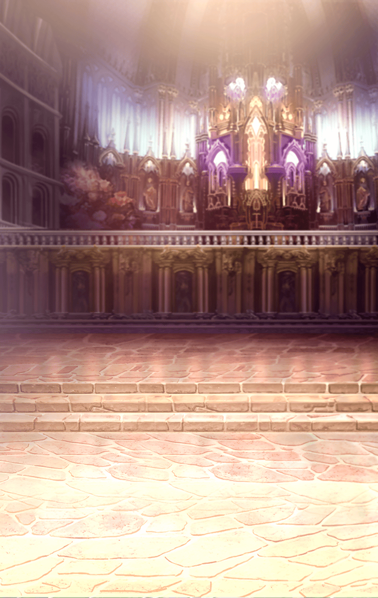

241610410 インテグラルノア編サイド インテグラルノア サイドストーリー 壊逅アップグルント ストーリークエスト 壊逅アップグルント 2 - 1話 壊逅アップグルント　OP-1 壊逅アップグルント　OP-1

[View script in lisp](../scripts/241610410.txt)

始まりには終わりがあって、
終わりには始まりがあるの

始まりには責任が付き物じゃ、
終わらせるという責任がな

始まりが祝福とされ、
終わりが救済なのだとしたら…
素敵なことばかりだと思いませんか？

でも、私達は終わりすら、奪われた

【フリズスキャールヴ】
…趣味が悪いな

【グレイプニル】
あら、どうしてそんなことを？
ここは思い出の場所では
ないのですか？

【ギャラルホルン】
…………

【フリズスキャールヴ】
まぁよい
むしろ、この話をするには
うってつけの場所かもしれんな

「終わったのなら、何を始める？」

誰とはなしに話題に挙がる
終わった先の、未来の話

終わった先に何があるなんて
誰も知りはしないのに

そもそも、此処には…

【ギャラルホルン】
ギャラルはねぇっ…――

背伸びをすることもなく

【フリズスキャールヴ】
であれば、わらわは――

自分の想いのままに

【グレイプニル】
私はですね――

誰かの為ではなく

それは『もしも』の物語

その『もしも』は、
『今』辿り着けたかもしれない

けれど『もしも』になった『今』は
もう訪れることのない『願望』

【フリズスキャールヴ】
わらわ達の願いが届くことはない

【ギャラルホルン】
ギャラルが…悪い子だったから？

【グレイプニル】
いいえ…
その裁定すら放棄されました

すべての願いは叶わない
誰かの願いは誰かの願いを否定する

そんな単純なすれ違いが
世界をこんな形にしてしまった

だから終わりは平等に
それが救いだから

でも、まだその時じゃない

いずれ、誰かの願いを背負い
世界を終わらせるその日がくる
この微かな願いも漆黒に染まる

だから、もう少し話をしよう
あと少しだけ――

【？？？】
――――！

【？？？】
――、――――？

【ギャラルホルン】
…………

【？？？】
ねぇ、あなたも一緒に！

【ギャラルホルン】
…あ、――――

【ギャラルホルン】
…………

【フリズスキャールヴ】
…どうした、行けばよいだろう？

【ギャラルホルン】
でも、ギャラルは…

【フリズスキャールヴ】
そなたは変わらぬのう
大丈夫、誰もそなたを傷つけぬ

【ギャラルホルン】
…っ！

【フリズスキャールヴ】
それに、そなたが切望する
オトモダチ、とやらも
できるはずだ

【ギャラルホルン】
う、うん！

【フリズスキャールヴ】
ふふっ…

【グレイプニル】
お優しいんですね

【フリズスキャールヴ】
なんじゃ、見ておったのか

【グレイプニル】
ええ、私もここにいますから

【フリズスキャールヴ】
…そうじゃな
いや、うむ、わらわも向こうで
ちとやってくるか

【フリズスキャールヴ】
久方ぶりに他愛のない日常とやらを
堪能するとしよう
例えそれが仮初めであったとしても

【グレイプニル】
まぁ、それはいいですね！
私も何か用意しましょう！

【フリズスキャールヴ】
絶望に埋もれた我らの願いの欠片
時にはそれを手にするのも悪くない
ここでなら、それが許される

【フリズスキャールヴ】
全ての世界に根付き
世界の全てを記憶する
ユグドラシルの中であれば

【？？？】
ほらほら！
行きますわよ！

【ギャラルホルン】
ま、待って…っ！
ギャラルも――

【ギャラルホルン】
わぁ…

【カラドボルグ】
ギャラル？
どうしたの、ボーっとして

【デュランダル】
虹も出ていないのに
何に見とれているんですの？

【カラドボルグ】
えっ、虹！？
どこどこ！？

【デュランダル】
だから出ておりませんの！

【ギャラルホルン】
…ふへへっ

【カラドボルグ】
ふふ、やっと笑ったわね

【ギャラルホルン】
え…？

【デュランダル】
これからお出かけですもの
楽しい時には笑顔でしょう？

【ギャラルホルン】
…うん！
笑顔がいい、ぬひひひひ

【デュランダル】
なんだか先ほどの笑顔とは
訳が違うような気がしますわ…

【デュランダル】
随分雰囲気変わりましたわね

【ギャラルホルン】
えっ

【カラドボルグ】
ふふ、いいじゃない
そのおかげで気兼ねなく
買い物が楽しめるんだから

【カラドボルグ】
…あらっ

【カラドボルグ】
いいわね、素敵だわ
ギャラルによく似合っているわよ！

【ギャラルホルン】
ふへへ、そうかなぁ

【デュランダル】
あら、ギャラルにはもっと
おしとやかなほうが
お似合いですわよ

【デュランダル】
ほら、こちらなんていかがかしら？

【ギャラルホルン】
こっちもかわいい、ね

【カラドボルグ】
うん、そっちもいいわね
お値段は少し可愛くないけれど

【ギャラルホルン】
ギャラルのおこづかいじゃ
ちょっと買えないかも…

【デュランダル】
お、オホン！
今日は下見、ですわ！

【カラドボルグ】
ふふっ、いつかの為の下見ね！
そういうことにしましょう

【ギャラルホルン】
いつかの為…

【デュランダル】
ギャラル、紅茶が冷めてしまいますわ

【ギャラルホルン】
え？

【ギャラルホルン】
ここは…綺麗ね

【カラドボルグ】
滝のそばならいつでも虹がかかる
なるほど、とっても素敵ね！

【カラドボルグ】
ギャラルもそう思うでしょう？
虹、好きだったものね！

【ギャラルホルン】
虹は好きよ
キラキラして、儚くて…

【デュランダル】
わたくしも大好きですわ！
空にかかる虹はも～っと好きですけど

語らいながら過ごす３人は
まるで『オトモダチ』のよう

【ギャラルホルン】
ふへへっ、
みんなで虹を見ながらお茶…あうっ

【デュランダル】
紅茶が熱すぎたのかしら！？
冷める前にとは言ったのですが…
ギャラル、ごめんなさい

【ギャラルホルン】
ううん、違うのよ
ちょっと、びっくりしただけ

『オトモダチ』と一緒に飲んだ
紅茶の香りはとても華やかで…

ちょっぴり背伸びして
ミルクもお砂糖も無しで飲むと
やっぱり苦くて渋くて

【ギャラルホルン】
ふへへへ…

今だけは背伸びも
お休みにしてもいいのかな、なんて

【フリズスキャールヴ】
ふふっ、美しいな

【フリズスキャールヴ】
…ふむ、いい葡萄酒じゃ
まぁ、酔うも酔わぬも
気の持ちようじゃがのう

【グレイプニル】
お待たせしました
お口に合うと良いのですが…

【フリズスキャールヴ】
おお、来た来た
いい香りじゃのう

【フリズスキャールヴ】
ん、これは美味じゃ
ワインの味をより豊かにしてくれる

【フリズスキャールヴ】
…そなたもどうじゃ、付き合わぬか？

【グレイプニル】
もう、程々にしてくださいね

【フリズスキャールヴ】
なんじゃ、つれないのう

【フリズスキャールヴ】
まだまだ時間は
いくらでもあるじゃろうに…

Next: [241610420](241610420.md)

[Back to index](index.md)
