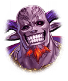

251051461 限定クエスト  PHANTOM of DEAD　ストーリークエスト PHANTOM of DEAD　ストーリークエスト 7 - PHANTOM of DEAD　【EP6】 PHANTOM of DEAD 【EP6】 PHANTOM of DEAD　【EP6】 戦闘前

[View script in lisp](../scripts/251051461.txt)

【スイハ】
たああぁっ！！

【アスモデウス】
…まさか、人間のくせに
ここまでの力を
もっているなんてね

【ベルゼブブ】
ギャギャ…

【スイハ】
か、勝った…
勝ちましたよ

だが、最深部の部屋から
質量を持ったかのような
『闇』が溢れ出す

【？？？】
グハハハハハハ！
これで同じ悪魔だってんだからな
情けねえ

【スイハ】
あ、あなたは…？

【？？？】
俺様はマモン
強欲のマモン様だ！

【シェキナー】
たとえ何人出てきても同じです
すぐに射抜いてあげます

【ミョルニル】
みんなぺったんこにしちゃうよ！

【デュランダル】
華麗に薙ぎ払います！

【ブラフマーストラ】
全部吹き飛ばす！

【スイハ】
！！
みんな…よかった…

【スイハ】
そうです
みんなの力が合わされば…

【マモン】
おっと、俺様をその悪魔どもと
一緒だと思うなよ

マモンは注射器を出して
自分の首に刺すと
マモンが纏う闇の力が増していく

【マモン】
これが、俺様の新たなる力だ！

【スイハ】
な、なんて力…

【マモン】
グガアアアアアア！

【マモン】
俺様が創造主となって
新たな世界を築くのだ！

【シェキナー】
そうはいきません！

だが、シェキナーの放った矢が
マモンの皮膚を
傷つけることはなかった

【シェキナー】
そ、そんな！

【スイハ】
みなさん、一斉に攻撃しましょう！

スイハ達が全員でマモンに
総攻撃をかける
しかし――

【マモン】
グガアアアアアアア！

マモンには全く通じない

【シェキナー】
まさしく、化け物ですね

【マモン】
ウグ……グぐ
ア…ガがが…

【スイハ】
なんでしょう？

【シェキナー】
おそらく、先ほど打った
注射の中身の副作用でしょう

【シェキナー】
力を得ることができても
自我がもたないようですね

【マモン】
グガアアアアアアア！

【スイハ】
きゃああ！

無作為に暴れ回るマモン

【スイハ】
こ、このままじゃ…

そのとき、
上空からヘリコプターの
プロペラ音が響く

【ゼロ】
助けに来たぞ、
スイハ、シェキナー
他のみんなも無事か？

【スイハ】
え？
ここは建物内では？
どうやって飛んでるんです…？

【ゼロ】
今は細かいことを考えてる
暇はない！
これを使え！

ゼロがヘリから
あるものを落とす

【ゼロ】
これはゾンビウィルスが
蔓延した世界を
救った最強の武器…

【ゼロ】
ロケットランチャーだ！

【ゼロ】
いけ、スイハ！
その格好をしたお前ならやれる！

『ロケットランチャー』を入手した

【スイハ】
はい！

Next: [251051463](251051463.md)

[Back to index](index.md)
