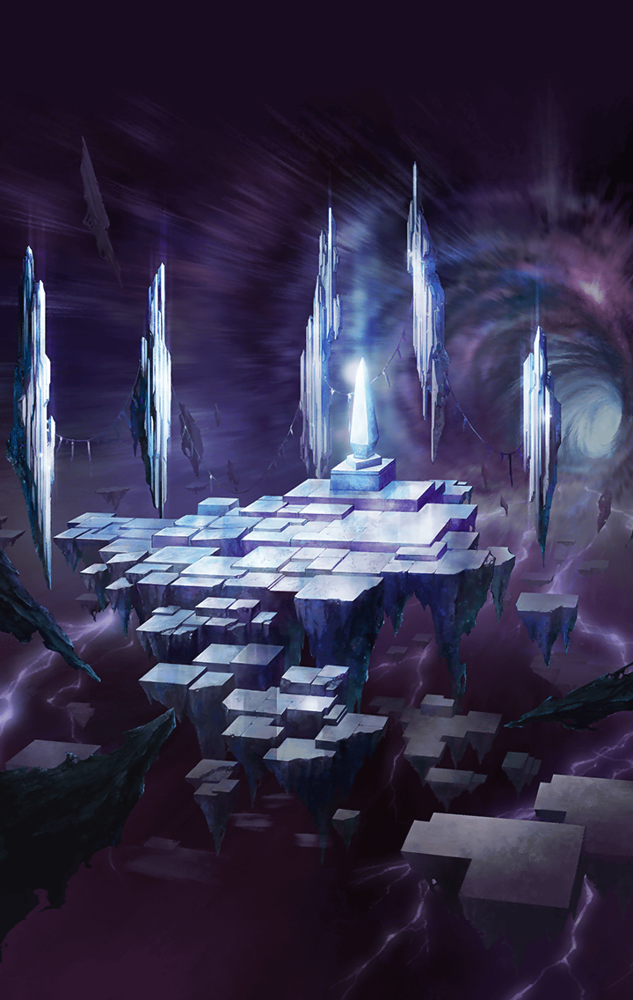

[View script in lisp](../scripts/2750008.txt)

[View source in markdown](2750008.md)

**【ティルフィング】**
レナ…ごめんなさい！

**【レナ】**
ありがとう、ティル――

**【ティルフィング】**
やった…
“レイヴナー”を打ち倒しました

**【クロエ】**
お見事ですっ
これで私達も元の世界に戻れますね…

**【サクラ】**
全く…なんだったのよ～…

**【ティルフィング】**
でも、皆さん無事で良かった

**【クロエ】**
そうですね
全員無事だというのが一番だと
ヴェテル様も仰ってましたし

**【サクラ】**
だから、べてるって誰？
ま、確かに四人全員生き残って
良かったよね～っ

戦いを終えた三人は清々しい顔をして
いる

**【クロエ】**
この扉を潜れば元の世界に戻れる
ようですね

**【サクラ】**
は～っ！疲れた～
早く帰って温泉入りたい！

**【ティルフィング】**
%(userName)sも
お疲れ様でした

**【ティルフィング】**
どうしたんですか？
…大丈夫ですか？

**【ティルフィング】**
あの…どうして…
泣いているんですか…？

**【ティルフィング】**
悲しいことなんて、
なにもないはずなのに…

**【？？？】**
お願い
助けて欲しいの
あの世界で私と三度、出会って

**【？？？】**
アナタならきっとできる
アナタにしかできないことなの

**【？？？】**
そうすればきっと、新しい扉を開く
ことができるから――