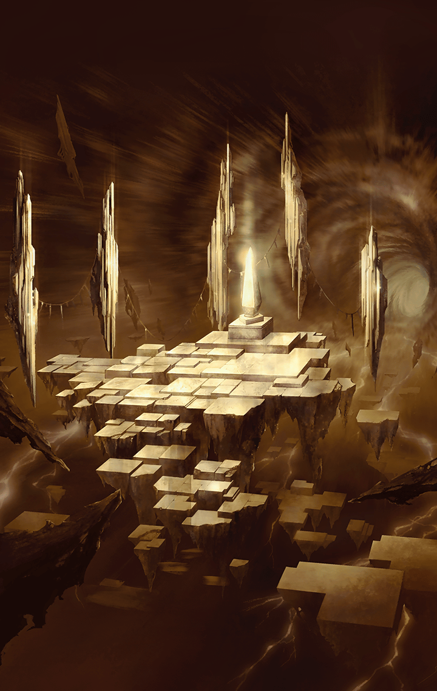

[View script in lisp](../scripts/2750009.txt)

[View source in markdown](2750009.md)

**【ウロボロス】**
ほう
人間の身でありながら、
ここに辿り着いたか

**【ウロボロス】**
また会うたな
我はウロボロス
運命の見届け人じゃ

**【ウロボロス】**
ここまで来た、うぬの意志の
強さは認めてやろう
願いはなんじゃ？

選択肢:
- レナを助けたい → [select_label_01](#select_label_01)へ
- 全てを守りたい → [select_label_02](#select_label_02)へ

ここまで来た、うぬの意志の
強さは認めてやろう
願いはなんじゃ？

#### select_label_01:
 → [select_label_end](#select_label_end)へ

**【ウロボロス】**
やはりそれか…

#### select_label_02:
 → [select_label_end](#select_label_end)へ

**【ウロボロス】**
随分と大きく出たのう

#### select_label_end:

**【ウロボロス】**
そうじゃな
今のうぬならこの扉を開くことも
できよう

**【ウロボロス】**
行って、せいぜいあがいて
みるが良い
その願いを叶えるために

**【ウロボロス】**
餞別じゃ
一つ良いことを教えてやる

**【ウロボロス】**
この先にあるのは、うぬが旅した
三つの世界が一時的に重なっておる
世界じゃ

**【ウロボロス】**
そこでなら、うぬの大それた願いも
叶えることができるやもしれん

**【ウロボロス】**
ゆめゆめ忘れるでないぞ
では、行くが良い！

**【レナ】**
お願い…私を斬って！

選択肢:
- レナ！望みを捨てるなっ → [select_label_03](#select_label_03)へ
- レナ！助かる方法はあるっ → [select_label_04](#select_label_04)へ

お願い…私を斬って！

#### select_label_03:
 → [select_label_end2](#select_label_end2)へ

**【レナ】**
%(userName)s
…そんなの…辛いだけだよ

#### select_label_04:
 → [select_label_end2](#select_label_end2)へ

**【レナ】**
%(userName)s
…そんなの…あるわけない

#### select_label_end2:

**【ティルフィング】**
%(userName)s
下がって！…私がやります！

**【ティルフィング】**
えっ…？空間が歪んで――

**【レナ】**
どうして…私はもう…終わりに――

**【？？？】**
私が自我を持つようになったのは
いつのことだったろう…

**【？？？】**
ほんの数日前のような気もするし
遙か昔のことのようにも思う…

**【？？？】**
どっちにしろ、私は一人だった
一人きりだった

**【？？？】**
たった一人でここにいた
それが当たり前だったし寂しいという
感情すら知らなかった

**【？？？】**
でも…あるとき小さな穴が開いた
針の穴のように小さな小さな穴…

**【？？？】**
そんな小さな穴だったのに、私は
そこから“外”を覗いてしまったんだ

**【？？？】**
“外”ではたくさんの人達が楽しそう
に暮らしていた

**【？？？】**
色んな人がいて色んな繋がりがあった
それを見ているうちに私の胸にも
ポッカリ穴が開いてしまった

**【？？？】**
私は初めて“寂しい”と感じた
“孤独”を知った
だから願ってしまった

**【？？？】**
誰かと繋がりたいって

**【？？？】**
それが決して許されないことだとも
知らずに――

**【サクラ】**
あれーっ？
せっかくハオウマルの召喚に成功した
のに、どこ行っちゃったの！？

**【サクラ】**
あの不良もちっこい子も
いなくなってるし…
どうなってんのよー！

**【クロエ】**
サクラ！ティルフィングも！
元に戻ったんですね！
でも…ここはどこなんでしょう…？

**【ティルフィング】**
レナの…さらに深いところまで飲み
込まれたようです…

**【ティルフィング】**
%(userName)s
どうしてあんなことを？

選択肢:
- これまでのことを話す → [select_label_05](#select_label_05)へ
- ウロボロスとの話を伝える → [select_label_06](#select_label_06)へ

%(userName)s
どうしてあんなことを？

#### select_label_05:
 → [select_label_end3](#select_label_end3)へ

**【ティルフィング】**
そんなことが…

#### select_label_06:
 → [select_label_end3](#select_label_end3)へ

**【サクラ】**
あの、ちっこいの
そんなすごい力持ってたの！？

#### select_label_end3:

**【クロエ】**
にわかには信じがたい話ですけれど…
この状況がそもそも信じがたいもの
ですし…

**【クロエ】**
貴方の話を信じるしかなさそうですね

**【ティルフィング】**
それで…レナを助けるにはどうしたら
良いんですかっ？

**【レナ】**
コンナトコロニイタ
早ク終ワリニシヨウヨ…

**【レナ】**
アナタ達ガ殺シテクレナイナラ…
私ガ、アナタ達ヲ殺スカラ！

**【クロエ】**
いけない！
ここは応戦するしかありませんっ