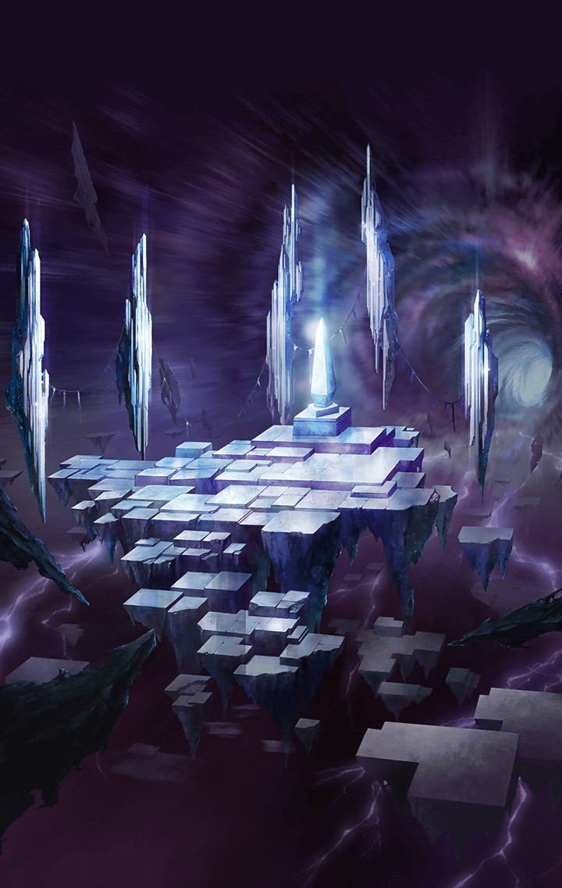

[View script in lisp](../scripts/2750010.txt)

[View source in markdown](2750010.md)

**【ティルフィング】**
くっ…
いっそう力を増したようです

**【クロエ】**
先程は私一人でもなんとかなりそう
だったのに、三人がかりで苦戦する
だなんて…

**【サクラ】**
なんか強さが三倍くらいになってる
気がするんだけどーっ

**【ティルフィング】**
%(userName)sの
話によると、ここでは三つの世界が
重なっています

**【ティルフィング】**
その影響でレイヴナーの力も三倍に
増しているのでは！？

**【サクラ】**
そんなのずるいじゃん！
ってか、私達の力はなんで三倍に
なんないのよ！！

**【クロエ】**
私の知る世界ではサクラもティルも
途中で消えてしまいましたから…

**【ティルフィング】**
ここに辿り着くことができた
“私達”は一人分しかいない
ということですね

**【サクラ】**
こんのぉ～！
せめて三体に別れて
出てきなさいよーっ！

**【サクラ】**
そしたら一体ずつ叩くことも
できたのに！

**【レイヴナー】**
私ハコノ世界ソノモノ…
故ニ幾ツ重ナロウトモ一ニシテ全
普遍ニシテ不変ナノヨ

**【クロエ】**
数が変わらない代わりに
力が増すという理屈ですかっ
厄介ですね

**【ティルフィング】**
…でも、だったらレナは？

**【ティルフィング】**
レナとレイヴナーは同一の存在…
だけど彼女は“三人”この世界に
存在しているはず…

**【クロエ】**
ティル、危ない！

**【サクラ】**
戦ってる最中にどうしたのよ！？

**【ティルフィング】**
ごめんなさい…
なにかが掴めそうな気がして―― 

**【ティルフィング】**
これはっ…？
空間にヒビが入っています

**【サクラ】**
いよいよ時間がなくなってきたって
ことだよね？

**【レナ】**
ソウダヨ…
私ヲ助ケル方法ナンテナイ…
早ク倒シテ…サモナイト！

**【クロエ】**
力がさらに増大していく…

**【レナ】**
全テヲ食ライ尽クシ…消シ去ッテ
シマウカラ！
早ク…早ク終ワリニシテヨォッ！！