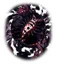

2750012 育成クエスト  3タイトルコラボ-誰ガ為に姫は哭く- 3タイトルコラボ-誰ガ為に姫は無く- 誰ガ為に姫は無く～第3話～ 3コンテンツコラボ裏3 3話｢誰ガ為に姫は無く｣ 戦闘後

[View script in lisp](../scripts/2750012.txt)

【レナ】
あれ…？
私、まだ生きてるの？

【レナ】
どうして…アナタと切り離されて
存在していられるはずがないのに…

【レイヴナー】
…………

【レナ】
…うん
分かってる
ずっと感じてた…

【レナ】
世界を滅ぼしかけたのも
私のためだったんだよね
私が願ってしまったから…

【レナ】
アナタは私のために人々の記憶を
集めた…世界そのものを
集めようとした…

【レナ】
それは間違った行いだったけど…
誰かと繋がりたいっていう私の願いを
叶えるためだったんだね

【レイヴナー】
…………

【レナ】
ごめんね
それから、ありがとう…今まで…

【レナ】
もういいの
一緒に眠ろう、永遠に
誰にも迷惑かけないように…

【レナ】
みんなと…ちゃんとお別れを――

【レイヴナー】
…………

【レナ】
えっ…？
でも…私…そんなっ…

【レイヴナー】
…………！

【レナ】
…うん
頑張るよ、私
ありがとう…さようなら――

【レイヴナー】
…………

【ウロボロス】
ふむ
首尾良くレナの三分の一だけ
切り離しおったか

【ウロボロス】
随分と無茶な理屈じゃが、人間は
ときに思いがけないことを起こしおる

【ウロボロス】
まあ…我もそれを見るのが楽しみ
なのかもしれんがな

【レナ】
！？
ここ…みんな…

【サクラ】
レナーっ！
良がっだよぉ～っ…

【レナ】
サクラ！？
…ちょっと…涙を私の服で…
鼻水汚いっ

【クロエ】
サクラ、少し落ち着きましょう
上手くいって良かった

【ティルフィング】
本当に…
[ユーザー名]の
おかげですね

【レナ】
あの…どうやってレイヴナーと
私を切り離したの？

【ウロボロス】
我がざっと説明してやろう
本来なら、うぬとレイヴナーを
切り離すことはできん

【ウロボロス】
じゃが、そこの人間の願いが
真理の扉を開いたのじゃ

【ウロボロス】
今、このとき、ここだけは
三つの世界が重なって存在しておる

【ウロボロス】
故に、うぬも三人分重なって
存在しておるのじゃ

【ウロボロス】
対してレイヴナーは次元の狭間に
遍在しておるから世界が幾ら
重なろうと一体しか存在せぬ

【ウロボロス】
この歪みを逆手に取って、うぬから
三分の一ずつ切り離したのよ

【ウロボロス】
うぬの“過去”“現在”“未来”の
うち“過去”だけをな

【ウロボロス】
三人分の“過去”をまとめて
うぬ一人分じゃ
それをアレの中に残してきた

【ウロボロス】
今のうぬは“現在”と“未来”しか
持たぬ三分の二の存在じゃ

【ウロボロス】
この先を生きるに不自由はなかろうが
今後、レイヴナーとともにあった
過去を思い出すこともあるまい

【ウロボロス】
さて、うぬに問おう
今なら我の力で再びレイヴナーと
一体化することも可能じゃ

【ウロボロス】
うぬが決めよ
“過去”と訣別して記憶のないまま
見知らぬ世界で生きるか

【ウロボロス】
“過去”へと戻り永遠の眠りにつくか

【サクラ】
ちょっと！
なに、勝手なこと言ってんのよ
チビハオウマル！

【クロエ】
…ウロボロスの正体を知っても
なお、その態度ですか、サクラ
ある意味、尊敬します

【ティルフィング】
…でも、確かにこれからのことを
決めるのはレナ自身であるべきです

【サクラ】
レナ！
もちろん私達とむぎゅっ――

【クロエ】
サクラ、ここは黙っていてください

【サクラ】
むむむ～っ…！

【レナ】
私は…私はっ――

【サクラ】
そんじゃ、また機会があったら
会おうね～
今度はもっとゆっくりしたいし！

【クロエ】
貴方達のことは決して忘れません
離ればなれになっても心は一つです

【ウロボロス】
ほれ、さっさと扉を潜れ
最後まで世話を焼かせる者どもじゃ

【ティルフィング】
サクラ、クロエ、またいつか…
[ユーザー名]も

選択肢:
- いつでも会えるよ → [select_label_01](#select_label_01)へ
- またね → [select_label_02](#select_label_02)へ

サクラ、クロエ、またいつか…
[ユーザー名]も

#### select_label_01:
 → [select_label_end](#select_label_end)へ

【ティルフィング】
フフッ
そうですね
不思議とそんな気がします

#### select_label_02:
 → [select_label_end](#select_label_end)へ

【ティルフィング】
はい
不思議とまた会える気がしています

#### select_label_end:

【サクラ】
んじゃね～！

【クロエ】
それでは！

【ティルフィング】
私達も行きましょうか

【レナ】
ええと…私…記憶がなくて…

【ティルフィング】
ええ…
でも、大丈夫だから

【ティルフィング】
レナ
アナタの未来にはきっと素晴らしい
ことがたくさん待っているわ

【ティルフィング】
だから、胸を張って前に踏み出して！

Next: [2760001](2760001.md)

[Back to index](index.md)
