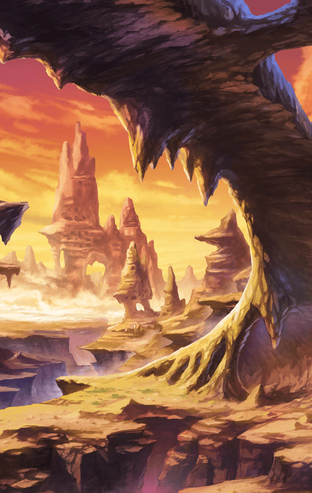

[View script in lisp](../scripts/2760004.txt)

**【デュリン】**
うううっ、ぬるぬるで気持ち悪い…

**【アクア】**
やっぱり生臭い…
ぐすっ、どこの世界だろうと
カエルの中は変わらないのね…

マスターは２人を慰めつつ、
周囲に不自然な穴が
たくさんあることを指摘する

**【ティルフィング】**
カエルが出てきた穴…にしては
大きすぎますね

マスターは試しに空から
見てもらえるよう
デュリンに頼むが…

**【デュリン】**
妖精扱いしてんじゃないわよ！
鳥でもないしっ！！

鼻頭に痛烈な体当たりを食らい、
結局自ら木に登って
確認する羽目となった

その結果、その穴が
“オ”という形であるとわかるが…

**【ティルフィング】**
マスター、落ちないように
気をつけて下さいね…！

はらはらとマスターを見守る
ティルフィング以外の２人は
興味ない様子であった

**【アクア】**
…カエル退治は済んだんでしょ？
ねぇ、無駄にうろうろしてないで
とっとと帰りましょうよ

**【デュリン】**
…そうね、とっととお風呂にでも
入らないと、ぬるぬるが
気持ち悪くてしょうがないし！

**【アクア】**
そうね、さっぱりしたら
今日はカエルの唐揚げで
一杯行きましょうか！

**【デュリン】**
…こいつらって食べられるの？

**【アクア】**
なかなかおいしいわよ？
淡白な味わいだから、どんなソースと
合わせるかで色々と楽しめるし

**【デュリン】**
ふぅん…
この大きさで食料になるっていうのは
とてもありがたいわね

**【デュリン】**
…でも、狩るのは
もう勘弁願いたいところだわ…

Next: [2760005](2760005.md)

[Back to index](index.md)
