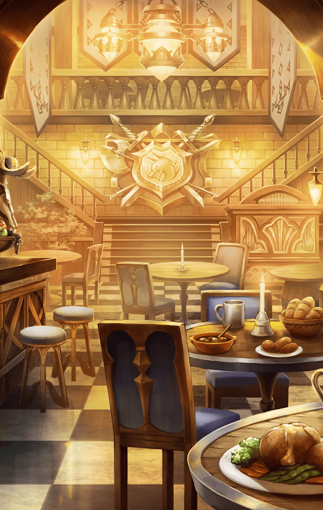

2763001 限定クエスト このすばコラボ この厄介な機動要塞に粛清を！ この厄介な機動要塞に粛清を！初級 1 - この厄介な機動要塞に粛清を！初級 この厄介な機動要塞に粛清を！初級 この厄介な機動要塞に粛清を！初級

[View script in lisp](../scripts/2763001.txt)

【ルナ】
緊急クエストです！
街の周辺で正体不明の敵対者が
確認されました！

【ルナ】
手の空いている方は
討伐戦に参加して下さい！

【ルナ】
“デストロイヤー”が接近中との
情報も届いています！その可能性も
踏まえての対応をお願いします！

【デュリン】
…今の呼びかけ、みんな聞いたわね？
街に被害が出たりする前に
とっとと討伐するわよ！

【デュリン】
…って、今いるのってこれだけ？
他の子が集まってくるの
待った方がいいかしら…

【グリモワール】
んもー！
ワタシ達じゃ敵わないとでも
言いたいわけぇ？

【ヤグルシ】
ヤグだって頑張ればできるってとこ、
マスターやお姉ちゃんに
見せてあげちゃうの！

【ダクネス】
なに、クルセイダーとして
皆のことはこの私が
身を挺して守ってみせる！

【めぐみん】
ふふふ…
我が爆裂魔法の出番というわけか…

【めぐみん】
いいでしょう！
どんな敵だろうと、
一網打尽にしてあげます！

【グリモワール】
む～…
キミの魔法は味方も巻き込みそうで
正直、怖いんだけど！

【ダクネス】
マスターの采配があるんだ
その辺の心配は不要だろう

【ダクネス】
…あと、アクアがまた借金を
重ねているようなので…

【ダクネス】
“デストロイヤー”戦となるなら
ここで一気に稼いでおかないと
正直、返済の目処がたたない

【グリモワール】
そっちの事情はどうでもいいけど
キミは盾としてアテにできそうね

【グリモワール】
…これだけいれば十分じゃない？
いいわ、早く行きましょ

【ヤグルシ】
ちょ、ちょっと怖いけど…
ヤグ、頑張るよ！
マスターも応援してね！！

【デュリン】
って、こら！
勝手に行くなー！

【デュリン】
あー、もう！
…しょうがないわね
アタシ達も行くわよ…！

Next: [2764000](2764000.md)

[Back to index](index.md)
