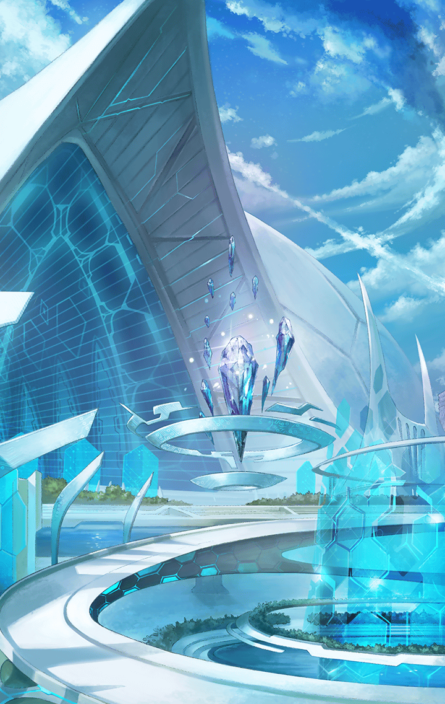

[View script in lisp](../scripts/277000471.txt)

【アルマス】
…………

【モラベガ】
アルマス…
元気ないね、どうしたの？

【ヘレナ】
カシウスとレーヴァなら心配ないよ
カリスがついているんだから

負傷した二人はあの場に残り、
カリスの治療を受けることにした

【ヘレナ】
嬉々として治療しているはずだよ、
カリスは本当の天使だからね…

【カリス】
今日はケガ人がいっぱいだねぇ！
でも安心して！ぜーんぶ、
カリスちゃんにお任せあれ！

【キプル】
すみません！すみません！
ケガで苦しいところ、
騒がしくしてしまってすみませ～ん！！

【レーヴァテイン】
……はぁ

【カシウス】
円環の内ではなく、
この身で喧騒を味わうことも、
また変革の始まり

そして、アルマス達は
ジャングルに向けて
出発することになったのだ

【アルマス】
…そうね
カリスがいれば、大丈夫よね

【ガ・ジャルグ】
ねぇ、無駄話はもう終わった？
次の相手が向こうで
お待ちかねみたいよ？

ジャングルに着いたマスター達を、
ティファレトは一瞥する

【ティファレト】
あなた達、どうしてここに？
なるほど…カシウスを倒した、
ということですか

【アルマス】
ええ、そうよ！
カシウスから話は聞いたわ！

【ティファレト】
そうですか…
ならば長話は不要ですね

【ティファレト】
私の使命はこの島に安寧をもたらし、
憐れな島に救済を施すこと…
それこそが私の責務なのです！

マスターはティファレトに、
それは違う！
と、反論する

自分達は守ってもらうだけの
弱い存在じゃない、
カシウスもわかってくれた

マスターはティファレトに、
まっすぐ答える

【ティファレト】
私は主の命に従うのみです…
あなた方には、
神の慈悲を与えましょうっ！

マスターの言葉を受けても、
ティファレトは迷いなく武器を構え、
その銃口をマスター達に向ける

【アルマス】
ティファレトッ！

剣を構えたアルマスを
ガ・ジャルグが制し、
ティファレトと向き合う

戸惑うアルマスに、
ガ・ジャルグは言った

【ガ・ジャルグ】
アルマス…
あなたには、
まだやることがあるでしょう？

【アルマス】
ガ・ジャルグ…？

【ガ・ジャルグ】
なによ、その間抜けな顔は？
この私が、あなたの代わりに戦う…
それが、そんなに驚くこと？

【アルマス】
だってあなた、
そんなことするタイプじゃ
ないじゃないっ！

【アルマス】
どういうつもり…？

【ガ・ジャルグ】
ふんっ…

【ガ・ジャルグ】
完璧なこの私が、最終決戦で
華麗に勝利を収める…というのは
必然のシナリオだけど…

【ガ・ジャルグ】
たまには意外性も必要でしょ？
だから、見せ場はあなたに譲るわ！

【アルマス】
ガ・ジャルグ…

【ソロモン】
アルマス、ここは私達が！
あなたはフェイルノートを！

【ヘレナ】
ふふっ…
ティファレトとは、
ビーチでの決着がまだだからね…

【ヘレナ】
ヘレナは…
本当は負けず嫌いなんだよ？

【アルマス】
みんな、ありがとう！
先に行かせてもらうわ！

【アルマス】
島の中央で、待ってるからね！

アルマスはそう言い残し、
モラベガ、マスターと
島の中央を目指して走り出す

【ガ・ジャルグ】
…それじゃ、始めましょうか？
至高の存在である、
私の華麗な槍さばきに見惚れなさい！

Next: [277000473](277000473.md)

[Back to index](index.md)
